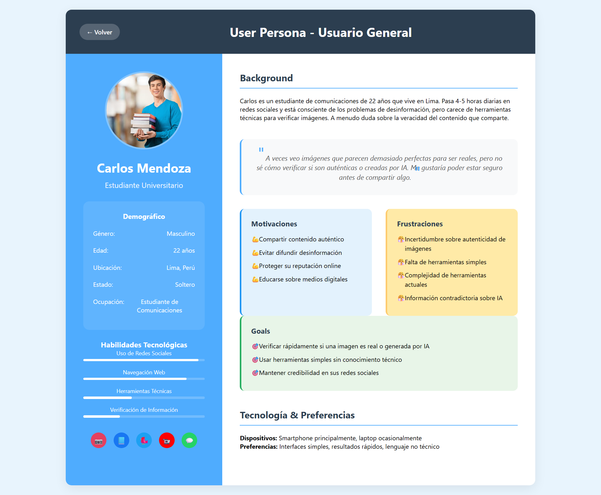
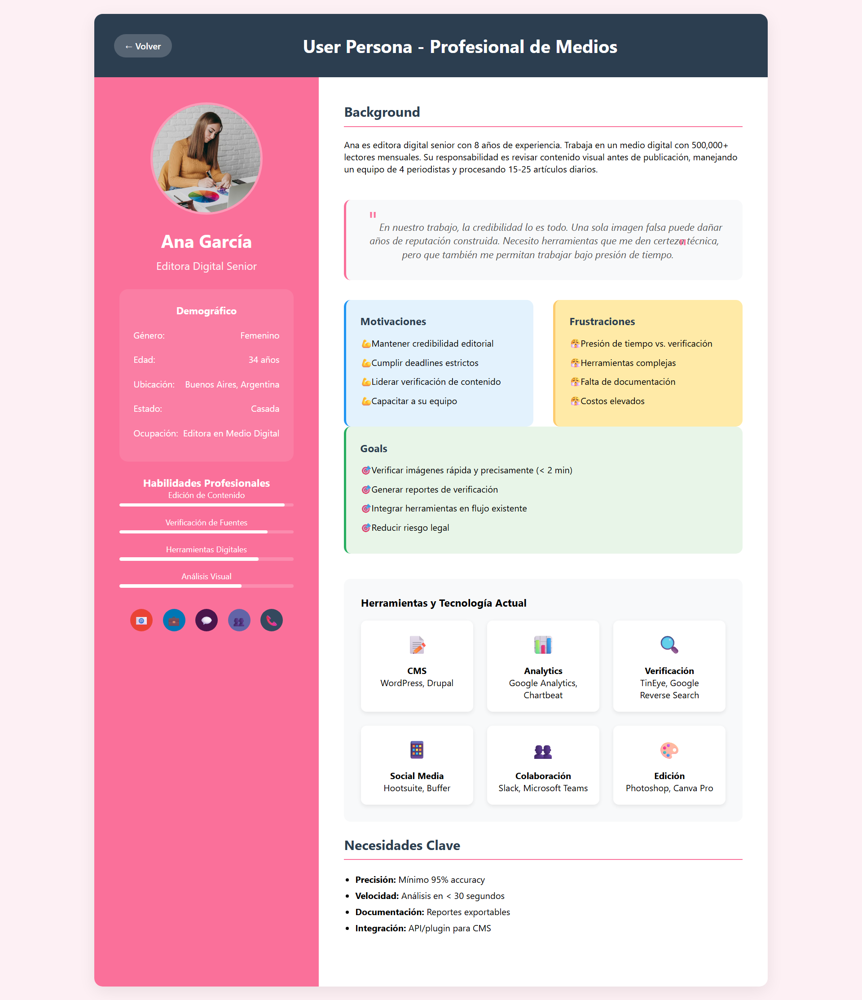
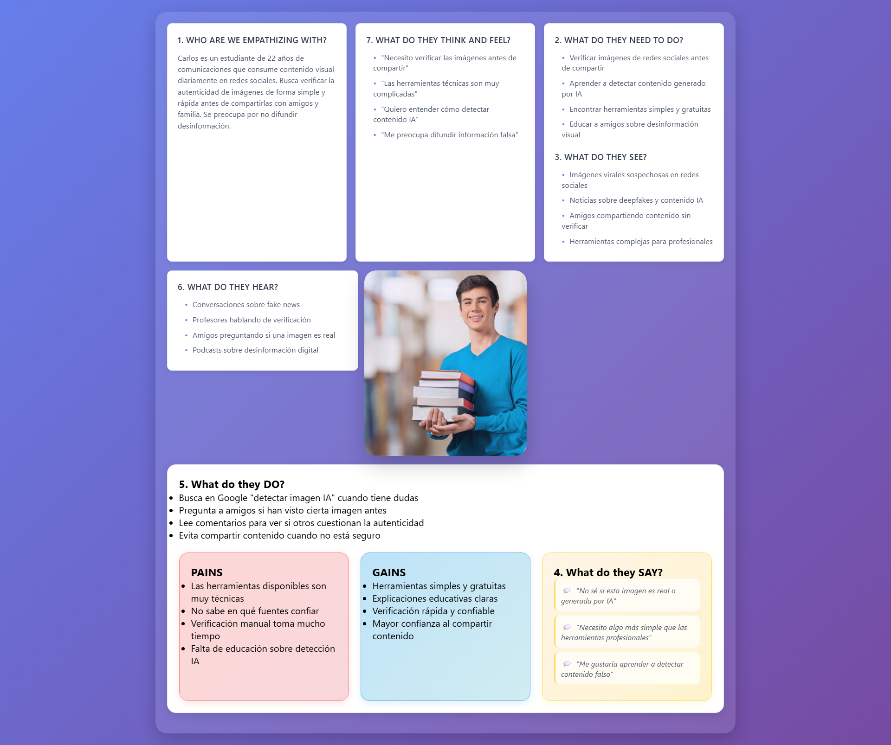
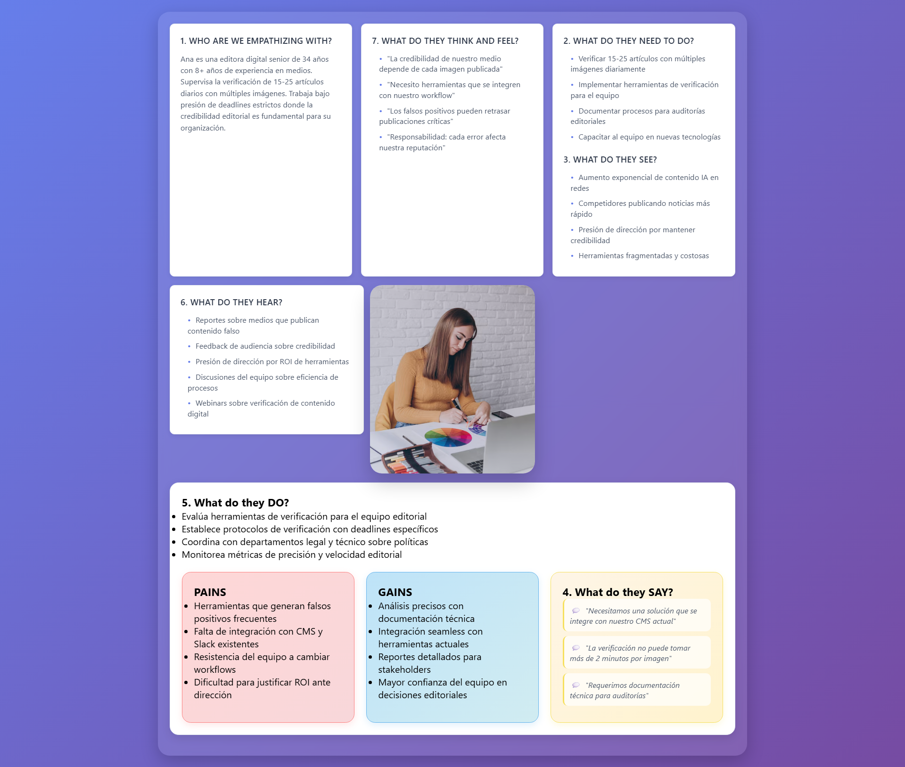
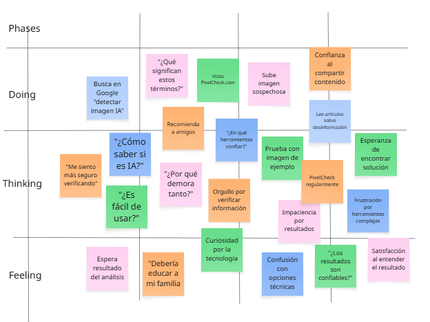
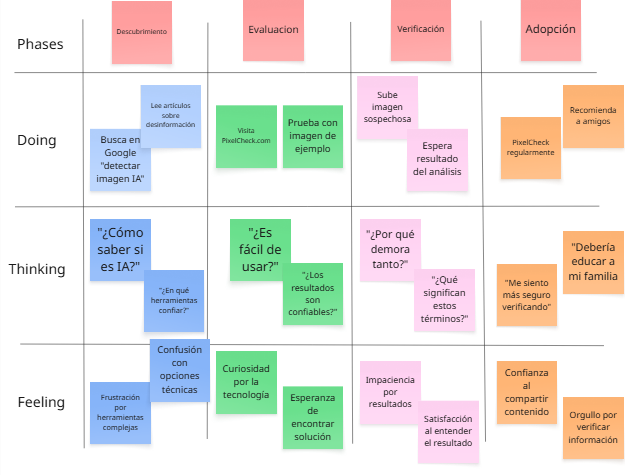
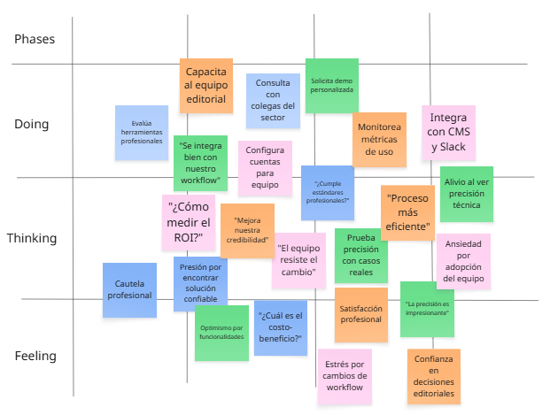
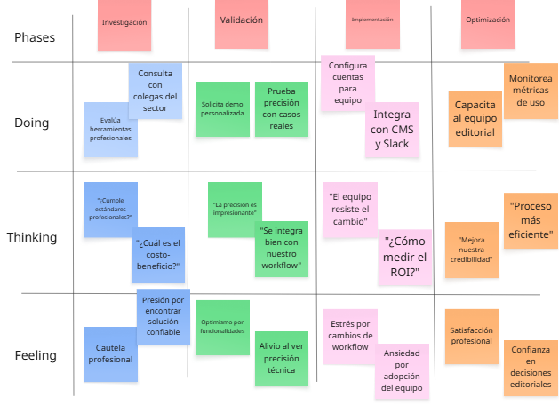

# 
COURSE PROJECT

    <strong>Universidad Peruana de Ciencias Aplicadas</strong> 
     
    <strong>Ingeniería de Software</strong> 
    <strong>Arquitecturas De Software Emergentes - 7295</strong> 
    <strong>Profesor: Royer Edelwer Rojas Malasquez </strong> 
     <strong>INFORME</strong>

<h4 style="text-align: center;"><strong>Startup: Pixel Dev</strong></h4>

<h4 style="text-align: center;"><strong>Product: PixelCheck</strong></h4>

<h5 style="text-align: center;"> Team Members</h5>

<table style="margin-left: auto; margin-right: auto; text-align: center;">
  <thead>
    <tr>
      <th>Member</th>
      <th>Code</th>
    </tr>
  </thead>
  <tbody>
    <tr>
      <td>Carmelino Dueñas, Michael Stefano</td>
      <td>U202212760</td>
    </tr>
    <tr>
      <td></td>
      <td></td>
    </tr>
    <tr>
      <td>Párraga Gamarra, Paolo Gonzalo</td>
      <td>U202219186</td>
    </tr>
    <tr>
      <td></td>
      <td></td>
    </tr>
  </tbody>
</table>

# Registro de Versiones del Informe

|**Versión**|**Fecha**|**Autor**|                                   **Descripción de modificación**                                   |
| :-: | :-: | :-: |:---------------------------------------------------------------------------------------------------:|
|1\.0|9/10/2025|Paolo Gonzalo Parraga Gamarra|                                 Redacción del perfil de la Startup.                                 |

# Project Report Collaboration Insights

## Repositorios:

- Informe: https://github.com/PixelCheckORG/Informe

# Contenido

## Tabla de contenidos

- [Student Outcome](#student-outcome)
- [Capítulo I: Introducción](#capítulo-i-introducción)
  - [1.1. Startup Profile](#11-startup-profile)
    - [1.1.1. Descripción de la Startup](#111-descripción-de-la-startup)
    - [1.1.2. Perfiles de integrantes del equipo](#112-perfiles-de-integradores-del-equipo)
  - [1.2. Solution Profile](#12-solution-profile)
    - [1.2.1 Antecedentes y problemática](#121-antecedentes-y-problemática)
    - [1.2.2. Lean UX Process](#122-lean-ux-process)
      - [1.2.2.1. Lean UX Problem Statements](#1221-lean-ux-problem-statements)
      - [1.2.2.2. Lean UX Assumptions](#1222-lean-ux-assumptions)
      - [1.2.2.3. Lean UX Hypothesis Statements](#1223-lean-ux-hypothesis-statements)
      - [1.2.2.4. Lean UX Canvas](#1224-lean-ux-canvas)
  - [1.3. Segmentos objetivo](#13-segmentos-objetivo)
- [Capítulo II: Requirements Elicitation & Analysis](#capítulo-ii-requirements-elicitation--analysis)
  - [2.1. Competidores](#21-competidores)
    - [2.1.1. Análisis competitivo](#211-análisis-competitivo)
    - [2.1.2. Estrategias y tácticas frente a competidores](#212-estrategias-y-tácticas-frente-a-competidores)
  - [2.2. Entrevistas](#22-entrevistas)
    - [2.2.1. Diseño de entrevistas](#221-diseño-de-entrevistas)
    - [2.2.2. Registro de entrevistas](#222-registro-de-entrevistas)
    - [2.2.3. Análisis de entrevistas](#223-análisis-de-entrevistas)
  - [2.3. Needfinding](#23-needfinding)
    - [2.3.1. User Personas](#231-user-personas)
    - [2.3.2. User Task Matrix](#232-user-task-matrix)
    - [2.3.3. Empathy Mapping](#233-empathy-mapping)
    - [2.3.4. As-is Scenario Mapping](#234-as-is-scenario-mapping)
  - [2.4. Ubiquitous Language](#24-ubiquitous-language)
- [Capítulo III: Requirements Specification](#capítulo-iii-requirements-specification)
  - [3.1. To-Be Scenario Mapping](#31-to-be-scenario-mapping)
  - [3.2. User Stories](#32-user-stories)
  - [3.3. Impact Mapping](#33-impact-mapping)
  - [3.4. Product Backlog](#34-product-backlog)
- [Capítulo IV: Strategic-Level Software Design](#capítulo-iv-strategic-level-software-design)
  - [4.1. Strategic-Level Attribute-Driven Design](#41-strategic-level-attribute-driven-design)
    - [4.1.1. Design Purpose](#411-design-purpose)
    - [4.1.2. Attribute-Driven Design Inputs](#412-attribute-driven-design-inputs)
      - [4.1.2.1. Primary Functionality (Primary User Stories)](#4121-primary-functionality-primary-user-stories)
      - [4.1.2.2. Quality attribute Scenarios](#4122-quality-attribute-scenarios)
      - [4.1.2.3. Constraints](#4123-constraints)
    - [4.1.3. Architectural Drivers Backlog](#413-architectural-drivers-backlog)
    - [4.1.4. Architectural Design Decisions](#414-architectural-design-decisions)
    - [4.1.5. Quality Attribute Scenario Refinements](#415-quality-attribute-scenario-refinements)
  - [4.2. Strategic-Level Domain-Driven Design](#42-strategic-level-domain-driven-design)
    - [4.2.1. EventStorming](#421-eventstorming)
    - [4.2.2. Candidate Context Discovery](#422-candidate-context-discovery)
    - [4.2.3. Domain Message Flows Modeling](#423-domain-message-flows-modeling)
    - [4.2.4. Bounded Context Canvases](#424-bounded-context-canvases)
    - [4.2.5. Context Mapping](#425-context-mapping)
  - [4.3. Software Architecture](#43-software-architecture)
    - [4.3.1. Software Architecture System Landscape Diagram](#431-software-architecture-system-landscape-diagram)
    - [4.3.2. Software Architecture Context Level Diagrams](#432-software-architecture-context-level-diagrams)
    - [4.3.3. Software Architecture Container Level Diagrams](#433-software-architecture-container-level-diagrams)
    - [4.3.4. Software Architecture Deployment Diagrams](#434-software-architecture-deployment-diagrams)
- [Capítulo V: Tactical-Level Software Design](#capítulo-v-tactical-level-software-design)
  - [5.X. Bounded Context: [Bounded Context Name]](#5x-bounded-context-bounded-context-name)
    - [5.X.1. Domain Layer](#5x1-domain-layer)
    - [5.X.2. Interface Layer](#5x2-interface-layer)
    - [5.X.3. Application Layer](#5x3-application-layer)
    - [5.X.4. Infrastructure Layer](#5x4-infrastructure-layer)
    - [5.X.5. Bounded Context Software Architecture Component Level Diagrams](#5x5-bounded-context-software-architecture-component-level-diagrams)
    - [5.X.6. Bounded Context Software Architecture Code Level Diagrams](#5x6-bounded-context-software-architecture-code-level-diagrams)
      - [5.X.6.1. Bounded Context Domain Layer Class Diagrams](#5x61-bounded-context-domain-layer-class-diagrams)
      - [5.X.6.2. Bounded Context Database Design Diagram](#5x62-bounded-context-database-design-diagram)
- [Capítulo VI: Solution UX Design](#capítulo-vi-solution-ux-design)
  - [6.1. Style Guidelines](#61-style-guidelines)
    - [6.1.1. General Style Guidelines](#611-general-style-guidelines)
    - [6.1.2. Web, Mobile & Devices Style Guidelines](#612-web-mobile--devices-style-guidelines)
  - [6.2. Information Architecture](#62-information-architecture)
    - [6.2.1. Labeling Systems](#621-labeling-systems)
    - [6.2.2. Searching Systems](#622-searching-systems)
    - [6.2.3. SEO Tags and Meta Tags](#623-seo-tags-and-meta-tags)
    - [6.2.4. Navigation Systems](#624-navigation-systems)
  - [6.3. Landing Page UI Design](#63-landing-page-ui-design)
    - [6.3.1. Landing Page Wireframe](#631-landing-page-wireframe)
    - [6.3.2. Landing Page Mock-up](#632-landing-page-mock-up)
  - [6.4. Applications UX/UI Design](#64-applications-uxui-design)
    - [6.4.1. Applications Wireframes](#641-applications-wireframes)
    - [6.4.2. Applications Wireflow Diagrams](#642-applications-wireflow-diagrams)
    - [6.4.3. Applications Mock-ups](#643-applications-mock-ups)
    - [6.4.4. Applications User Flow Diagrams](#644-applications-user-flow-diagrams)
  - [6.5. Applications Prototyping](#65-applications-prototyping)
- [Capítulo VII: Product Implementation, Validation & Deployment](#capítulo-vii-product-implementation-validation--deployment)
  - [7.1. Software Configuration Management](#71-software-configuration-management)
    - [7.1.1. Software Development Environment Configuration](#711-software-development-environment-configuration)
    - [7.1.2. Source Code Management](#712-source-code-management)
    - [7.1.3. Source Code Style Guide & Conventions](#713-source-code-style-guide--conventions)
    - [7.1.4. Software Deployment Configuration](#714-software-deployment-configuration)
  - [7.2. Solution Implementation](#72-solution-implementation)
    - [7.2.X. Sprint n](#72x-sprint-n)
      - [7.2.X.1. Sprint Planning n](#72x1-sprint-planning-n)
      - [7.2.X.2. Sprint Backlog n](#72x2-sprint-backlog-n)
      - [7.2.X.3. Development Evidence for Sprint Review](#72x3-development-evidence-for-sprint-review)
      - [7.2.X.4. Testing Suite Evidence for Sprint Review](#72x4-testing-suite-evidence-for-sprint-review)
      - [7.2.X.5. Execution Evidence for Sprint Review](#72x5-execution-evidence-for-sprint-review)
      - [7.2.X.6. Services Documentation Evidence for Sprint Review](#72x6-services-documentation-evidence-for-sprint-review)
      - [7.2.X.7. Software Deployment Evidence for Sprint Review](#72x7-software-deployment-evidence-for-sprint-review)
      - [7.2.X.8. Team Collaboration Insights during Sprint](#72x8-team-collaboration-insights-during-sprint)
  - [7.3. Validation Interviews](#73-validation-interviews)
    - [7.3.1. Diseño de Entrevistas](#731-diseño-de-entrevistas)
    - [7.3.2. Registro de Entrevistas](#732-registro-de-entrevistas)
    - [7.3.3. Evaluaciones según heurísticas](#733-evaluaciones-según-heurísticas)
  - [7.4. Video About-the-Product](#74-video-about-the-product)

# Student Outcome

El curso contribuye al cumplimiento del Student Outcome ABET:

**ABET – EAC - Student Outcome 3**

Criterio: Capacidad de comunicarse efectivamente con un rango de audiencias.
En el siguiente cuadro se describe las acciones realizadas y enunciados de
conclusiones por parte del grupo, que permiten sustentar el haber alcanzado el logro
del ABET – EAC - Student Outcome 3.

| **Criterio Específico** | **Acciones Realizadas** | **Conclusiones** |
|-------------------------|-------------------------|------------------|
| Comunica oralmente sus ideas y/o resultados con objetividad a público de diferentes especialidades y niveles jerárquicos, en el marco del desarrollo de un proyecto en ingeniería. |   **TB1:**    **TP1:**    **TB2:**    **TF1:** | |
| Comunica en forma escrita ideas y/o resultados con objetividad a público de diferentes especialidades y niveles jerárquicos, en el marco del desarrollo de un proyecto en ingeniería. |   **TB1:**    **TP1:**    **TB2:**    **TF1:** |  |

# Capítulo I: Introducción

## 1.1. Startup Profile

### 1.1.1. Descripción de la Startup

[Content for startup description]

### 1.1.2. Perfiles de integrantes del equipo

[Content for team member profiles]

## 1.2. Solution Profile

### 1.2.1 Antecedentes y problemática

[Content for background and problem statement]

### 1.2.2. Lean UX Process

#### 1.2.2.1. Lean UX Problem Statements

[Content for Lean UX problem statements]

#### 1.2.2.2. Lean UX Assumptions

[Content for Lean UX assumptions]

#### 1.2.2.3. Lean UX Hypothesis Statements

[Content for Lean UX hypothesis statements]

#### 1.2.2.4. Lean UX Canvas

[Content for Lean UX canvas]

## 1.3. Segmentos objetivo

[Content for target segments]

# Capítulo II: Requirements Elicitation & Analysis

## 2.1. Competidores

### 2.1.1. Análisis competitivo

El mercado de detección de imágenes generadas por IA presenta competidores establecidos con diferentes enfoques y segmentos objetivo. A continuación se presenta un análisis detallado de los tres principales competidores identificados:

| **Competidor** | **Fortalezas** | **Debilidades** | **Segmento Objetivo** | **Modelo de Precios** | **Precisión** |
|---|---|---|---|---|---|
| **Sightengine** | • Líder en precisión (98.3%) • API robusta para desarrolladores • Plataforma integral de moderación • Detección sin metadatos | • Interfaz compleja para usuarios generales • Precio elevado (80x más caro que competidores) • Enfoque técnico especializado | Desarrolladores y empresas B2B | Premium/Enterprise | 98.3% |
| **Winston AI** | • Alta precisión (99.98% en texto) • Fácil integración con múltiples plataformas • Enfoque educativo e institucional • Interfaz amigable | • Precio mensual recurrente • Limitado a instituciones principalmente • Mayor enfoque en texto que imágenes | Instituciones educativas y profesionales | $12/mes (plan básico) | 95%+ |
| **IsItAI** | • Completamente gratuito • Interfaz extremadamente simple • Extensión de Chrome integrada • Sin límites de uso | • Menor precisión reportada • Análisis básico sin detalles técnicos • Falta de características avanzadas | Usuarios generales y casuales | Freemium | 70-85% |

#### Análisis del panorama competitivo

**Gaps identificados en el mercado:**
- **Brecha técnica-accesible:** Existe un vacío entre herramientas ultra-técnicas (Sightengine) y ultra-simples (IsItAI)
- **Transparencia del proceso:** Los competidores muestran resultados pero no explican el "cómo" del análisis
- **Segmento profesional-accesible:** Profesionales de medios necesitan más detalle que IsItAI pero menos complejidad que Sightengine

**Ventajas competitivas de PixelCheck:**
- **Análisis multicapa transparente:** Mostrar análisis de patrones de píxeles, distribución de colores, texturas y metadatos de forma comprensible
- **Enfoque educativo:** Explicar el proceso de detección, no solo el resultado
- **Flexibilidad de audiencia:** Interfaz adaptable para usuarios generales y profesionales

### 2.1.2. Estrategias y tácticas frente a competidores

#### Estrategia de Diferenciación por Transparencia

| **Competidor** | **Su Enfoque** | **Nuestra Táctica Diferenciadora** | **Implementación** |
|---|---|---|---|
| **Sightengine** | API técnica con resultados directos | **Democratización del análisis técnico** | • Visualización interactiva de patrones de píxeles • Explicaciones en lenguaje natural • Interfaz web accesible sin necesidad de API |
| **Winston AI** | Enfoque institucional con integraciones | **Análisis educativo personalizable** | • Niveles de detalle ajustables (básico/avanzado) • Explicaciones paso a paso del proceso • Capacitación integrada sobre detección de IA |
| **IsItAI** | Simplicidad extrema con resultados binarios | **Simplicidad con profundidad opcional** | • Resultado inmediato simple • Opción de "Ver análisis detallado" • Tooltips explicativos interactivos |

#### Estrategias Específicas por Segmento

**Para Usuarios Generales:**
- **Táctica de Entrada Suave:** Interfaz simple similar a IsItAI pero con opción de "aprender más"
- **Gamificación Educativa:** "¿Puedes detectar esta imagen IA?" con explicaciones posteriores
- **Comparación Visual:** Mostrar lado a lado qué características indican contenido IA

**Para Profesionales de Medios:**
- **Análisis Forense Visual:** Mapas de calor mostrando áreas sospechosas en la imagen
- **Reportes Exportables:** Documentación técnica para verificación editorial
- **Integración con Flujos de Trabajo:** Plugins para herramientas de edición populares

#### Tácticas de Posicionamiento

| **Estrategia** | **Contra Sightengine** | **Contra Winston AI** | **Contra IsItAI** |
|---|---|---|---|
| **Mensaje Principal** | "La precisión técnica de Sightengine, pero accesible para todos" | "Análisis de imágenes especializado vs. herramienta generalista" | "La facilidad de IsItAI con la profundidad que necesitas" |
| **Táctica Clave** | Demos comparativos mostrando mismo nivel de análisis con interfaz más amigable | Enfoque exclusivo en imágenes con características específicas (análisis de ruido, texturas) | Freemium con características premium educativas |
| **Diferenciador** | Transparencia del proceso vs. "caja negra" | Profundidad técnica específica para imágenes | Educación y transparencia vs. simplicidad ciega |

#### Estrategia de Precios Competitiva

| **Segmento** | **Estrategia** | **Justificación** |
|---|---|---|
| **Usuarios Generales** | **Freemium Educativo** | Competir con IsItAI gratuito pero agregar valor educativo |
| **Profesionales** | **Valor Medio** ($6-8/mes) | Posicionarse entre IsItAI (gratis) y Winston AI ($12/mes) |
| **Empresas** | **Personalizado** | Competir con Sightengine en valor, no en precio |

#### Plan de Implementación Táctica

**Fase 1 - Lanzamiento (0-3 meses):**
- Posicionamiento anti-"caja negra": "Ve exactamente cómo detectamos IA"
- Contenido educativo: Blog sobre técnicas de detección
- Demos interactivos comparando con competidores

**Fase 2 - Crecimiento (3-6 meses):**
- Partnerships con escuelas de periodismo y comunicación
- Certificaciones de detección de IA para profesionales
- Integración con herramientas de verificación de fact-checkers

**Fase 3 - Expansión (6-12 meses):**
- API competitiva con Sightengine pero con mejor documentación
- Marketplace de plugins para herramientas de edición
- Programa de afiliados con educadores y profesionales de medios

## 2.2. Entrevistas

### 2.2.1. Diseño de entrevistas

### Preguntas Generales

1. ¿ Cual es tu nombre?
2. ¿ Cual es tu edad?
3. ¿ Donde Resides?
4. ¿Cual es tu Ocupación?

### Segmento 1: Usuarios Generales de Internet

1. ¿Con qué frecuencia consumes contenido visual (imágenes, memes, noticias) en redes sociales y sitios web?

2. ¿Has tenido alguna experiencia donde dudaste si una imagen era real o creada artificialmente?

3. ¿Qué haces actualmente cuando sospechas que una imagen podría ser falsa o generada por IA?

4. En una escala del 1 al 10, ¿qué tan importante consideras poder identificar imágenes generadas por IA?

5. ¿Prefieres obtener una respuesta rápida (sí/no es IA) o te interesaría entender el "por qué" detrás del resultado?

6. ¿Estarías dispuesto/a a usar una herramienta que te tome 30 segundos analizar una imagen si te da resultados confiables?

7. ¿Qué dispositivos usas más frecuentemente para ver contenido en línea? (móvil, tablet, computadora)

8. ¿Pagarías por una herramienta de detección de imágenes IA? Si sí, ¿cuánto máximo al mes?

9. ¿Qué tan cómodo te sientes con tecnología en general? ¿Prefieres interfaces simples o no te molestan las opciones avanzadas?

10. Si pudieras diseñar la herramienta perfecta para detectar imágenes IA, ¿cuáles serían sus 3 características más importantes?

### Segmento 2: Profesionales de Medios y Comunicación

1. ¿Cuál es tu rol específico en medios/comunicación y con qué frecuencia trabajas con imágenes en tu día a día?

2. ¿Has enfrentado situaciones donde la autenticidad de una imagen fue crítica para tu trabajo? Cuéntame sobre esa experiencia.

3. ¿Qué procesos o herramientas utilizas actualmente para verificar la autenticidad de imágenes antes de publicarlas?

4. ¿Cuánto tiempo puedes dedicar típicamente a verificar la autenticidad de una imagen en tu flujo de trabajo?

5. ¿Qué nivel de confianza necesitas en un resultado para considerarlo válido para publicación? (porcentaje, documentación, etc.)

6. ¿Necesitarías poder generar reportes o documentación del análisis para tu organización o archivo?

7. ¿Trabajas solo/a en la verificación de imágenes o necesitas colaborar con otros miembros del equipo en este proceso?

8. ¿Qué información técnica te sería útil conocer sobre una imagen además de si es IA o no? (metadatos, tipo de generador, etc.)

9. ¿Tu organización tendría presupuesto para herramientas especializadas de verificación? ¿En qué rango de precios?

10. ¿Cómo te gustaría integrar una herramienta de detección de IA en tu flujo de trabajo actual? (plugin, API, web app, etc.)

### 2.2.2. Registro de entrevistas

**Entrevista para el Segmento Objetivo 1 - Usuarios Generales de Internet:**

---

Entrevista N°1:

**Entrevistado:** Piero Delgado 
**Sexo:** Masculino  
**Edad:** 22 años 
**Domicilio:** San Miguel, Lima 
**Inicio de la Entrevista:** 0:12 
**Duración de la Entrevista:** 4:03 

 

**Enlace:** [`https://upcedupe-my.sharepoint.com/:v:/g/personal/u202221518_upc_edu_pe/EbU1K3Kw37RJicXWqdh5hTUBuuuEgMFEweqpZgZiIw_PMQ?nav=eyJyZWZlcnJhbEluZm8iOnsicmVmZXJyYWxBcHAiOiJTdHJlYW1XZWJBcHAiLCJyZWZlcnJhbFZpZXciOiJTaGFyZURpYWxvZy1MaW5rIiwicmVmZXJyYWxBcHBQbGF0Zm9ybSI6IldlYiIsInJlZmVycmFsTW9kZSI6InZpZXcifX0%3D&e=jbLISr`](https://upcedupe-my.sharepoint.com/:v:/g/personal/u202221518_upc_edu_pe/EbU1K3Kw37RJicXWqdh5hTUBuuuEgMFEweqpZgZiIw_PMQ?nav=eyJyZWZlcnJhbEluZm8iOnsicmVmZXJyYWxBcHAiOiJTdHJlYW1XZWJBcHAiLCJyZWZlcnJhbFZpZXciOiJTaGFyZURpYWxvZy1MaW5rIiwicmVmZXJyYWxBcHBQbGF0Zm9ybSI6IldlYiIsInJlZmVycmFsTW9kZSI6InZpZXcifX0%3D&e=jbLISr)

**Resumen de la Entrevista:**  

Piero Delgado, estudiante de Administración y Marketing de 22 años que reside en San Miguel, comentó que consume contenido visual en redes sociales varias veces al día y que en ocasiones ha dudado de la autenticidad de imágenes, aunque actualmente solo compara fuentes o ignora las que parecen falsas. Considera muy importante (9/10) poder identificar imágenes generadas por IA y prefiere una herramienta que no solo indique si una imagen es real o no, sino que también explique el porqué del resultado. Estaría dispuesto a usar una aplicación que analice imágenes en menos de 30 segundos, especialmente desde su celular, y aunque no pagaría mucho, mencionó un rango de 10 a 15 soles mensuales si es realmente confiable. Prefiere interfaces simples e intuitivas, y destacó que la herramienta ideal debería ser rápida, confiable y con reportes claros para compartir o guardar.

---

Entrevista N°2:

**Entrevistado:** Joaquin Cortez 
**Sexo:** Masculino  
**Edad:** 21 años 
**Domicilio:** Lima 
**Inicio de la Entrevista:** 0:00 
**Duración de la Entrevista:** 8:30 

 

**Enlace:** [`https://upcedupe-my.sharepoint.com/:v:/g/personal/u202219186_upc_edu_pe/EfB1wapVTCNNvbFtnP6cU58BSKL2ze7MMJKHsxySug4M_A?e=m70lAE&nav=eyJyZWZlcnJhbEluZm8iOnsicmVmZXJyYWxBcHAiOiJTdHJlYW1XZWJBcHAiLCJyZWZlcnJhbFZpZXciOiJTaGFyZURpYWxvZy1MaW5rIiwicmVmZXJyYWxBcHBQbGF0Zm9ybSI6IldlYiIsInJlZmVycmFsTW9kZSI6InZpZXcifX0%3D`](https://upcedupe-my.sharepoint.com/:v:/g/personal/u202219186_upc_edu_pe/EfB1wapVTCNNvbFtnP6cU58BSKL2ze7MMJKHsxySug4M_A?e=m70lAE&nav=eyJyZWZlcnJhbEluZm8iOnsicmVmZXJyYWxBcHAiOiJTdHJlYW1XZWJBcHAiLCJyZWZlcnJhbFZpZXciOiJTaGFyZURpYWxvZy1MaW5rIiwicmVmZXJyYWxBcHBQbGF0Zm9ybSI6IldlYiIsInJlZmVycmFsTW9kZSI6InZpZXcifX0%3D)

**Resumen de la Entrevista:** El entrevistado es un consumidor digital activo que pasa 2-3 horas diarias consumiendo contenido visual en redes sociales y sitios web, principalmente desde su móvil (70% del tiempo). Ha experimentado directamente la dificultad de distinguir entre imágenes reales y generadas por IA, especialmente con deepfakes de celebridades, y actualmente recurre a métodos básicos como búsqueda inversa en Google para verificar autenticidad. Considera extremadamente importante (9/10) poder identificar contenido artificial debido a preocupaciones sobre desinformación, y estaría dispuesto a pagar hasta $10-25 USD mensuales por una herramienta confiable que analice imágenes en 30 segundos o menos.  

---

Entrevista N°3:

**Entrevistado:** Jose Pierola 
**Sexo:** Masculino  
**Edad:** 21 años 
**Domicilio:** Lima 
**Inicio de la Entrevista:** 0:00 
**Duración de la Entrevista:** 5:06 

 

**Enlace:** [`https://upcedupe-my.sharepoint.com/:v:/g/personal/u202221518_upc_edu_pe/EbU1K3Kw37RJicXWqdh5hTUBuWQuuEgMFEweqpZgZiIw_PMQ?nav=eyJyZWZlcnJhbEluZm8iOnsicmVmZXJyYWxBcHAiOiJTdHJlYW1XZWJBcHAiLCJyZWZlcnJhbFZpZXciOiJTaGFyZURpYWxvZy1MaW5rIiwicmVmZXJyYWxBcHBQbGF0Zm9ybSI6IldlYiIsInJlZmVycmFsTW9kZSI6InZpZXcifX0%3D&e=jbLISr`](https://upcedupe-my.sharepoint.com/:v:/g/personal/u202221518_upc_edu_pe/EbU1K3Kw37RJicXWqdh5hTUBuWQuuEgMFEweqpZgZiIw_PMQ?nav=eyJyZWZlcnJhbEluZm8iOnsicmVmZXJyYWxBcHAiOiJTdHJlYW1XZWJBcHAiLCJyZWZlcnJhbFZpZXciOiJTaGFyZURpYWxvZy1MaW5rIiwicmVmZXJyYWxBcHBQbGF0Zm9ybSI6IldlYiIsInJlZmVycmFsTW9kZSI6InZpZXcifX0%3D&e=jbLISr)

**Resumen de la Entrevista:** El entrevistado es un usuario ocasional de redes sociales que consume contenido visual principalmente los fines de semana desde su computadora, con un enfoque más hacia noticias que entretenimiento. Aunque no ha tenido experiencias directas sospechando de imágenes falsas, reconoce moderadamente la importancia del tema (6/10) y prefiere soluciones gratuitas o de muy bajo costo. Valora la simplicidad por encima de la funcionalidad avanzada, prefiere respuestas rápidas tipo sí/no sin complicaciones técnicas, y estaría dispuesto a esperar hasta 2 minutos por resultados confiables. Su perfil representa a usuarios menos técnicos que buscan herramientas básicas, intuitivas y accesibles económicamente, priorizando la facilidad de uso sobre características avanzadas.  

---

**Entrevista para el Segmento Objetivo 2 - Profesionales de Medios y Comunicación:**

---

Entrevista N°1:

**Entrevistado:** Nasthya Del Carpio 
**Sexo:** Femenino  
**Edad:** 21 años 
**Domicilio:** La perla, Callao 
**Inicio de la Entrevista:** 0:12 
**Duración de la Entrevista:** 4:03 

 

**Enlace:** [`https://upcedupe-my.sharepoint.com/:v:/g/personal/u202221518_upc_edu_pe/EZ4vWSOqZ05IhOwIzeAajdsBMUiJd2v-KAkvx2FqzxwX3w?nav=eyJyZWZlcnJhbEluZm8iOnsicmVmZXJyYWxBcHAiOiJTdHJlYW1XZWJBcHAiLCJyZWZlcnJhbFZpZXciOiJTaGFyZURpYWxvZy1MaW5rIiwicmVmZXJyYWxBcHBQbGF0Zm9ybSI6IldlYiIsInJlZmVycmFsTW9kZSI6InZpZXcifX0%3D&e=iOUGaZ`](https://upcedupe-my.sharepoint.com/:v:/g/personal/u202221518_upc_edu_pe/EZ4vWSOqZ05IhOwIzeAajdsBMUiJd2v-KAkvx2FqzxwX3w?nav=eyJyZWZlcnJhbEluZm8iOnsicmVmZXJyYWxBcHAiOiJTdHJlYW1XZWJBcHAiLCJyZWZlcnJhbFZpZXciOiJTaGFyZURpYWxvZy1MaW5rIiwicmVmZXJyYWxBcHBQbGF0Zm9ybSI6IldlYiIsInJlZmVycmFsTW9kZSI6InZpZXcifX0%3D&e=iOUGaZ)

**Resumen de la Entrevista:**  

Nasthya, estudiante de Comunicación Audiovisual y practicante en una agencia de publicidad, trabaja diariamente con 20 a 30 imágenes para campañas. Señala que la autenticidad es clave, ya que una vez publicaron imágenes generadas por IA que dañaron la confianza del público. Actualmente revisa metadatos o usa Google Imágenes, pero reconoce que no son procesos confiables ni rápidos, dedicando máximo 5 minutos por imagen. Considera que necesita al menos un 90% de certeza y un sistema de reportes claros para clientes. Piensa que una herramienta como PixelCheck debería integrarse como web app o plugin, con un costo accesible de 30–50 dólares mensuales.

---

Entrevista N°2:

**Entrevistado:** Hanna Pairazaman  
**Sexo:** Femenino  
**Edad:** 21 años 
**Domicilio:** Callao 
**Inicio de la Entrevista:** 0:15 
**Duración de la Entrevista:** 3:23 

 

**Enlace:** [`https://upcedupe-my.sharepoint.com/:v:/g/personal/u202221518_upc_edu_pe/EVi6fSL5sP5DnBBJAMQJlm8BlrJc3YoBxIZm260g4J-89A?nav=eyJyZWZlcnJhbEluZm8iOnsicmVmZXJyYWxBcHAiOiJTdHJlYW1XZWJBcHAiLCJyZWZlcnJhbFZpZXciOiJTaGFyZURpYWxvZy1MaW5rIiwicmVmZXJyYWxBcHBQbGF0Zm9ybSI6IldlYiIsInJlZmVycmFsTW9kZSI6InZpZXcifX0%3D&e=FycJx8`](https://upcedupe-my.sharepoint.com/:v:/g/personal/u202221518_upc_edu_pe/EVi6fSL5sP5DnBBJAMQJlm8BlrJc3YoBxIZm260g4J-89A?nav=eyJyZWZlcnJhbEluZm8iOnsicmVmZXJyYWxBcHAiOiJTdHJlYW1XZWJBcHAiLCJyZWZlcnJhbFZpZXciOiJTaGFyZURpYWxvZy1MaW5rIiwicmVmZXJyYWxBcHBQbGF0Zm9ybSI6IldlYiIsInJlZmVycmFsTW9kZSI6InZpZXcifX0%3D&e=FycJx8)

**Resumen de la Entrevista:**  

Hanna, estudiante de Periodismo y practicante en un medio digital, usa entre 10 y 15 imágenes diarias en notas y noticias. Resalta la importancia de la verificación, ya que enfrentó casos de fotos manipuladas en política que casi se publican como reales. Actualmente utiliza búsqueda inversa y TinEye, pero considera que no son suficientes. Puede dedicar máximo 10 minutos a la verificación, especialmente en noticias urgentes, y requiere un 95% de certeza para publicar. Valora la generación de reportes para justificar decisiones editoriales y prefiere un portal web o API integrada al CMS. Estima que su organización podría destinar unos 100 dólares mensuales para una herramienta como PixelCheck.

---

Entrevista N°3:

**Entrevistado:** Maria Jose Munisaca 
**Sexo:** Femenino  
**Edad:** 22 años 
**Domicilio:** San Borja, Lima  
**Inicio de la Entrevista:** 0:12 
**Duración de la Entrevista:** 4:58 

 

**Enlace:** [`https://upcedupe-my.sharepoint.com/:v:/g/personal/u202221518_upc_edu_pe/EatWsg5UdnhBk0hG4fyjn_kB_w0pCc1vPXz776u7GPcSNw?e=QV4Q06&nav=eyJyZWZlcnJhbEluZm8iOnsicmVmZXJyYWxBcHAiOiJTdHJlYW1XZWJBcHAiLCJyZWZlcnJhbFZpZXciOiJTaGFyZURpYWxvZy1MaW5rIiwicmVmZXJyYWxBcHBQbGF0Zm9ybSI6IldlYiIsInJlZmVycmFsTW9kZSI6InZpZXcifX0%3D`](https://upcedupe-my.sharepoint.com/:v:/g/personal/u202221518_upc_edu_pe/EatWsg5UdnhBk0hG4fyjn_kB_w0pCc1vPXz776u7GPcSNw?e=QV4Q06&nav=eyJyZWZlcnJhbEluZm8iOnsicmVmZXJyYWxBcHAiOiJTdHJlYW1XZWJBcHAiLCJyZWZlcnJhbFZpZXciOiJTaGFyZURpYWxvZy1MaW5rIiwicmVmZXJyYWxBcHBQbGF0Zm9ybSI6IldlYiIsInJlZmVycmFsTW9kZSI6InZpZXcifX0%3D)

**Resumen de la Entrevista:**  

María José, estudiante de Marketing y practicante en comunicación de una ONG, gestiona materiales visuales para redes y reportes a donantes. Ha enfrentado problemas con imágenes manipuladas con IA que exageraban el impacto de donaciones, lo cual puso en riesgo la transparencia institucional. Actualmente revisa de forma visual y descarta imágenes sospechosas, con un tiempo de 5 a 10 minutos por revisión. Necesita entre 80–90% de certeza y considera fundamental contar con reportes técnicos para sustentar la autenticidad ante socios y donantes. Su ONG tiene un presupuesto limitado (20–30 dólares mensuales) y busca una solución ligera, fácil de usar y basada en web.

---

### 2.2.3. Análisis de entrevistas

### Segmento 1: Usuarios Generales de Internet

**Perfil de Entrevistado:**
- Hombre, 22 años, estudiante universitario
- Consumo: múltiple acceso diario a contenido visual
- Comportamiento: comparación de fuentes o descarte por sospecha

**Expectativas:**
- Importancia de detección IA: 9/10
- Tiempo máximo tolerado: 30 segundos
- Dispositivo preferido: móvil
- Disposición de pago: $3-4 USD mensuales

### Validación de Hipótesis

**Confirmadas:**
- Demanda de herramientas rápidas y precisas
- Insuficiencia de métodos actuales de verificación
- Diferenciación clara entre necesidades profesionales y casuales

**Nuevos Insights:**
- Brecha de precio significativa entre segmentos (12.5x diferencia)
- Necesidad crítica de documentación en contexto profesional
- Preferencia por explicaciones educativas en usuarios generales

### Implicaciones de Producto

**Características Core:**
- Análisis < 30 segundos
- Precisión > 90%
- Interfaz responsive (móvil-first)

**Diferenciación por Segmento:**
- Profesionales: reportes, integraciones, soporte técnico
- Generales: simplicidad, educación, modelo freemium

**Modelo de Precios Validado:**
- Freemium para usuarios generales
- Suscripción profesional: $20-100 USD/mes según organización

### Segmento 2: Profesionales de Medios y Comunicación

**Perfil de Entrevistados:**
- 100% mujeres, edad promedio: 21.3 años
- Roles: practicantes en agencias publicitarias, medios digitales y ONGs
- Ubicación: Lima Metropolitana y Callao

**Uso y Volumen:**
- Procesamiento diario: 10-30 imágenes por profesional
- Tiempo máximo de verificación: 5-10 minutos por imagen
- Métodos actuales: Google Imágenes (100%), TinEye (67%), metadatos (33%)

**Experiencias Críticas:**
- 100% reportó casos de contenido IA que casi se publica o se publicó
- Sectores afectados: política, publicidad, transparencia institucional

**Requisitos Técnicos:**
- Nivel de certeza requerido: 80-95%
- 100% requiere reportes técnicos para justificar decisiones
- Integración preferida: web app (67%), API/CMS (33%)

**Presupuesto Disponible:**
- Rango: $20-100 USD mensuales
- Promedio: $50 USD mensuales

### 2.3.1. User Personas

Se han elaborado los User Persona correspondientes a cada uno de nuestros segmentos objetivos. Estos segmentos incluyen, por un lado, a los usuarios generales de internet que consumen contenido visual en redes sociales y sitios de noticias; y por otro lado, a los profesionales de medios y comunicación que requieren verificación técnica de imágenes. La construcción de estos perfiles se ha basado en los datos obtenidos a partir de las entrevistas realizadas y el análisis competitivo del mercado.

Los user persona nos permiten entender el perfil y comportamiento de cada segmento, ayudando a identificar sus necesidades técnicas y objetivos de forma general para el desarrollo de PixelCheck.

#### Segmento 1: Usuarios Generales de Internet

Presentamos a Carlos Mendoza, un joven estudiante universitario que representa a nuestro primer segmento objetivo. Este user persona encarna las características y necesidades de los usuarios generales que consumen contenido visual diariamente y buscan herramientas simples para verificar la autenticidad de las imágenes que encuentran online. Carlos fue creado a partir del análisis de comportamientos reales identificados durante el proceso de investigación y validación de hipótesis Lean UX.

#### Segmento 2: Profesionales de Medios y Comunicación

Presentamos a Ana García, una editora digital senior que representa a nuestro segundo segmento objetivo. Este user persona fue construido a partir de la información recopilada durante las entrevistas con profesionales del sector medios. Ana encarna las necesidades de precisión, documentación y eficiencia que caracterizan a los profesionales que deben verificar contenido visual como parte crítica de su flujo de trabajo editorial.

### 2.3.2. User Task Matrix

El user task matrix permite identificar y comparar los procesos clave de cada segmento objetivo de PixelCheck, destacando sus similitudes y diferencias en cuanto a frecuencia e importancia para el desarrollo de funcionalidades priorizadas.

| **Necesidad / Función** | **Importancia (Usuarios Generales)** | **Frecuencia (Usuarios Generales)** | **Importancia (Profesionales de Medios)** | **Frecuencia (Profesionales de Medios)** |
|---|---|---|---|---|
| **Detectar si una imagen es generada por IA** | Alta | Media | Alta | Alta |
| **Obtener resultado rápido (sí/no)** | Alta | Media | Alta | Alta |
| **Entender por qué es detectada como IA** | Media | Baja | Alta | Alta |
| **Cargar/subir imagen para análisis** | Alta | Media | Alta | Alta |
| **Analizar múltiples imágenes simultáneamente** | Baja | Baja | Alta | Alta |
| **Generar reportes de verificación** | Baja | Baja | Alta | Media |
| **Acceder desde dispositivo móvil** | Alta | Media | Media | Media |
| **Compartir resultados con otros** | Media | Baja | Alta | Media |
| **Identificar tipo de generador de IA** | Baja | Baja | Media | Media |
| **Exportar análisis técnico detallado** | Baja | Baja | Alta | Media |
| **Verificar metadatos de imagen** | Baja | Baja | Media | Media |
| **Acceso sin registro/cuenta** | Alta | Media | Baja | Baja |

En la matriz presentada, se pueden observar las siguientes tareas con mayor frecuencia e importancia:

#### **Usuarios Generales:**

* **Detectar si una imagen es generada por IA y obtener resultado rápido** 
  - Funcionalidad **más crítica**, con **alta importancia y frecuencia media**. Los usuarios generales necesitan una respuesta clara y rápida sobre la autenticidad de una imagen, sin complejidad técnica adicional.

* **Cargar/subir imagen para análisis y acceso desde dispositivo móvil** 
  - Tareas de **alta importancia** con **frecuencia media**. Requieren una interfaz intuitiva optimizada para móviles que permita subir imágenes de forma sencilla desde redes sociales o galería.

* **Acceso sin registro/cuenta** 
  - De **alta importancia y frecuencia media**. Los usuarios ocasionales prefieren herramientas que no requieran registro, priorizando la facilidad de acceso inmediato.

* **Entender por qué es detectada como IA y compartir resultados** 
  - Funcionalidades de **importancia y frecuencia baja a media**. Pueden ofrecerse como características educativas opcionales para usuarios curiosos por aprender sobre detección de IA.

#### **Profesionales de Medios:**

* **Detectar IA, obtener resultados rápidos y analizar múltiples imágenes** 
  - Tareas **críticas y frecuentes**, esenciales para su flujo de trabajo editorial diario. Requieren herramientas eficientes para procesar volúmenes altos de contenido visual bajo presión de tiempo.

* **Entender por qué es detectada como IA y generar reportes** 
  - Funcionalidades con **alta importancia y frecuencia alta a media**. Necesitan justificación técnica detallada y documentación formal para respaldo editorial y archivo institucional.

* **Cargar imágenes y compartir resultados con equipo** 
  - Actividades de **alta importancia** y **frecuencia alta a media**. Requieren flujos colaborativos integrados con herramientas de trabajo existentes (CMS, Slack, etc.).

* **Exportar análisis técnico detallado e identificar tipo de generador** 
  - Características especializadas de **importancia media-alta** con **frecuencia media**. Necesarias para análisis forense y verificación avanzada en casos de contenido sospechoso.

### 2.3.3. Empathy Mapping

Para la creación del Empathy Map, hemos utilizado la información obtenida de nuestros dos User Personas que representan nuestros segmentos objetivo de PixelCheck. Este mapa nos permite profundizar en la comprensión de las necesidades, pensamientos, emociones y comportamientos de los usuarios, ayudándonos a diseñar soluciones más alineadas con sus expectativas y experiencias reales en el contexto de la verificación de contenido visual.

#### Segmento 1: Usuarios Generales de Internet
En el siguiente Empathy Map tenemos a Carlos Mendoza, un estudiante de comunicaciones de 22 años que consume contenido visual diariamente en redes sociales. Él busca verificar la autenticidad de imágenes de forma simple y rápida antes de compartirlas con amigos y familia. Podemos observar su experiencia, la cual refleja los desafíos de millones de usuarios que se preocupan por no difundir desinformación visual pero carecen de herramientas accesibles para la verificación.

#### Segmento 2: Profesionales de Medios y Comunicación
En el siguiente Empathy Map presentamos a Ana García, una editora digital senior con 8+ años de experiencia que supervisa la verificación de 15-25 artículos diarios con múltiples imágenes. Ella trabaja bajo la presión de deadlines estrictos donde la credibilidad editorial es fundamental para su organización. Podemos observar su experiencia profesional, la cual refleja las necesidades técnicas y operacionales de los profesionales de medios que requieren herramientas precisas y eficientes para mantener la integridad del contenido publicado.

### 2.3.4. As-is Scenario Mapping

El As-is Scenario Mapping permite analizar la situación actual de cada segmento objetivo antes de la implementación de PixelCheck, identificando los procesos existentes, puntos de dolor y oportunidades de mejora en sus flujos de trabajo de verificación de imágenes.

#### Segmento 1: Usuarios Generales de Internet

El As-Is Scenario para el segmento de usuarios generales revela un proceso de verificación de imágenes caracterizado por métodos informales y poco confiables. Los usuarios dependen principalmente de búsquedas en Google, consultas a conocidos, y su intuición personal para determinar la autenticidad de las imágenes. No existe un sistema estructurado de verificación, lo que genera incertidumbre y riesgo de compartir contenido falso inadvertidamente.

**Enlace para visualizar el As-is Scenario Map de Usuarios Generales realizado en Miro:** [Acceso al mapa completo](usuario_general.html)

**Brainstorming:**

**Identify the highs and lows:**

**Positive Areas:**
- Satisfacción al encontrar herramientas simples e intuitivas
- Confianza cuando obtiene resultados claros y comprensibles

**Negative Areas:**
- Frustración ante herramientas muy técnicas o complejas
- Confusión con terminología especializada sin explicaciones

**Blank Areas:**
- Necesidad de explorar cómo integrar la verificación en el flujo natural de consumo de contenido en redes sociales
- Oportunidad de desarrollar características educativas que aumenten la conciencia sobre desinformación visual

#### Segmento 2: Profesionales de Medios y Comunicación

El As-Is Scenario para el segmento de profesionales de medios muestra un proceso de verificación editorial que depende de herramientas básicas como búsqueda reversa de imágenes, verificación manual y consultas con fuentes. Los procesos actuales son lentos, no están estandarizados, carecen de documentación formal y no proporcionan el nivel de certeza técnica requerido para mantener la credibilidad editorial en un entorno de alta presión temporal.

**Enlace para visualizar el As-is Scenario Map de Profesionales de Medios realizado en Miro:** [Acceso al mapa completo](profesional_medios.html)

**Brainstorming:**

**Identify the highs and lows:**

**Positive Areas:**
- Optimismo al descubrir herramientas que cumplen estándares profesionales de precisión
- Satisfacción profesional al implementar procesos que mejoran la credibilidad editorial

**Negative Areas:**
- Cautela y preocupación por el costo-beneficio de nuevas herramientas especializadas
- Estrés por la resistencia del equipo a cambios en workflows establecidos

**Blank Areas:**
- Explorar la integración profunda con sistemas de gestión de contenido (CMS) existentes
- Desarrollar métricas específicas para medir el impacto de la verificación en la credibilidad y eficiencia editorial
- Investigar necesidades de capacitación y certificación profesional en detección de contenido sintético

#### Análisis Comparativo de Escenarios Actuales

| **Aspecto** | **Usuario General** | **Profesional de Medios** |
|---|---|---|
| **Método Principal** | Intuición y búsquedas básicas | Verificación manual y fuentes |
| **Tiempo Disponible** | Flexible, uso ocasional | Limitado por deadlines |
| **Nivel de Certeza Requerido** | Suficiente para decisión personal | Alto, respaldo institucional |
| **Consecuencias de Error** | Vergüenza personal | Daño a credibilidad editorial |
| **Herramientas Actuales** | Google Images, preguntar a otros | TinEye, contacto con fuentes |
| **Documentación** | No requerida | Necesaria para auditorías |

#### Implicaciones para el Diseño de PixelCheck

Los insights obtenidos del As-is Scenario Mapping revelan oportunidades claras para que PixelCheck aborde las brechas identificadas:

**Para Usuarios Generales:**
- Interfaz simple que reduzca la curva de aprendizaje
- Explicaciones educativas que transformen la frustración en conocimiento
- Integración con plataformas de redes sociales para verificación in-situ

**Para Profesionales de Medios:**
- Funcionalidades avanzadas de documentación y reportes
- Integración con herramientas editoriales existentes
- Soporte técnico especializado para casos complejos
- Métricas de rendimiento para justificar ROI organizacional

## 2.4. Ubiquitous Language

| Term | Definition |
|------|------------|
| **Usuario General** | Usuario final que consume contenido visual diariamente en redes sociales y utiliza la plataforma para verificar la autenticidad de imágenes antes de compartirlas. |
| **Profesional de Medios** | Editor, periodista o creador de contenido responsable de verificar imágenes como parte de su flujo de trabajo editorial profesional. |
| **Análisis de IA** | Proceso algorítmico que examina una imagen para detectar si fue generada por inteligencia artificial o es contenido real. |
| **Imagen Generada por IA** | Contenido visual creado completamente por algoritmos de inteligencia artificial, como DALL-E, Midjourney o Stable Diffusion. |
| **Imagen Auténtica** | Fotografía capturada por dispositivos reales (cámaras, smartphones) sin manipulación significativa por IA. |
| **Puntuación de Confianza** | Valor numérico (0-100%) que indica la probabilidad de que una imagen sea generada por IA versus contenido auténtico. |
| **Reporte de Verificación** | Documento detallado que incluye el análisis técnico, puntuación de confianza, y explicación educativa sobre los resultados de verificación. |
| **Dashboard Profesional** | Interfaz personalizada para profesionales de medios que muestra historial de verificaciones, métricas de uso, y herramientas de gestión de equipo. |
| **Verificación en Tiempo Real** | Procesamiento inmediato de imágenes subidas que proporciona resultados de análisis en segundos. |
| **Metadatos de Imagen** | Información técnica embebida en archivos de imagen que puede revelar detalles sobre su origen, modificaciones, y proceso de creación. |
| **Análisis de Patrones** | Detección de características específicas en imágenes que son típicas de contenido generado por IA versus fotografías reales. |
| **API de Verificación** | Interfaz de programación que permite integrar las capacidades de PixelCheck en aplicaciones y flujos de trabajo externos. |
| **Usuario Registrado** | Persona con acceso autenticado a la plataforma, con funcionalidades diferenciadas según su tipo (General o Profesional). |
| **Historial de Verificaciones** | Registro cronológico de todas las imágenes analizadas por un usuario, incluyendo resultados y fechas de verificación. |
| **Integración CMS** | Conectividad con sistemas de gestión de contenido que permite verificar imágenes directamente desde plataformas editoriales. |
| **Educación sobre IA** | Contenido informativo que explica cómo detectar imágenes generadas por IA y los principios detrás de la tecnología de verificación. |
| **Flujo de Trabajo Editorial** | Proceso establecido en organizaciones de medios para revisar, verificar y aprobar contenido visual antes de publicación. |
| **Falso Positivo** | Resultado incorrecto donde una imagen auténtica es identificada como generada por IA. |
| **Falso Negativo** | Resultado incorrecto donde una imagen generada por IA es identificada como auténtica. |
| **Threshold de Detección** | Umbral configurable que determina la sensibilidad del algoritmo para clasificar imágenes como IA o auténticas. |
| **Batch Processing** | Capacidad de analizar múltiples imágenes simultáneamente, especialmente útil para profesionales con alto volumen de contenido. |

# Capítulo III: Requirements Specification

## 3.1. To-Be Scenario Mapping

[Content for to-be scenario mapping]

## 3.2. User Stories

[Content for user stories]

## 3.3. Impact Mapping

[Content for impact mapping]

## 3.4. Product Backlog

[Content for product backlog]

# Capítulo IV: Strategic-Level Software Design

## 4.1. Strategic-Level Attribute-Driven Design

### 4.1.1. Design Purpose

[Content for design purpose]

### 4.1.2. Attribute-Driven Design Inputs

#### 4.1.2.1. Primary Functionality (Primary User Stories)

[Content for primary functionality]

#### 4.1.2.2. Quality attribute Scenarios

[Content for quality attribute scenarios]

#### 4.1.2.3. Constraints

[Content for constraints]

### 4.1.3. Architectural Drivers Backlog

[Content for architectural drivers backlog]

### 4.1.4. Architectural Design Decisions

[Content for architectural design decisions]

### 4.1.5. Quality Attribute Scenario Refinements

[Content for quality attribute scenario refinements]

## 4.2. Strategic-Level Domain-Driven Design

### 4.2.1. EventStorming

[Content for event storming]

### 4.2.2. Candidate Context Discovery

[Content for candidate context discovery]

### 4.2.3. Domain Message Flows Modeling

[Content for domain message flows modeling]

### 4.2.4. Bounded Context Canvases

[Content for bounded context canvases]

### 4.2.5. Context Mapping

[Content for context mapping]

## 4.3. Software Architecture

### 4.3.1. Software Architecture System Landscape Diagram

[Content for system landscape diagram]

### 4.3.2. Software Architecture Context Level Diagrams

[Content for context level diagrams]

### 4.3.3. Software Architecture Container Level Diagrams

[Content for container level diagrams]

### 4.3.4. Software Architecture Deployment Diagrams

[Content for deployment diagrams]

# Capítulo V: Tactical-Level Software Design

## 5.X. Bounded Context: [Bounded Context Name]

### 5.X.1. Domain Layer

[Content for domain layer]

### 5.X.2. Interface Layer

[Content for interface layer]

### 5.X.3. Application Layer

[Content for application layer]

### 5.X.4. Infrastructure Layer

[Content for infrastructure layer]

### 5.X.5. Bounded Context Software Architecture Component Level Diagrams

[Content for component level diagrams]

### 5.X.6. Bounded Context Software Architecture Code Level Diagrams

#### 5.X.6.1. Bounded Context Domain Layer Class Diagrams

[Content for domain layer class diagrams]

#### 5.X.6.2. Bounded Context Database Design Diagram

[Content for database design diagram]

# Capítulo VI: Solution UX Design

## 6.1. Style Guidelines

### 6.1.1. General Style Guidelines

[Content for general style guidelines]

### 6.1.2. Web, Mobile & Devices Style Guidelines

[Content for web, mobile & devices style guidelines]

## 6.2. Information Architecture

### 6.2.1. Labeling Systems

[Content for labeling systems]

### 6.2.2. Searching Systems

[Content for searching systems]

### 6.2.3. SEO Tags and Meta Tags

[Content for SEO tags and meta tags]

### 6.2.4. Navigation Systems

[Content for navigation systems]

## 6.3. Landing Page UI Design

### 6.3.1. Landing Page Wireframe

[Content for landing page wireframe]

### 6.3.2. Landing Page Mock-up

[Content for landing page mock-up]

## 6.4. Applications UX/UI Design

### 6.4.1. Applications Wireframes

[Content for applications wireframes]

### 6.4.2. Applications Wireflow Diagrams

[Content for applications wireflow diagrams]

### 6.4.3. Applications Mock-ups

[Content for applications mock-ups]

### 6.4.4. Applications User Flow Diagrams

[Content for applications user flow diagrams]

## 6.5. Applications Prototyping

[Content for applications prototyping]

# Capítulo VII: Product Implementation, Validation & Deployment

## 7.1. Software Configuration Management

### 7.1.1. Software Development Environment Configuration

[Content for development environment configuration]

### 7.1.2. Source Code Management

[Content for source code management]

### 7.1.3. Source Code Style Guide & Conventions

[Content for source code style guide & conventions]

### 7.1.4. Software Deployment Configuration

[Content for software deployment configuration]

## 7.2. Solution Implementation

### 7.2.X. Sprint n

#### 7.2.X.1. Sprint Planning n

[Content for sprint planning]

#### 7.2.X.2. Sprint Backlog n

[Content for sprint backlog]

#### 7.2.X.3. Development Evidence for Sprint Review

[Content for development evidence]

#### 7.2.X.4. Testing Suite Evidence for Sprint Review

[Content for testing suite evidence]

#### 7.2.X.5. Execution Evidence for Sprint Review

[Content for execution evidence]

#### 7.2.X.6. Services Documentation Evidence for Sprint Review

[Content for services documentation evidence]

#### 7.2.X.7. Software Deployment Evidence for Sprint Review

[Content for software deployment evidence]

#### 7.2.X.8. Team Collaboration Insights during Sprint

[Content for team collaboration insights]

## 7.3. Validation Interviews

### 7.3.1. Diseño de Entrevistas

[Content for interview design]

### 7.3.2. Registro de Entrevistas

[Content for interview records]

### 7.3.3. Evaluaciones según heurísticas

[Content for heuristic evaluations]

## 7.4. Video About-the-Product

[Content for video about the product]

---

## Bibliografía

[Bibliography content]

---

## Anexos

[Annexes content]
