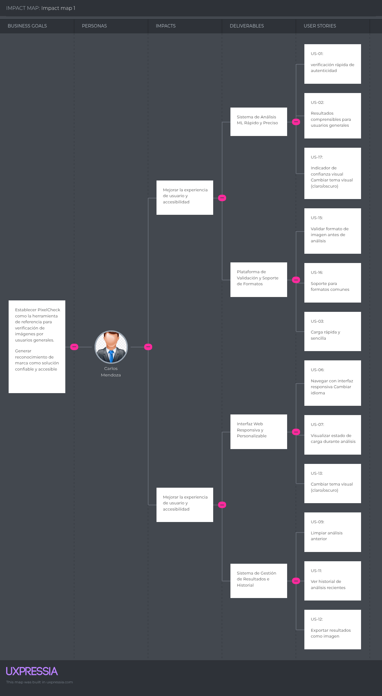
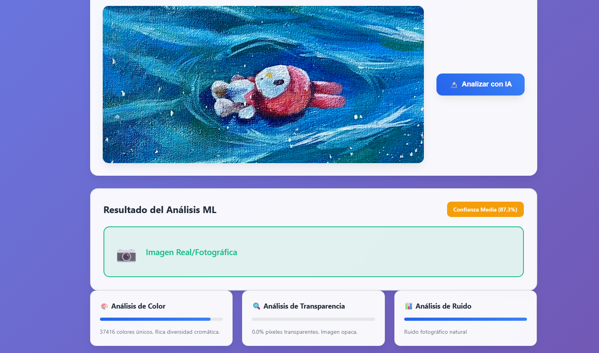

# <center>Informe de Trabajo Final</center>

<p align="center">
  <strong>Universidad Peruana de Ciencias Aplicadas</strong><br>
  <br>
  <strong>Carrera: Ingeniería de Software - 8vo ciclo</strong><br>
  <strong>Curso: Arquitecturas De Software Emergentes</strong><br>
  <strong>Sección: 7295</strong><br>
  <strong>Profesor: Royer Edelwer Rojas Malasquez</strong><br>
  <br><strong>Informe de Trabajo Final</strong>
  <br><strong>Startup: Pixel Dev</strong>
  <br><strong>Producto: PixelCheck</strong>
  <br><strong>Mes y año: Septiembre 2025</strong>
</p>

<div style="text-align: center;">

<h5 style="text-align: center;"> Team Members</h5>

<table style="margin-left: auto; margin-right: auto; text-align: center;">
  <thead>
    <tr>
      <th>Member</th>
      <th>Code</th>
    </tr>
  </thead>
  <tbody>
    <tr>
      <td>Carmelino Dueñas, Michael Stefano</td>
      <td>U202212760</td>
    </tr>
    <tr>
      <td>Palma Obispo, Adrian Enrique Jesus</td>
      <td>U202210066</td>
    </tr>
    <tr>
      <td>Párraga Gamarra, Paolo Gonzalo</td>
      <td>U202219186</td>
    </tr>
    <tr>
      <td>Gutiérrez García, José Eduardo</td>
      <td>U20222518</td>
    </tr>
  </tbody>
</table>


</div>

<div style="page-break-after: always;"></div>

# Registro de Versiones del Informe


## Registro de Versiones del Informe

|**Versión**|**Fecha**|**Autor**|                                   **Descripción de modificación**                                   |
| :-: | :-: | :-: |:---------------------------------------------------------------------------------------------------:|
|1.0|29/08/2025|Adrian [Capítulo I]|Redacción del perfil de la startup, análisis de problema y justificación.|
|1.1|05/09/2025|Michael [Capítulo II]|Desarrollo de Lean UX Canvas, definición de hipótesis y user outcomes.|
|1.2|10/09/2025|Paolo [Capítulo III]|Elaboración de user personas, user journey mapping y event storming.|
|1.3|15/09/2025|Jose [Capítulo IV]|Creación de product backlog, domain message flows y context mapping.|
|1.4|16/09/2025|Adrian|Actualización de la justificación y objetivos del Capítulo I.|
|1.5|18/09/2025|Michael|Agregado de entrevistas y resumen de entrevistas en Capítulo II.|
|1.6|19/09/2025|Paolo|Actualización de user stories y technical stories en Capítulo III.|
|1.7|20/09/2025|Jose|Elaboración de bounded context canvas y diagramas de despliegue en Capítulo IV.|
|1.8|20/09/2025|Todos|Revisión general, ajustes de formato y bibliografía.|

# Project Report Collaboration Insights

## Repositorios:

- Informe: https://github.com/PixelCheckORG/Informe

<div style="page-break-after: always;"></div>

# Contenido

## Tabla de contenidos

- [Student Outcome](#student-outcome)
- [Capítulo I: Introducción](#capítulo-i-introducción)
  - [1.1. Startup Profile](#11-startup-profile)
    - [1.1.1. Descripción de la Startup](#111-descripción-de-la-startup)
    - [1.1.2. Perfiles de integrantes del equipo](#112-perfiles-de-integradores-del-equipo)
  - [1.2. Solution Profile](#12-solution-profile)
    - [1.2.1 Antecedentes y problemática](#121-antecedentes-y-problemática)
    - [1.2.2. Lean UX Process](#122-lean-ux-process)
      - [1.2.2.1. Lean UX Problem Statements](#1221-lean-ux-problem-statements)
      - [1.2.2.2. Lean UX Assumptions](#1222-lean-ux-assumptions)
      - [1.2.2.3. Lean UX Hypothesis Statements](#1223-lean-ux-hypothesis-statements)
      - [1.2.2.4. Lean UX Canvas](#1224-lean-ux-canvas)
  - [1.3. Segmentos objetivo](#13-segmentos-objetivo)
- [Capítulo II: Requirements Elicitation & Analysis](#capítulo-ii-requirements-elicitation--analysis)
  - [2.1. Competidores](#21-competidores)
    - [2.1.1. Análisis competitivo](#211-análisis-competitivo)
    - [2.1.2. Estrategias y tácticas frente a competidores](#212-estrategias-y-tácticas-frente-a-competidores)
  - [2.2. Entrevistas](#22-entrevistas)
    - [2.2.1. Diseño de entrevistas](#221-diseño-de-entrevistas)
    - [2.2.2. Registro de entrevistas](#222-registro-de-entrevistas)
    - [2.2.3. Análisis de entrevistas](#223-análisis-de-entrevistas)
  - [2.3. Needfinding](#23-needfinding)
    - [2.3.1. User Personas](#231-user-personas)
    - [2.3.2. User Task Matrix](#232-user-task-matrix)
    - [2.3.3. Empathy Mapping](#233-empathy-mapping)
    - [2.3.4. As-is Scenario Mapping](#234-as-is-scenario-mapping)
  - [2.4. Ubiquitous Language](#24-ubiquitous-language)
- [Capítulo III: Requirements Specification](#capítulo-iii-requirements-specification)
  - [3.1. To-Be Scenario Mapping](#31-to-be-scenario-mapping)
  - [3.2. User Stories](#32-user-stories)
  - [3.3. Impact Mapping](#33-impact-mapping)
  - [3.4. Product Backlog](#34-product-backlog)
- [Capítulo IV: Strategic-Level Software Design](#capítulo-iv-strategic-level-software-design)
  - [4.1. Strategic-Level Attribute-Driven Design](#41-strategic-level-attribute-driven-design)
    - [4.1.1. Design Purpose](#411-design-purpose)
    - [4.1.2. Attribute-Driven Design Inputs](#412-attribute-driven-design-inputs)
      - [4.1.2.1. Primary Functionality (Primary User Stories)](#4121-primary-functionality-primary-user-stories)
      - [4.1.2.2. Quality attribute Scenarios](#4122-quality-attribute-scenarios)
      - [4.1.2.3. Constraints](#4123-constraints)
    - [4.1.3. Architectural Drivers Backlog](#413-architectural-drivers-backlog)
    - [4.1.4. Architectural Design Decisions](#414-architectural-design-decisions)
    - [4.1.5. Quality Attribute Scenario Refinements](#415-quality-attribute-scenario-refinements)
  - [4.2. Strategic-Level Domain-Driven Design](#42-strategic-level-domain-driven-design)
    - [4.2.1. EventStorming](#421-eventstorming)
    - [4.2.2. Candidate Context Discovery](#422-candidate-context-discovery)
    - [4.2.3. Domain Message Flows Modeling](#423-domain-message-flows-modeling)
    - [4.2.4. Bounded Context Canvases](#424-bounded-context-canvases)
    - [4.2.5. Context Mapping](#425-context-mapping)
  - [4.3. Software Architecture](#43-software-architecture)
    - [4.3.1. Software Architecture System Landscape Diagram](#431-software-architecture-system-landscape-diagram)
    - [4.3.2. Software Architecture Context Level Diagrams](#432-software-architecture-context-level-diagrams)
    - [4.3.3. Software Architecture Container Level Diagrams](#433-software-architecture-container-level-diagrams)
    - [4.3.4. Software Architecture Deployment Diagrams](#434-software-architecture-deployment-diagrams)
- [Capítulo V: Tactical-Level Software Design](#capítulo-v-tactical-level-software-design)
  - [5.X. Bounded Context: [Bounded Context Name]](#5x-bounded-context-bounded-context-name)
    - [5.X.1. Domain Layer](#5x1-domain-layer)
    - [5.X.2. Interface Layer](#5x2-interface-layer)
    - [5.X.3. Application Layer](#5x3-application-layer)
    - [5.X.4. Infrastructure Layer](#5x4-infrastructure-layer)
    - [5.X.5. Bounded Context Software Architecture Component Level Diagrams](#5x5-bounded-context-software-architecture-component-level-diagrams)
    - [5.X.6. Bounded Context Software Architecture Code Level Diagrams](#5x6-bounded-context-software-architecture-code-level-diagrams)
      - [5.X.6.1. Bounded Context Domain Layer Class Diagrams](#5x61-bounded-context-domain-layer-class-diagrams)
      - [5.X.6.2. Bounded Context Database Design Diagram](#5x62-bounded-context-database-design-diagram)
- [Capítulo VI: Solution UX Design](#capítulo-vi-solution-ux-design)
  - [6.1. Style Guidelines](#61-style-guidelines)
    - [6.1.1. General Style Guidelines](#611-general-style-guidelines)
    - [6.1.2. Web, Mobile & Devices Style Guidelines](#612-web-mobile--devices-style-guidelines)
  - [6.2. Information Architecture](#62-information-architecture)
    - [6.2.1. Labeling Systems](#621-labeling-systems)
    - [6.2.2. Searching Systems](#622-searching-systems)
    - [6.2.3. SEO Tags and Meta Tags](#623-seo-tags-and-meta-tags)
    - [6.2.4. Navigation Systems](#624-navigation-systems)
  - [6.3. Landing Page UI Design](#63-landing-page-ui-design)
    - [6.3.1. Landing Page Wireframe](#631-landing-page-wireframe)
    - [6.3.2. Landing Page Mock-up](#632-landing-page-mock-up)
  - [6.4. Applications UX/UI Design](#64-applications-uxui-design)
    - [6.4.1. Applications Wireframes](#641-applications-wireframes)
    - [6.4.2. Applications Wireflow Diagrams](#642-applications-wireflow-diagrams)
    - [6.4.3. Applications Mock-ups](#643-applications-mock-ups)
    - [6.4.4. Applications User Flow Diagrams](#644-applications-user-flow-diagrams)
  - [6.5. Applications Prototyping](#65-applications-prototyping)
- [Capítulo VII: Product Implementation, Validation & Deployment](#capítulo-vii-product-implementation-validation--deployment)
  - [7.1. Software Configuration Management](#71-software-configuration-management)
    - [7.1.1. Software Development Environment Configuration](#711-software-development-environment-configuration)
    - [7.1.2. Source Code Management](#712-source-code-management)
    - [7.1.3. Source Code Style Guide & Conventions](#713-source-code-style-guide--conventions)
    - [7.1.4. Software Deployment Configuration](#714-software-deployment-configuration)
  - [7.2. Solution Implementation](#72-solution-implementation)
    - [7.2.X. Sprint n](#72x-sprint-n)
      - [7.2.X.1. Sprint Planning n](#72x1-sprint-planning-n)
      - [7.2.X.2. Sprint Backlog n](#72x2-sprint-backlog-n)
      - [7.2.X.3. Development Evidence for Sprint Review](#72x3-development-evidence-for-sprint-review)
      - [7.2.X.4. Testing Suite Evidence for Sprint Review](#72x4-testing-suite-evidence-for-sprint-review)
      - [7.2.X.5. Execution Evidence for Sprint Review](#72x5-execution-evidence-for-sprint-review)
      - [7.2.X.6. Services Documentation Evidence for Sprint Review](#72x6-services-documentation-evidence-for-sprint-review)
      - [7.2.X.7. Software Deployment Evidence for Sprint Review](#72x7-software-deployment-evidence-for-sprint-review)
      - [7.2.X.8. Team Collaboration Insights during Sprint](#72x8-team-collaboration-insights-during-sprint)
  - [7.3. Validation Interviews](#73-validation-interviews)
    - [7.3.1. Diseño de Entrevistas](#731-diseño-de-entrevistas)
    - [7.3.2. Registro de Entrevistas](#732-registro-de-entrevistas)
    - [7.3.3. Evaluaciones según heurísticas](#733-evaluaciones-según-heurísticas)
  - [7.4. Video About-the-Product](#74-video-about-the-product)

<div style="page-break-after: always;"></div>

# Student Outcome

El curso contribuye al cumplimiento del Student Outcome ABET:

**ABET – EAC - Student Outcome 3**

Criterio: Capacidad de comunicarse efectivamente con un rango de audiencias.
En el siguiente cuadro se describe las acciones realizadas y enunciados de
conclusiones por parte del grupo, que permiten sustentar el haber alcanzado el logro
del ABET – EAC - Student Outcome 3.
| **Criterio Específico**                                                                                                                                                                   | **Acciones Realizadas**                                                                                                                                                                                                                                                                                                                                                                                                                                                                                                                                                                                                                                                                                                                                                                                                                                                                                                                                                                                                                                                                                                                                                                                                                                                                                                                                                                                                                                                                                                                                                    | **Conclusiones**                                                                                                                                                                                                                                                                                                                                                                                                                      |
| ----------------------------------------------------------------------------------------------------------------------------------------------------------------------------------------- | -------------------------------------------------------------------------------------------------------------------------------------------------------------------------------------------------------------------------------------------------------------------------------------------------------------------------------------------------------------------------------------------------------------------------------------------------------------------------------------------------------------------------------------------------------------------------------------------------------------------------------------------------------------------------------------------------------------------------------------------------------------------------------------------------------------------------------------------------------------------------------------------------------------------------------------------------------------------------------------------------------------------------------------------------------------------------------------------------------------------------------------------------------------------------------------------------------------------------------------------------------------------------------------------------------------------------------------------------------------------------------------------------------------------------------------------------------------------------------------------------------------------------------------------------------------------------- | ------------------------------------------------------------------------------------------------------------------------------------------------------------------------------------------------------------------------------------------------------------------------------------------------------------------------------------------------------------------------------------------------------------------------------------- |
| **Comunica oralmente sus ideas y/o resultados con objetividad a público de diferentes especialidades y niveles jerárquicos, en el marco del desarrollo de un proyecto en ingeniería.**    | <br>**TB1:**<br><br>Yo, **José Eduardo Gutiérrez García**, realicé las **entrevistas a usuarios**, incluyendo el diseño, la recopilación de información y el análisis de resultados. Además, expuse la **documentación técnica de los diagramas C4**, mostrando la arquitectura del sistema a nivel de landscape, contexto, contenedores y despliegue.<br><br>Yo, **Paolo Gonzalo Párraga Gamarra**, desarrollé completamente la **especificación de requerimientos**, que incluyó el **mapeo de escenarios futuros (To-Be)**, la definición de **User Stories**, la elaboración del **Impact Mapping** y la priorización en el **Product Backlog**. También participé en la explicación de puntos clave de la **arquitectura estratégica**.<br><br>Yo, **Michael Stefano Carmelino Dueñas**, elaboré el **análisis de competidores** y sus estrategias, conduje el proceso de **Needfinding** mediante la construcción de **User Personas, User Task Matrix, Empathy Mapping y As-Is Scenario Mapping**, y definí el **lenguaje ubicuo** del proyecto. Asimismo, presenté el **planeamiento del producto**, guiando la visión de la solución.<br><br>Yo, **Adrián Enrique Jesús Palma Obispo**, presenté el **Startup Profile**, los **perfiles de los integrantes del equipo**, el **Solution Profile**, la identificación de **antecedentes y problemática**, y apliqué el **Lean UX Process**, desarrollando los **problem statements, assumptions, hypothesis statements y el Lean UX Canvas**. También expuse los **segmentos objetivo** y el **prototipo MVP Web**. | En **TB1** demostré mi capacidad de **comunicación oral efectiva**, presentando resultados, metodologías y propuestas con **claridad y objetividad**. Pude **adaptar el lenguaje según la audiencia**, desde explicaciones técnicas hasta enfoques más generales. Con ello, evidencié mi **competencia en el logro del curso** y en el **Student Outcome 3 de ABET**, vinculado con la comunicación oral.                             |
| **Comunica en forma escrita ideas y/o resultados con objetividad a público de diferentes especialidades y niveles jerárquicos, en el marco del desarrollo de un proyecto en ingeniería.** | <br>**TB1:**<br><br>Yo, **José Eduardo Gutiérrez García**, documenté de manera detallada las **entrevistas realizadas**, presentando la metodología y los hallazgos más relevantes. También elaboré la **documentación técnica de los diagramas C4**, describiendo con precisión la arquitectura del sistema y sus diferentes vistas.<br><br>Yo, **Paolo Gonzalo Párraga Gamarra**, redacté íntegramente la **especificación de requerimientos**, que incluyó el mapeo de escenarios futuros, la definición de historias de usuario, la construcción del impact mapping y la organización del product backlog. Adicionalmente, aporté en la documentación técnica de la **arquitectura estratégica**.<br><br>Yo, **Michael Stefano Carmelino Dueñas**, redacté el **análisis de requerimientos**, incluyendo el estudio de competidores, el análisis de entrevistas, la definición de user personas, task matrix, empathy mapping, escenarios actuales y el lenguaje ubicuo. También me encargué de la **documentación del planeamiento del producto**.<br><br>Yo, **Adrián Enrique Jesús Palma Obispo**, elaboré el informe que incluyó el **Startup Profile**, el **Solution Profile**, los **antecedentes y la problemática**, así como la documentación completa del **Lean UX Process** con problem statements, assumptions, hypothesis statements y Lean UX Canvas. También desarrollé el **canvas de modelo de negocio** y la descripción del **MVP Web**.                                                                                                          | En **TB1** demostré mi capacidad de **comunicación escrita clara y estructurada**, logrando plasmar de manera **objetiva y comprensible** el proceso seguido y los resultados alcanzados. El documento permitió que personas con distintos niveles de especialización comprendieran el análisis y la propuesta. Con ello, evidencié mi **aporte al logro del curso** y al **Student Outcome 3 de ABET**, en su **dimensión escrita**. |

| **Criterio Específico**                                                                                                                                                                   | **Acciones Realizadas**                                                                                                                                                                                                                                                                                                                                                                                                                                                                                                                                                                                                                                                                                                                                                                                                                                                                                                                                                                                                                                                                                                                                                                                                                                                                                                                                                                                                                                                                                                                                                    | **Conclusiones**                                                                                                                                                                                                                                                                                                                                                                                                                      |
| ----------------------------------------------------------------------------------------------------------------------------------------------------------------------------------------- | ---------------------------------------------------------------------------------------------------------------------------------------------------------------------------------------------------------------------------------------------------------------------------------------------------------------------------------------------------------------------------------------------------------------------------------------------------------------------------------------------------------------------------------------------------------------------------------------------------------------------------------------------------------------------------------------------------------------------------------------------------------------------------------------------------------------------------------------------------------------------------------------------------------------------------------------------------------------------------------------------------------------------------------------------------------------------------------------------------------------------------------------------------------------------------------------------------------------------------------------------------------------------------------------------------------------------------------------------------------------------------------------------------------------------------------------------------------------------------------------------------------- | ------------------------------------------------------------------------------------------------------------------------------------------------------------------------------------------------------------------------------------------------------------------------------------------------------------------------------------------------------------------------------------------------------------------------------------- |
| **Comunica oralmente sus ideas y/o resultados con objetividad a público de diferentes especialidades y niveles jerárquicos, en el marco del desarrollo de un proyecto en ingeniería.**    | <br>**TB1:**<br><br>Yo, **José Eduardo Gutiérrez García**, realicé las **entrevistas a usuarios**, incluyendo el diseño, la recopilación de información y el análisis de resultados. Además, expuse la **documentación técnica de los diagramas C4**, mostrando la arquitectura del sistema a nivel de landscape, contexto, contenedores y despliegue.<br><br>Yo, **Paolo Gonzalo Párraga Gamarra**, desarrollé completamente la **especificación de requerimientos**, que incluyó el **mapeo de escenarios futuros (To-Be)**, la definición de **User Stories**, la elaboración del **Impact Mapping** y la priorización en el **Product Backlog**. También participé en la explicación de puntos clave de la **arquitectura estratégica**.<br><br>Yo, **Michael Stefano Carmelino Dueñas**, elaboré el **análisis de competidores** y sus estrategias, conduje el proceso de **Needfinding** mediante la construcción de **User Personas, User Task Matrix, Empathy Mapping y As-Is Scenario Mapping**, y definí el **lenguaje ubicuo** del proyecto. Asimismo, presenté el **planeamiento del producto**, guiando la visión de la solución.<br><br>Yo, **Adrián Enrique Jesús Palma Obispo**, presenté el **Startup Profile**, los **perfiles de los integrantes del equipo**, el **Solution Profile**, la identificación de **antecedentes y problemática**, y apliqué el **Lean UX Process**, desarrollando los **problem statements, assumptions, hypothesis statements y el Lean UX Canvas**. También expuse los **segmentos objetivo** y el **prototipo MVP Web**. | En **TB1** demostré mi capacidad de **comunicación oral efectiva**, presentando resultados, metodologías y propuestas con **claridad y objetividad**. Pude **adaptar el lenguaje según la audiencia**, desde explicaciones técnicas hasta enfoques más generales. Con ello, evidencié mi **competencia en el logro del curso** y en el **Student Outcome 3 de ABET**, vinculado con la comunicación oral.                             |
| **Comunica en forma escrita ideas y/o resultados con objetividad a público de diferentes especialidades y niveles jerárquicos, en el marco del desarrollo de un proyecto en ingeniería.** | <br>**TB1:**<br><br>Yo, **José Eduardo Gutiérrez García**, documenté de manera detallada las **entrevistas realizadas**, presentando la metodología y los hallazgos más relevantes. También elaboré la **documentación técnica de los diagramas C4**, describiendo con precisión la arquitectura del sistema y sus diferentes vistas.<br><br>Yo, **Paolo Gonzalo Párraga Gamarra**, redacté íntegramente la **especificación de requerimientos**, que incluyó el mapeo de escenarios futuros, la definición de historias de usuario, la construcción del impact mapping y la organización del product backlog. Adicionalmente, aporté en la documentación técnica de la **arquitectura estratégica**.<br><br>Yo, **Michael Stefano Carmelino Dueñas**, redacté el **análisis de requerimientos**, incluyendo el estudio de competidores, el análisis de entrevistas, la definición de user personas, task matrix, empathy mapping, escenarios actuales y el lenguaje ubicuo. También me encargué de la **documentación del planeamiento del producto**.<br><br>Yo, **Adrián Enrique Jesús Palma Obispo**, elaboré el informe que incluyó el **Startup Profile**, el **Solution Profile**, los **antecedentes y la problemática**, así como la documentación completa del **Lean UX Process** con problem statements, assumptions, hypothesis statements y Lean UX Canvas. También desarrollé el **canvas de modelo de negocio** y la descripción del **MVP Web**.                                                                                                          | En **TB1** demostré mi capacidad de **comunicación escrita clara y estructurada**, logrando plasmar de manera **objetiva y comprensible** el proceso seguido y los resultados alcanzados. El documento permitió que personas con distintos niveles de especialización comprendieran el análisis y la propuesta. Con ello, evidencié mi **aporte al logro del curso** y al **Student Outcome 3 de ABET**, en su **dimensión escrita**. |

<div style="page-break-after: always;"></div>

# Capítulo I: Introducción

## 1.1. Startup Profile

### 1.1.1. Descripción de la Startup

PixelCheck es una startup enfocada en el desarrollo de soluciones para la verificación de contenido visual. Su producto principal, una aplicación web ligera, permite detectar si una imagen fue generada por inteligencia artificial (IA), combinando análisis de patrones de píxeles, distribución de colores y texturas, presencia o ausencia de ruido natural y revisión de metadatos. La startup busca brindar herramientas confiables y accesibles que ayuden a usuarios y profesionales a diferenciar contenido real de contenido generado artificialmente, potenciando la transparencia en medios digitales.

### 1.1.2. Perfiles de integrantes del equipo

El equipo de PixelCheck está conformado por profesionales multidisciplinarios:

| Nombre                   | Descripción | Foto |
|--------------------------|-------------|------|
| Gutierrez Garcia, José Eduardo | Tengo 21 años, actualmente me encuentro cruzando mi 8vo ciclo de la carrera de ingeniería de software en la UPC. Me gusta jugar videojuegos y practicar natación, soy un gran aficionado de la tecnología y del ensamblaje de computadoras. Me considero una persona dispuesta siempre a aprender tecnologías nuevas, creativa y responsable.<br> | |
| Paolo Gonzalo Párraga Gamarra | Soy Paolo Párraga, estudiante de ingeniería de software en séptimo ciclo. Soy una persona que disfruta trabajar duro para lograr mis objetivos y nunca me rindo a pesar de los momentos difíciles. Me gusta el trabajo en equipo porque siento que puedo aportar a mis compañeros cuando lo necesiten.| |
| Palma Obispo, Adrián Enrique Jesús | Tengo 20 años y actualmente curso el 7mo ciclo de Ingeniería de Software en la Universidad Peruana de Ciencias Aplicadas (UPC). Me apasiona la programación y el desarrollo web, tengo experiencia en proyectos freelance y disfruto trabajar en equipo. Me considero una persona creativa, responsable y siempre dispuesta a aprender nuevas tecnologías, especialmente en el área de diseño de experiencia de usuario y gestión de proyectos. |  |
| Michael Stefano Carmelino Dueñas | Soy Michael Carmelino, estudiante de la carrera de Ingeniería de Software en la Universidad Peruana de Ciencias Aplicadas (UPC), actualmente cursando el séptimo ciclo. Soy una persona que le gusta el trabajo en equipo donde haya una comunicación y formas de integrarse entre todos para llegar a un fin común.<br><br>Me gusta desarrollar proyectos que tengan que ver con la seguridad en ciertos aspectos pero también me gusta hacer proyectos que me den a mí facilidades en lo personal o por diversión.<br> |  |
## 1.2. Solution Profile

La solución propuesta consiste en una plataforma digital orientada a la reserva y gestión de cubículos de estudio dentro de entornos académicos. El sistema busca resolver los problemas actuales de disponibilidad, falta de organización y poca visibilidad en el uso de espacios, brindando a los estudiantes una herramienta intuitiva para realizar reservas rápidas y seguras, y a los administradores un panel centralizado para supervisar la ocupación y optimizar la gestión de recursos. De esta forma, se garantiza una experiencia más ordenada, transparente y eficiente tanto para usuarios generales como para la administración de la institución.

**Tecnologías Emergentes Utilizadas**

En el desarrollo de la solución, se incorpora Machine Learning (ML) como tecnología emergente clave para mejorar la experiencia de los usuarios y aportar valor agregado al sistema. El uso de ML permite analizar patrones de uso en las reservas y en la gestión de espacios, anticipando necesidades de los usuarios y optimizando la asignación de recursos.

Con esta integración, el sistema no solo cumple con las funcionalidades básicas de registro, reservas y administración, sino que además adquiere la capacidad de aprender del comportamiento de los usuarios y ofrecer recomendaciones inteligentes, lo cual contribuye a la escalabilidad futura y posiciona la solución dentro de la tendencia de aplicaciones inteligentes en el mercado educativo.

### 1.2.1. Antecedentes y problemática

El aumento exponencial de imágenes generadas por IA ha generado desafíos en la veracidad de la información visual. Plataformas y medios digitales se enfrentan a la dificultad de diferenciar contenido real de contenido manipulado o generado artificialmente. Esto provoca riesgos de desinformación y disminuye la confianza en medios digitales. PixelCheck surge como solución para proporcionar a usuarios generales y profesionales herramientas precisas y rápidas para verificar la autenticidad de imágenes, utilizando técnicas avanzadas de Machine Learning y análisis de imágenes.

### 1.2.2. Lean UX Process

PixelCheck adopta un enfoque **Lean UX**, centrado en validar hipótesis de usuario mediante iteraciones rápidas y feedback constante. Este proceso permite construir una experiencia efectiva, enfocada en resolver los problemas más relevantes de los usuarios.

#### 1.2.2.1. Lean UX Problem Statements

* Los usuarios tienen dificultades para identificar imágenes generadas por IA en medios digitales.
* Las herramientas existentes son complejas, lentas o inaccesibles para usuarios generales.
* Existe falta de confianza en la autenticidad de contenido visual en redes sociales y medios online.

#### 1.2.2.2. Lean UX Assumptions

* Los usuarios buscan una herramienta ligera y rápida para verificar imágenes.
* La mayoría de los usuarios no posee conocimientos técnicos profundos sobre Machine Learning o procesamiento de imágenes.
* La visualización de resultados claros y comprensibles incrementa la confianza en la herramienta.
* La detección de patrones de píxeles, ruido y metadatos es suficiente para diferenciar imágenes reales de generadas por IA con alta precisión.

#### 1.2.2.3. Lean UX Hypothesis Statements

* Si proporcionamos un análisis accesible y comprensible de imágenes, entonces los usuarios podrán diferenciar imágenes reales de generadas por IA de manera confiable.
* Si la aplicación permite filtrar resultados y analizar múltiples características (colores, texturas, ruido, metadatos), entonces los usuarios técnicos podrán tomar decisiones informadas sobre la autenticidad del contenido.
* Si la interfaz es responsiva y ligera, entonces los usuarios podrán utilizar la herramienta en cualquier dispositivo sin inconvenientes.


#### 1.2.2.4. Lean UX Canvas


## 1.3. Segmentos objetivo

* **Usuarios generales de internet:**
  Personas que consumen contenido en redes sociales y sitios de noticias, que necesitan verificar rápidamente si una imagen es real o generada por IA, sin requerir conocimientos técnicos avanzados.

* **Profesionales de medios y comunicación:**
  Editores, periodistas y creadores de contenido que requieren herramientas precisas para analizar imágenes, asegurando la autenticidad antes de su publicación.


<div style="page-break-after: always;"></div>

# Capítulo II: Requirements Elicitation & Analysis

## 2.1. Competidores

### 2.1.1. Análisis competitivo

El mercado de detección de imágenes generadas por IA presenta competidores establecidos con diferentes enfoques y segmentos objetivo. A continuación se presenta un análisis detallado de los tres principales competidores identificados:

| **Competidor** | **Fortalezas** | **Debilidades** | **Segmento Objetivo** | **Modelo de Precios** | **Precisión** |
|---|---|---|---|---|---|
| **Sightengine** | • Líder en precisión (98.3%)<br>• API robusta para desarrolladores<br>• Plataforma integral de moderación<br>• Detección sin metadatos | • Interfaz compleja para usuarios generales<br>• Precio elevado (80x más caro que competidores)<br>• Enfoque técnico especializado | Desarrolladores y empresas B2B | Premium/Enterprise | 98.3% |
| **Winston AI** | • Alta precisión (99.98% en texto)<br>• Fácil integración con múltiples plataformas<br>• Enfoque educativo e institucional<br>• Interfaz amigable | • Precio mensual recurrente<br>• Limitado a instituciones principalmente<br>• Mayor enfoque en texto que imágenes | Instituciones educativas y profesionales | $12/mes (plan básico) | 95%+ |
| **IsItAI** | • Completamente gratuito<br>• Interfaz extremadamente simple<br>• Extensión de Chrome integrada<br>• Sin límites de uso | • Menor precisión reportada<br>• Análisis básico sin detalles técnicos<br>• Falta de características avanzadas | Usuarios generales y casuales | Freemium | 70-85% |

#### Análisis del panorama competitivo

**Gaps identificados en el mercado:**
- **Brecha técnica-accesible:** Existe un vacío entre herramientas ultra-técnicas (Sightengine) y ultra-simples (IsItAI)
- **Transparencia del proceso:** Los competidores muestran resultados pero no explican el "cómo" del análisis
- **Segmento profesional-accesible:** Profesionales de medios necesitan más detalle que IsItAI pero menos complejidad que Sightengine

**Ventajas competitivas de PixelCheck:**
- **Análisis multicapa transparente:** Mostrar análisis de patrones de píxeles, distribución de colores, texturas y metadatos de forma comprensible
- **Enfoque educativo:** Explicar el proceso de detección, no solo el resultado
- **Flexibilidad de audiencia:** Interfaz adaptable para usuarios generales y profesionales

### 2.1.2. Estrategias y tácticas frente a competidores

#### Estrategia de Diferenciación por Transparencia

| **Competidor** | **Su Enfoque** | **Nuestra Táctica Diferenciadora** | **Implementación** |
|---|---|---|---|
| **Sightengine** | API técnica con resultados directos | **Democratización del análisis técnico** | • Visualización interactiva de patrones de píxeles<br>• Explicaciones en lenguaje natural<br>• Interfaz web accesible sin necesidad de API |
| **Winston AI** | Enfoque institucional con integraciones | **Análisis educativo personalizable** | • Niveles de detalle ajustables (básico/avanzado)<br>• Explicaciones paso a paso del proceso<br>• Capacitación integrada sobre detección de IA |
| **IsItAI** | Simplicidad extrema con resultados binarios | **Simplicidad con profundidad opcional** | • Resultado inmediato simple<br>• Opción de "Ver análisis detallado"<br>• Tooltips explicativos interactivos |

#### Estrategias Específicas por Segmento

**Para Usuarios Generales:**
- **Táctica de Entrada Suave:** Interfaz simple similar a IsItAI pero con opción de "aprender más"
- **Gamificación Educativa:** "¿Puedes detectar esta imagen IA?" con explicaciones posteriores
- **Comparación Visual:** Mostrar lado a lado qué características indican contenido IA

**Para Profesionales de Medios:**
- **Análisis Forense Visual:** Mapas de calor mostrando áreas sospechosas en la imagen
- **Reportes Exportables:** Documentación técnica para verificación editorial
- **Integración con Flujos de Trabajo:** Plugins para herramientas de edición populares

#### Tácticas de Posicionamiento

| **Estrategia** | **Contra Sightengine** | **Contra Winston AI** | **Contra IsItAI** |
|---|---|---|---|
| **Mensaje Principal** | "La precisión técnica de Sightengine, pero accesible para todos" | "Análisis de imágenes especializado vs. herramienta generalista" | "La facilidad de IsItAI con la profundidad que necesitas" |
| **Táctica Clave** | Demos comparativos mostrando mismo nivel de análisis con interfaz más amigable | Enfoque exclusivo en imágenes con características específicas (análisis de ruido, texturas) | Freemium con características premium educativas |
| **Diferenciador** | Transparencia del proceso vs. "caja negra" | Profundidad técnica específica para imágenes | Educación y transparencia vs. simplicidad ciega |

#### Estrategia de Precios Competitiva

| **Segmento** | **Estrategia** | **Justificación** |
|---|---|---|
| **Usuarios Generales** | **Freemium Educativo** | Competir con IsItAI gratuito pero agregar valor educativo |
| **Profesionales** | **Valor Medio** ($6-8/mes) | Posicionarse entre IsItAI (gratis) y Winston AI ($12/mes) |
| **Empresas** | **Personalizado** | Competir con Sightengine en valor, no en precio |

#### Plan de Implementación Táctica

**Fase 1 - Lanzamiento (0-3 meses):**
- Posicionamiento anti-"caja negra": "Ve exactamente cómo detectamos IA"
- Contenido educativo: Blog sobre técnicas de detección
- Demos interactivos comparando con competidores

**Fase 2 - Crecimiento (3-6 meses):**
- Partnerships con escuelas de periodismo y comunicación
- Certificaciones de detección de IA para profesionales
- Integración con herramientas de verificación de fact-checkers

**Fase 3 - Expansión (6-12 meses):**
- API competitiva con Sightengine pero con mejor documentación
- Marketplace de plugins para herramientas de edición
- Programa de afiliados con educadores y profesionales de medios

## 2.2. Entrevistas

### 2.2.1. Diseño de entrevistas

### Preguntas Generales

1. ¿ Cual es tu nombre?
2. ¿ Cual es tu edad?
3. ¿ Donde Resides?
4. ¿Cual es tu Ocupación?

### Segmento 1: Usuarios Generales de Internet

1. ¿Con qué frecuencia consumes contenido visual (imágenes, memes, noticias) en redes sociales y sitios web?

2. ¿Has tenido alguna experiencia donde dudaste si una imagen era real o creada artificialmente?

3. ¿Qué haces actualmente cuando sospechas que una imagen podría ser falsa o generada por IA?

4. En una escala del 1 al 10, ¿qué tan importante consideras poder identificar imágenes generadas por IA?

5. ¿Prefieres obtener una respuesta rápida (sí/no es IA) o te interesaría entender el "por qué" detrás del resultado?

6. ¿Estarías dispuesto/a a usar una herramienta que te tome 30 segundos analizar una imagen si te da resultados confiables?

7. ¿Qué dispositivos usas más frecuentemente para ver contenido en línea? (móvil, tablet, computadora)

8. ¿Pagarías por una herramienta de detección de imágenes IA? Si sí, ¿cuánto máximo al mes?

9. ¿Qué tan cómodo te sientes con tecnología en general? ¿Prefieres interfaces simples o no te molestan las opciones avanzadas?

10. Si pudieras diseñar la herramienta perfecta para detectar imágenes IA, ¿cuáles serían sus 3 características más importantes?

### Segmento 2: Profesionales de Medios y Comunicación

1. ¿Cuál es tu rol específico en medios/comunicación y con qué frecuencia trabajas con imágenes en tu día a día?

2. ¿Has enfrentado situaciones donde la autenticidad de una imagen fue crítica para tu trabajo? Cuéntame sobre esa experiencia.

3. ¿Qué procesos o herramientas utilizas actualmente para verificar la autenticidad de imágenes antes de publicarlas?

4. ¿Cuánto tiempo puedes dedicar típicamente a verificar la autenticidad de una imagen en tu flujo de trabajo?

5. ¿Qué nivel de confianza necesitas en un resultado para considerarlo válido para publicación? (porcentaje, documentación, etc.)

6. ¿Necesitarías poder generar reportes o documentación del análisis para tu organización o archivo?

7. ¿Trabajas solo/a en la verificación de imágenes o necesitas colaborar con otros miembros del equipo en este proceso?

8. ¿Qué información técnica te sería útil conocer sobre una imagen además de si es IA o no? (metadatos, tipo de generador, etc.)

9. ¿Tu organización tendría presupuesto para herramientas especializadas de verificación? ¿En qué rango de precios?

10. ¿Cómo te gustaría integrar una herramienta de detección de IA en tu flujo de trabajo actual? (plugin, API, web app, etc.)


### 2.2.2. Registro de entrevistas

**Entrevista para el Segmento Objetivo 1 - Usuarios Generales de Internet:**

---

Entrevista N°1:

**Entrevistado:** Piero Delgado<br>
**Sexo:** Masculino <br>
**Edad:** 22 años<br>
**Domicilio:** San Miguel, Lima<br>
**Inicio de la Entrevista:** 0:12<br>
**Duración de la Entrevista:** 4:03<br>

<br>

**Enlace:** [`https://upcedupe-my.sharepoint.com/:v:/g/personal/u202221518_upc_edu_pe/EbU1K3Kw37RJicXWqdh5hTUBuuuEgMFEweqpZgZiIw_PMQ?nav=eyJyZWZlcnJhbEluZm8iOnsicmVmZXJyYWxBcHAiOiJTdHJlYW1XZWJBcHAiLCJyZWZlcnJhbFZpZXciOiJTaGFyZURpYWxvZy1MaW5rIiwicmVmZXJyYWxBcHBQbGF0Zm9ybSI6IldlYiIsInJlZmVycmFsTW9kZSI6InZpZXcifX0%3D&e=jbLISr`](https://upcedupe-my.sharepoint.com/:v:/g/personal/u202221518_upc_edu_pe/EbU1K3Kw37RJicXWqdh5hTUBuuuEgMFEweqpZgZiIw_PMQ?nav=eyJyZWZlcnJhbEluZm8iOnsicmVmZXJyYWxBcHAiOiJTdHJlYW1XZWJBcHAiLCJyZWZlcnJhbFZpZXciOiJTaGFyZURpYWxvZy1MaW5rIiwicmVmZXJyYWxBcHBQbGF0Zm9ybSI6IldlYiIsInJlZmVycmFsTW9kZSI6InZpZXcifX0%3D&e=jbLISr)

**Resumen de la Entrevista:** <br>

Piero Delgado, estudiante de Administración y Marketing de 22 años que reside en San Miguel, comentó que consume contenido visual en redes sociales varias veces al día y que en ocasiones ha dudado de la autenticidad de imágenes, aunque actualmente solo compara fuentes o ignora las que parecen falsas. Considera muy importante (9/10) poder identificar imágenes generadas por IA y prefiere una herramienta que no solo indique si una imagen es real o no, sino que también explique el porqué del resultado. Estaría dispuesto a usar una aplicación que analice imágenes en menos de 30 segundos, especialmente desde su celular, y aunque no pagaría mucho, mencionó un rango de 10 a 15 soles mensuales si es realmente confiable. Prefiere interfaces simples e intuitivas, y destacó que la herramienta ideal debería ser rápida, confiable y con reportes claros para compartir o guardar.

---

Entrevista N°2:

**Entrevistado:** Joaquin Cortez<br>
**Sexo:** Masculino <br>
**Edad:** 21 años<br>
**Domicilio:** Lima<br>
**Inicio de la Entrevista:** 0:00<br>
**Duración de la Entrevista:** 8:30<br>

<br>

**Enlace:** [`https://upcedupe-my.sharepoint.com/:v:/g/personal/u202219186_upc_edu_pe/EfB1wapVTCNNvbFtnP6cU58BSKL2ze7MMJKHsxySug4M_A?e=m70lAE&nav=eyJyZWZlcnJhbEluZm8iOnsicmVmZXJyYWxBcHAiOiJTdHJlYW1XZWJBcHAiLCJyZWZlcnJhbFZpZXciOiJTaGFyZURpYWxvZy1MaW5rIiwicmVmZXJyYWxBcHBQbGF0Zm9ybSI6IldlYiIsInJlZmVycmFsTW9kZSI6InZpZXcifX0%3D`](https://upcedupe-my.sharepoint.com/:v:/g/personal/u202219186_upc_edu_pe/EfB1wapVTCNNvbFtnP6cU58BSKL2ze7MMJKHsxySug4M_A?e=m70lAE&nav=eyJyZWZlcnJhbEluZm8iOnsicmVmZXJyYWxBcHAiOiJTdHJlYW1XZWJBcHAiLCJyZWZlcnJhbFZpZXciOiJTaGFyZURpYWxvZy1MaW5rIiwicmVmZXJyYWxBcHBQbGF0Zm9ybSI6IldlYiIsInJlZmVycmFsTW9kZSI6InZpZXcifX0%3D)

**Resumen de la Entrevista:** El entrevistado es un consumidor digital activo que pasa 2-3 horas diarias consumiendo contenido visual en redes sociales y sitios web, principalmente desde su móvil (70% del tiempo). Ha experimentado directamente la dificultad de distinguir entre imágenes reales y generadas por IA, especialmente con deepfakes de celebridades, y actualmente recurre a métodos básicos como búsqueda inversa en Google para verificar autenticidad. Considera extremadamente importante (9/10) poder identificar contenido artificial debido a preocupaciones sobre desinformación, y estaría dispuesto a pagar hasta $10-25 USD mensuales por una herramienta confiable que analice imágenes en 30 segundos o menos. <br>


---

Entrevista N°3:

**Entrevistado:** Jose Pierola<br>
**Sexo:** Masculino <br>
**Edad:** 21 años<br>
**Domicilio:** Lima<br>
**Inicio de la Entrevista:** 0:00<br>
**Duración de la Entrevista:** 5:06<br>

<br>

**Enlace:** [`https://upcedupe-my.sharepoint.com/:v:/g/personal/u202221518_upc_edu_pe/EbU1K3Kw37RJicXWqdh5hTUBuWQuuEgMFEweqpZgZiIw_PMQ?nav=eyJyZWZlcnJhbEluZm8iOnsicmVmZXJyYWxBcHAiOiJTdHJlYW1XZWJBcHAiLCJyZWZlcnJhbFZpZXciOiJTaGFyZURpYWxvZy1MaW5rIiwicmVmZXJyYWxBcHBQbGF0Zm9ybSI6IldlYiIsInJlZmVycmFsTW9kZSI6InZpZXcifX0%3D&e=jbLISr`](https://upcedupe-my.sharepoint.com/:v:/g/personal/u202221518_upc_edu_pe/EbU1K3Kw37RJicXWqdh5hTUBuWQuuEgMFEweqpZgZiIw_PMQ?nav=eyJyZWZlcnJhbEluZm8iOnsicmVmZXJyYWxBcHAiOiJTdHJlYW1XZWJBcHAiLCJyZWZlcnJhbFZpZXciOiJTaGFyZURpYWxvZy1MaW5rIiwicmVmZXJyYWxBcHBQbGF0Zm9ybSI6IldlYiIsInJlZmVycmFsTW9kZSI6InZpZXcifX0%3D&e=jbLISr)


**Resumen de la Entrevista:** El entrevistado es un usuario ocasional de redes sociales que consume contenido visual principalmente los fines de semana desde su computadora, con un enfoque más hacia noticias que entretenimiento. Aunque no ha tenido experiencias directas sospechando de imágenes falsas, reconoce moderadamente la importancia del tema (6/10) y prefiere soluciones gratuitas o de muy bajo costo. Valora la simplicidad por encima de la funcionalidad avanzada, prefiere respuestas rápidas tipo sí/no sin complicaciones técnicas, y estaría dispuesto a esperar hasta 2 minutos por resultados confiables. Su perfil representa a usuarios menos técnicos que buscan herramientas básicas, intuitivas y accesibles económicamente, priorizando la facilidad de uso sobre características avanzadas. <br>


---

**Entrevista para el Segmento Objetivo 2 - Profesionales de Medios y Comunicación:**

---

Entrevista N°1:

**Entrevistado:** Nasthya Del Carpio<br>
**Sexo:** Femenino <br>
**Edad:** 21 años<br>
**Domicilio:** La perla, Callao<br>
**Inicio de la Entrevista:** 0:12<br>
**Duración de la Entrevista:** 4:03<br>

<br>

**Enlace:** [`https://upcedupe-my.sharepoint.com/:v:/g/personal/u202221518_upc_edu_pe/EZ4vWSOqZ05IhOwIzeAajdsBMUiJd2v-KAkvx2FqzxwX3w?nav=eyJyZWZlcnJhbEluZm8iOnsicmVmZXJyYWxBcHAiOiJTdHJlYW1XZWJBcHAiLCJyZWZlcnJhbFZpZXciOiJTaGFyZURpYWxvZy1MaW5rIiwicmVmZXJyYWxBcHBQbGF0Zm9ybSI6IldlYiIsInJlZmVycmFsTW9kZSI6InZpZXcifX0%3D&e=iOUGaZ`](https://upcedupe-my.sharepoint.com/:v:/g/personal/u202221518_upc_edu_pe/EZ4vWSOqZ05IhOwIzeAajdsBMUiJd2v-KAkvx2FqzxwX3w?nav=eyJyZWZlcnJhbEluZm8iOnsicmVmZXJyYWxBcHAiOiJTdHJlYW1XZWJBcHAiLCJyZWZlcnJhbFZpZXciOiJTaGFyZURpYWxvZy1MaW5rIiwicmVmZXJyYWxBcHBQbGF0Zm9ybSI6IldlYiIsInJlZmVycmFsTW9kZSI6InZpZXcifX0%3D&e=iOUGaZ)

**Resumen de la Entrevista:** <br>

Nasthya, estudiante de Comunicación Audiovisual y practicante en una agencia de publicidad, trabaja diariamente con 20 a 30 imágenes para campañas. Señala que la autenticidad es clave, ya que una vez publicaron imágenes generadas por IA que dañaron la confianza del público. Actualmente revisa metadatos o usa Google Imágenes, pero reconoce que no son procesos confiables ni rápidos, dedicando máximo 5 minutos por imagen. Considera que necesita al menos un 90% de certeza y un sistema de reportes claros para clientes. Piensa que una herramienta como PixelCheck debería integrarse como web app o plugin, con un costo accesible de 30–50 dólares mensuales.

---

Entrevista N°2:

**Entrevistado:** Hanna Pairazaman <br>
**Sexo:** Femenino <br>
**Edad:** 21 años<br>
**Domicilio:** Callao<br>
**Inicio de la Entrevista:** 0:15<br>
**Duración de la Entrevista:** 3:23<br>

<br>

**Enlace:** [`https://upcedupe-my.sharepoint.com/:v:/g/personal/u202221518_upc_edu_pe/EVi6fSL5sP5DnBBJAMQJlm8BlrJc3YoBxIZm260g4J-89A?nav=eyJyZWZlcnJhbEluZm8iOnsicmVmZXJyYWxBcHAiOiJTdHJlYW1XZWJBcHAiLCJyZWZlcnJhbFZpZXciOiJTaGFyZURpYWxvZy1MaW5rIiwicmVmZXJyYWxBcHBQbGF0Zm9ybSI6IldlYiIsInJlZmVycmFsTW9kZSI6InZpZXcifX0%3D&e=FycJx8`](https://upcedupe-my.sharepoint.com/:v:/g/personal/u202221518_upc_edu_pe/EVi6fSL5sP5DnBBJAMQJlm8BlrJc3YoBxIZm260g4J-89A?nav=eyJyZWZlcnJhbEluZm8iOnsicmVmZXJyYWxBcHAiOiJTdHJlYW1XZWJBcHAiLCJyZWZlcnJhbFZpZXciOiJTaGFyZURpYWxvZy1MaW5rIiwicmVmZXJyYWxBcHBQbGF0Zm9ybSI6IldlYiIsInJlZmVycmFsTW9kZSI6InZpZXcifX0%3D&e=FycJx8)

**Resumen de la Entrevista:** <br>

Hanna, estudiante de Periodismo y practicante en un medio digital, usa entre 10 y 15 imágenes diarias en notas y noticias. Resalta la importancia de la verificación, ya que enfrentó casos de fotos manipuladas en política que casi se publican como reales. Actualmente utiliza búsqueda inversa y TinEye, pero considera que no son suficientes. Puede dedicar máximo 10 minutos a la verificación, especialmente en noticias urgentes, y requiere un 95% de certeza para publicar. Valora la generación de reportes para justificar decisiones editoriales y prefiere un portal web o API integrada al CMS. Estima que su organización podría destinar unos 100 dólares mensuales para una herramienta como PixelCheck.

---

Entrevista N°3:

**Entrevistado:** Maria Jose Munisaca<br>
**Sexo:** Femenino <br>
**Edad:** 22 años<br>
**Domicilio:** San Borja, Lima <br>
**Inicio de la Entrevista:** 0:12<br>
**Duración de la Entrevista:** 4:58<br>

<br>

**Enlace:** [`https://upcedupe-my.sharepoint.com/:v:/g/personal/u202221518_upc_edu_pe/EatWsg5UdnhBk0hG4fyjn_kB_w0pCc1vPXz776u7GPcSNw?e=QV4Q06&nav=eyJyZWZlcnJhbEluZm8iOnsicmVmZXJyYWxBcHAiOiJTdHJlYW1XZWJBcHAiLCJyZWZlcnJhbFZpZXciOiJTaGFyZURpYWxvZy1MaW5rIiwicmVmZXJyYWxBcHBQbGF0Zm9ybSI6IldlYiIsInJlZmVycmFsTW9kZSI6InZpZXcifX0%3D`](https://upcedupe-my.sharepoint.com/:v:/g/personal/u202221518_upc_edu_pe/EatWsg5UdnhBk0hG4fyjn_kB_w0pCc1vPXz776u7GPcSNw?e=QV4Q06&nav=eyJyZWZlcn

**Resumen de la Entrevista:** <br>

María José, estudiante de Marketing y practicante en comunicación de una ONG, gestiona materiales visuales para redes y reportes a donantes. Ha enfrentado problemas con imágenes manipuladas con IA que exageraban el impacto de donaciones, lo cual puso en riesgo la transparencia institucional. Actualmente revisa de forma visual y descarta imágenes sospechosas, con un tiempo de 5 a 10 minutos por revisión. Necesita entre 80–90% de certeza y considera fundamental contar con reportes técnicos para sustentar la autenticidad ante socios y donantes. Su ONG tiene un presupuesto limitado (20–30 dólares mensuales) y busca una solución ligera, fácil de usar y basada en web.

---

### 2.2.3. Análisis de entrevistas

### Segmento 1: Usuarios Generales de Internet

**Perfil de Entrevistado:**
- Hombre, 22 años, estudiante universitario
- Consumo: múltiple acceso diario a contenido visual
- Comportamiento: comparación de fuentes o descarte por sospecha

**Expectativas:**
- Importancia de detección IA: 9/10
- Tiempo máximo tolerado: 30 segundos
- Dispositivo preferido: móvil
- Disposición de pago: $3-4 USD mensuales

### Validación de Hipótesis

**Confirmadas:**
- Demanda de herramientas rápidas y precisas
- Insuficiencia de métodos actuales de verificación
- Diferenciación clara entre necesidades profesionales y casuales

**Nuevos Insights:**
- Brecha de precio significativa entre segmentos (12.5x diferencia)
- Necesidad crítica de documentación en contexto profesional
- Preferencia por explicaciones educativas en usuarios generales

### Implicaciones de Producto

**Características Core:**
- Análisis < 30 segundos
- Precisión > 90%
- Interfaz responsive (móvil-first)

**Diferenciación por Segmento:**
- Profesionales: reportes, integraciones, soporte técnico
- Generales: simplicidad, educación, modelo freemium

**Modelo de Precios Validado:**
- Freemium para usuarios generales
- Suscripción profesional: $20-100 USD/mes según organización

### Segmento 2: Profesionales de Medios y Comunicación

**Perfil de Entrevistados:**
- 100% mujeres, edad promedio: 21.3 años
- Roles: practicantes en agencias publicitarias, medios digitales y ONGs
- Ubicación: Lima Metropolitana y Callao

**Uso y Volumen:**
- Procesamiento diario: 10-30 imágenes por profesional
- Tiempo máximo de verificación: 5-10 minutos por imagen
- Métodos actuales: Google Imágenes (100%), TinEye (67%), metadatos (33%)

**Experiencias Críticas:**
- 100% reportó casos de contenido IA que casi se publica o se publicó
- Sectores afectados: política, publicidad, transparencia institucional

**Requisitos Técnicos:**
- Nivel de certeza requerido: 80-95%
- 100% requiere reportes técnicos para justificar decisiones
- Integración preferida: web app (67%), API/CMS (33%)

**Presupuesto Disponible:**
- Rango: $20-100 USD mensuales
- Promedio: $50 USD mensuales

### 2.3.1. User Personas

Se han elaborado los User Persona correspondientes a cada uno de nuestros segmentos objetivos. Estos segmentos incluyen, por un lado, a los usuarios generales de internet que consumen contenido visual en redes sociales y sitios de noticias; y por otro lado, a los profesionales de medios y comunicación que requieren verificación técnica de imágenes. La construcción de estos perfiles se ha basado en los datos obtenidos a partir de las entrevistas realizadas y el análisis competitivo del mercado.

Los user persona nos permiten entender el perfil y comportamiento de cada segmento, ayudando a identificar sus necesidades técnicas y objetivos de forma general para el desarrollo de PixelCheck.

#### Segmento 1: Usuarios Generales de Internet

Presentamos a Carlos Mendoza, un joven estudiante universitario que representa a nuestro primer segmento objetivo. Este user persona encarna las características y necesidades de los usuarios generales que consumen contenido visual diariamente y buscan herramientas simples para verificar la autenticidad de las imágenes que encuentran online. Carlos fue creado a partir del análisis de comportamientos reales identificados durante el proceso de investigación y validación de hipótesis Lean UX.


#### Segmento 2: Profesionales de Medios y Comunicación

Presentamos a Ana García, una editora digital senior que representa a nuestro segundo segmento objetivo. Este user persona fue construido a partir de la información recopilada durante las entrevistas con profesionales del sector medios. Ana encarna las necesidades de precisión, documentación y eficiencia que caracterizan a los profesionales que deben verificar contenido visual como parte crítica de su flujo de trabajo editorial.


### 2.3.2. User Task Matrix

El user task matrix permite identificar y comparar los procesos clave de cada segmento objetivo de PixelCheck, destacando sus similitudes y diferencias en cuanto a frecuencia e importancia para el desarrollo de funcionalidades priorizadas.

| **Necesidad / Función** | **Importancia (Usuarios Generales)** | **Frecuencia (Usuarios Generales)** | **Importancia (Profesionales de Medios)** | **Frecuencia (Profesionales de Medios)** |
|---|---|---|---|---|
| **Detectar si una imagen es generada por IA** | Alta | Media | Alta | Alta |
| **Obtener resultado rápido (sí/no)** | Alta | Media | Alta | Alta |
| **Entender por qué es detectada como IA** | Media | Baja | Alta | Alta |
| **Cargar/subir imagen para análisis** | Alta | Media | Alta | Alta |
| **Analizar múltiples imágenes simultáneamente** | Baja | Baja | Alta | Alta |
| **Generar reportes de verificación** | Baja | Baja | Alta | Media |
| **Acceder desde dispositivo móvil** | Alta | Media | Media | Media |
| **Compartir resultados con otros** | Media | Baja | Alta | Media |
| **Identificar tipo de generador de IA** | Baja | Baja | Media | Media |
| **Exportar análisis técnico detallado** | Baja | Baja | Alta | Media |
| **Verificar metadatos de imagen** | Baja | Baja | Media | Media |
| **Acceso sin registro/cuenta** | Alta | Media | Baja | Baja |

En la matriz presentada, se pueden observar las siguientes tareas con mayor frecuencia e importancia:

#### **Usuarios Generales:**

* **Detectar si una imagen es generada por IA y obtener resultado rápido** 
  - Funcionalidad **más crítica**, con **alta importancia y frecuencia media**. Los usuarios generales necesitan una respuesta clara y rápida sobre la autenticidad de una imagen, sin complejidad técnica adicional.

* **Cargar/subir imagen para análisis y acceso desde dispositivo móvil** 
  - Tareas de **alta importancia** con **frecuencia media**. Requieren una interfaz intuitiva optimizada para móviles que permita subir imágenes de forma sencilla desde redes sociales o galería.

* **Acceso sin registro/cuenta** 
  - De **alta importancia y frecuencia media**. Los usuarios ocasionales prefieren herramientas que no requieran registro, priorizando la facilidad de acceso inmediato.

* **Entender por qué es detectada como IA y compartir resultados** 
  - Funcionalidades de **importancia y frecuencia baja a media**. Pueden ofrecerse como características educativas opcionales para usuarios curiosos por aprender sobre detección de IA.

#### **Profesionales de Medios:**

* **Detectar IA, obtener resultados rápidos y analizar múltiples imágenes** 
  - Tareas **críticas y frecuentes**, esenciales para su flujo de trabajo editorial diario. Requieren herramientas eficientes para procesar volúmenes altos de contenido visual bajo presión de tiempo.

* **Entender por qué es detectada como IA y generar reportes** 
  - Funcionalidades con **alta importancia y frecuencia alta a media**. Necesitan justificación técnica detallada y documentación formal para respaldo editorial y archivo institucional.

* **Cargar imágenes y compartir resultados con equipo** 
  - Actividades de **alta importancia** y **frecuencia alta a media**. Requieren flujos colaborativos integrados con herramientas de trabajo existentes (CMS, Slack, etc.).

* **Exportar análisis técnico detallado e identificar tipo de generador** 
  - Características especializadas de **importancia media-alta** con **frecuencia media**. Necesarias para análisis forense y verificación avanzada en casos de contenido sospechoso.


### 2.3.3. Empathy Mapping

Para la creación del Empathy Map, hemos utilizado la información obtenida de nuestros dos User Personas que representan nuestros segmentos objetivo de PixelCheck. Este mapa nos permite profundizar en la comprensión de las necesidades, pensamientos, emociones y comportamientos de los usuarios, ayudándonos a diseñar soluciones más alineadas con sus expectativas y experiencias reales en el contexto de la verificación de contenido visual.

#### Segmento 1: Usuarios Generales de Internet
En el siguiente Empathy Map tenemos a Carlos Mendoza, un estudiante de comunicaciones de 22 años que consume contenido visual diariamente en redes sociales. Él busca verificar la autenticidad de imágenes de forma simple y rápida antes de compartirlas con amigos y familia. Podemos observar su experiencia, la cual refleja los desafíos de millones de usuarios que se preocupan por no difundir desinformación visual pero carecen de herramientas accesibles para la verificación.


#### Segmento 2: Profesionales de Medios y Comunicación
En el siguiente Empathy Map presentamos a Ana García, una editora digital senior con 8+ años de experiencia que supervisa la verificación de 15-25 artículos diarios con múltiples imágenes. Ella trabaja bajo la presión de deadlines estrictos donde la credibilidad editorial es fundamental para su organización. Podemos observar su experiencia profesional, la cual refleja las necesidades técnicas y operacionales de los profesionales de medios que requieren herramientas precisas y eficientes para mantener la integridad del contenido publicado.


### 2.3.4. As-is Scenario Mapping

El As-is Scenario Mapping permite analizar la situación actual de cada segmento objetivo antes de la implementación de PixelCheck, identificando los procesos existentes, puntos de dolor y oportunidades de mejora en sus flujos de trabajo de verificación de imágenes.

#### Segmento 1: Usuarios Generales de Internet

El As-Is Scenario para el segmento de usuarios generales revela un proceso de verificación de imágenes caracterizado por métodos informales y poco confiables. Los usuarios dependen principalmente de búsquedas en Google, consultas a conocidos, y su intuición personal para determinar la autenticidad de las imágenes. No existe un sistema estructurado de verificación, lo que genera incertidumbre y riesgo de compartir contenido falso inadvertidamente.

**Enlace para visualizar el As-is Scenario Map de Usuarios Generales realizado en Miro:** [Acceso al mapa completo](usuario_general.html)

**Brainstorming:**


**Identify the highs and lows:**


**Positive Areas:**
- Satisfacción al encontrar herramientas simples e intuitivas
- Confianza cuando obtiene resultados claros y comprensibles

**Negative Areas:**
- Frustración ante herramientas muy técnicas o complejas
- Confusión con terminología especializada sin explicaciones

**Blank Areas:**
- Necesidad de explorar cómo integrar la verificación en el flujo natural de consumo de contenido en redes sociales
- Oportunidad de desarrollar características educativas que aumenten la conciencia sobre desinformación visual

#### Segmento 2: Profesionales de Medios y Comunicación

El As-Is Scenario para el segmento de profesionales de medios muestra un proceso de verificación editorial que depende de herramientas básicas como búsqueda reversa de imágenes, verificación manual y consultas con fuentes. Los procesos actuales son lentos, no están estandarizados, carecen de documentación formal y no proporcionan el nivel de certeza técnica requerido para mantener la credibilidad editorial en un entorno de alta presión temporal.

**Enlace para visualizar el As-is Scenario Map de Profesionales de Medios realizado en Miro:** [Acceso al mapa completo](profesional_medios.html)

**Brainstorming:**


**Identify the highs and lows:**


**Positive Areas:**
- Optimismo al descubrir herramientas que cumplen estándares profesionales de precisión
- Satisfacción profesional al implementar procesos que mejoran la credibilidad editorial

**Negative Areas:**
- Cautela y preocupación por el costo-beneficio de nuevas herramientas especializadas
- Estrés por la resistencia del equipo a cambios en workflows establecidos

**Blank Areas:**
- Explorar la integración profunda con sistemas de gestión de contenido (CMS) existentes
- Desarrollar métricas específicas para medir el impacto de la verificación en la credibilidad y eficiencia editorial
- Investigar necesidades de capacitación y certificación profesional en detección de contenido sintético

#### Análisis Comparativo de Escenarios Actuales

| **Aspecto** | **Usuario General** | **Profesional de Medios** |
|---|---|---|
| **Método Principal** | Intuición y búsquedas básicas | Verificación manual y fuentes |
| **Tiempo Disponible** | Flexible, uso ocasional | Limitado por deadlines |
| **Nivel de Certeza Requerido** | Suficiente para decisión personal | Alto, respaldo institucional |
| **Consecuencias de Error** | Vergüenza personal | Daño a credibilidad editorial |
| **Herramientas Actuales** | Google Images, preguntar a otros | TinEye, contacto con fuentes |
| **Documentación** | No requerida | Necesaria para auditorías |

#### Implicaciones para el Diseño de PixelCheck

Los insights obtenidos del As-is Scenario Mapping revelan oportunidades claras para que PixelCheck aborde las brechas identificadas:

**Para Usuarios Generales:**
- Interfaz simple que reduzca la curva de aprendizaje
- Explicaciones educativas que transformen la frustración en conocimiento
- Integración con plataformas de redes sociales para verificación in-situ

**Para Profesionales de Medios:**
- Funcionalidades avanzadas de documentación y reportes
- Integración con herramientas editoriales existentes
- Soporte técnico especializado para casos complejos
- Métricas de rendimiento para justificar ROI organizacional


## 2.4. Ubiquitous Language

| Term | Definition |
|------|------------|
| **Usuario General** | Usuario final que consume contenido visual diariamente en redes sociales y utiliza la plataforma para verificar la autenticidad de imágenes antes de compartirlas. |
| **Profesional de Medios** | Editor, periodista o creador de contenido responsable de verificar imágenes como parte de su flujo de trabajo editorial profesional. |
| **Análisis de IA** | Proceso algorítmico que examina una imagen para detectar si fue generada por inteligencia artificial o es contenido real. |
| **Imagen Generada por IA** | Contenido visual creado completamente por algoritmos de inteligencia artificial, como DALL-E, Midjourney o Stable Diffusion. |
| **Imagen Auténtica** | Fotografía capturada por dispositivos reales (cámaras, smartphones) sin manipulación significativa por IA. |
| **Puntuación de Confianza** | Valor numérico (0-100%) que indica la probabilidad de que una imagen sea generada por IA versus contenido auténtico. |
| **Reporte de Verificación** | Documento detallado que incluye el análisis técnico, puntuación de confianza, y explicación educativa sobre los resultados de verificación. |
| **Dashboard Profesional** | Interfaz personalizada para profesionales de medios que muestra historial de verificaciones, métricas de uso, y herramientas de gestión de equipo. |
| **Verificación en Tiempo Real** | Procesamiento inmediato de imágenes subidas que proporciona resultados de análisis en segundos. |
| **Metadatos de Imagen** | Información técnica embebida en archivos de imagen que puede revelar detalles sobre su origen, modificaciones, y proceso de creación. |
| **Análisis de Patrones** | Detección de características específicas en imágenes que son típicas de contenido generado por IA versus fotografías reales. |
| **API de Verificación** | Interfaz de programación que permite integrar las capacidades de PixelCheck en aplicaciones y flujos de trabajo externos. |
| **Usuario Registrado** | Persona con acceso autenticado a la plataforma, con funcionalidades diferenciadas según su tipo (General o Profesional). |
| **Historial de Verificaciones** | Registro cronológico de todas las imágenes analizadas por un usuario, incluyendo resultados y fechas de verificación. |
| **Integración CMS** | Conectividad con sistemas de gestión de contenido que permite verificar imágenes directamente desde plataformas editoriales. |
| **Educación sobre IA** | Contenido informativo que explica cómo detectar imágenes generadas por IA y los principios detrás de la tecnología de verificación. |
| **Flujo de Trabajo Editorial** | Proceso establecido en organizaciones de medios para revisar, verificar y aprobar contenido visual antes de publicación. |
| **Falso Positivo** | Resultado incorrecto donde una imagen auténtica es identificada como generada por IA. |
| **Falso Negativo** | Resultado incorrecto donde una imagen generada por IA es identificada como auténtica. |
| **Threshold de Detección** | Umbral configurable que determina la sensibilidad del algoritmo para clasificar imágenes como IA o auténticas. |
| **Batch Processing** | Capacidad de analizar múltiples imágenes simultáneamente, especialmente útil para profesionales con alto volumen de contenido. |


<div style="page-break-after: always;"></div>

# Capítulo III: Requirements Specification

## 3.1. To-Be Scenario Mapping

En esta sección se describe cómo serían los escenarios ideales (To-Be) una vez implementada la solución PixelCheck propuesta por nuestro equipo. A partir de los problemas identificados en el análisis de detección de imágenes generadas por IA, se plantea una visión futura optimizada, en la que los usuarios pueden verificar la autenticidad de contenido visual de manera rápida y confiable.

Cada mapeo To-Be representa la experiencia del usuario mejorada, los escenarios están divididos por segmentos para mantener un enfoque claro y específico.

### Segmento 1: Usuarios Generales

**Enlace para visualizar el To-Be Scenario Map de Usuarios Generales realizado en Miro:** 

https://miro.com/welcomeonboard/bEhJWmdYV3h4bEtXTmRTN0NIZEx1WjIzRDBBd3NGdnBXZ3ZNZGUzUCs3V01ncW8zbmdZQmc1RGZoVlZ4MUVwY1NBY1l5aE5XUHlyTkpldHJQYTcxTnNuREFFVEF3QUU1c0ExaEQ3RHNLRTJoNjBHaFkxZWlUd3E1TUZIbkZTemRBd044SHFHaVlWYWk0d3NxeHNmeG9BPT0hdjE=?share_link_id=668820882265

### Brainstorming:


### To-Be Scenario Mapping 


### Segmento 2: Profesionales de medios y comunicación

**Enlace para visualizar el To-Be Scenario Map de Profesionales de medios y comunicación realizado en Miro:** 

https://miro.com/welcomeonboard/bEhJWmdYV3h4bEtXTmRTN0NIZEx1WjIzRDBBd3NGdnBXZ3ZNZGUzUCs3V01ncW8zbmdZQmc1RGZoVlZ4MUVwY1NBY1l5aE5XUHlyTkpldHJQYTcxTnNuREFFVEF3QUU1c0ExaEQ3RHNLRTJoNjBHaFkxZWlUd3E1TUZIbkZTemRBd044SHFHaVlWYWk0d3NxeHNmeG9BPT0hdjE=?share_link_id=668820882265

### Brainstorming:


### To-Be Scenario Mapping 


## 3.2. User Stories

El apartado de User Stories permite identificar las diversas situaciones que experimenta el usuario al interactuar con las diferentes áreas del proyecto PixelCheck, desde la carga de imágenes hasta el análisis de detección de IA. Su relevancia radica en que facilita la creación de un product backlog y, mediante los criterios de aceptación, podemos comprobar si estas historias se han cumplido correctamente.

**Epics y User Stories de PixelCheck**

|**Epic / Story ID**|**Título**|**Descripción**|**Criterios de Aceptación**|**Relacionado con (Epic ID)**|
| - | - | - | - | - |
|**EP01**|**Análisis Core para Usuarios Generales**|<p>**Como** usuario general de internet,</p><p>**Quiero** verificar rápidamente si una imagen es real o generada por IA</p><p>**Para** validar contenido que veo en redes sociales sin conocimientos técnicos.</p>|||
|**HU01**|**Verificación rápida de autenticidad**|<p>**Como** usuario general de internet,</p><p>**Quiero** cargar una imagen y obtener una respuesta rápida sobre si es real o generada por IA</p><p>**Para** verificar contenido que veo en redes sociales.</p>|<p>**Escenario 1: Verificación rápida exitosa<br>Dado** que el usuario general tiene una imagen sospechosa,<br>**Cuando** carga la imagen en PixelCheck,<br>**Entonces** debe recibir un resultado claro (Real/IA) con porcentaje de confianza en menos de 10 segundos.</p><p>**Escenario 2: Interfaz simple sin términos técnicos<br>Dado** que el usuario general accede a PixelCheck,<br>**Cuando** usa la interfaz,<br>**Entonces** debe poder entender cómo funciona inmediatamente sin leer instrucciones técnicas.</p>|**EP01**|
|**HU02**|**Resultados comprensibles para usuarios generales**|<p>**Como** usuario general de internet,</p><p>**Quiero** recibir una explicación simple de por qué una imagen es real o generada por IA</p><p>**Para** entender la conclusión sin detalles técnicos complejos.</p>|<p>**Escenario 1: Explicación simple y clara<br>Dado** que el usuario general ha recibido un resultado de análisis,<br>**Cuando** revisa la explicación,<br>**Entonces** debe entender claramente qué características de la imagen llevaron a la conclusión en lenguaje simple.</p><p>**Escenario 2: Sin jerga técnica<br>Dado** que el usuario general ve los resultados,<br>**Cuando** lee la explicación,<br>**Entonces** no debe encontrar términos técnicos complejos como "algoritmos ML" o "características espectrales".</p>|**EP01**|
|**HU03**|**Carga rápida y sencilla**|<p>**Como** usuario general de internet,</p><p>**Quiero** poder cargar imágenes de manera muy rápida y sencilla</p><p>**Para** no perder tiempo en el proceso de verificación.</p>|<p>**Escenario 1: Carga por arrastrar y soltar<br>Dado** que el usuario general quiere verificar una imagen,<br>**Cuando** arrastra la imagen al área de carga,<br>**Entonces** debe poder cargar la imagen en menos de 3 segundos.</p><p>**Escenario 2: Carga por selección de archivo<br>Dado** que el usuario general hace clic en el área de carga,<br>**Cuando** selecciona un archivo de imagen válido,<br>**Entonces** el sistema debe mostrar la imagen en vista previa inmediatamente.</p>|**EP01**|
|**TS01**|**Implementar validación de archivos de imagen**|<p>**Como** desarrollador,</p><p>**Quiero** implementar validación de tipos de archivo de imagen</p><p>**Para** asegurar que solo se procesen formatos válidos y evitar errores del sistema.</p>|<p>**Escenario 1: Validación de formatos soportados<br>Dado** que el usuario carga un archivo,<br>**Cuando** el formato es JPG, PNG, WEBP o GIF,<br>**Entonces** el sistema acepta el archivo y procede con el análisis.</p><p>**Escenario 2: Rechazo de formatos no soportados<br>Dado** que el usuario carga un archivo no válido,<br>**Cuando** el formato no es imagen soportada,<br>**Entonces** el sistema muestra un mensaje de error claro y específico.</p>|**EP01**|
|**TS02**|**Configurar límites de tamaño de archivo**|<p>**Como** desarrollador,</p><p>**Quiero** establecer límites de tamaño para archivos de imagen</p><p>**Para** optimizar el rendimiento del sistema y evitar sobrecarga del servidor.</p>|<p>**Escenario 1: Aceptación de archivos dentro del límite<br>Dado** que el usuario carga una imagen,<br>**Cuando** el tamaño es menor a 10MB,<br>**Entonces** el sistema procesa la imagen normalmente.</p><p>**Escenario 2: Rechazo de archivos muy grandes<br>Dado** que el usuario carga una imagen muy grande,<br>**Cuando** el tamaño excede 10MB,<br>**Entonces** el sistema muestra un mensaje de error y sugiere comprimir la imagen.</p>|**EP01**|
|**TS04**|**Configurar compresión automática de imágenes**|<p>**Como** desarrollador,</p><p>**Quiero** implementar compresión automática de imágenes</p><p>**Para** reducir el tiempo de procesamiento y mejorar la eficiencia del análisis.</p>|<p>**Escenario 1: Compresión automática de imágenes grandes<br>Dado** que el usuario carga una imagen de alta resolución,<br>**Cuando** la imagen excede 1920x1080 píxeles,<br>**Entonces** el sistema la redimensiona automáticamente manteniendo la proporción.</p><p>**Escenario 2: Preservación de calidad en compresión<br>Dado** que se aplica compresión automática,<br>**Cuando** se procesa la imagen,<br>**Entonces** se mantiene una calidad mínima del 85% para preservar detalles importantes.</p>|**EP01**|
|**EP02**|**Análisis Avanzado para Profesionales de Medios**|<p>**Como** profesional de medios y comunicación,</p><p>**Quiero** herramientas precisas para analizar imágenes</p><p>**Para** asegurar la autenticidad antes de su publicación.</p>|||
|**HU04**|**Análisis técnico detallado para profesionales**|<p>**Como** profesional de medios,</p><p>**Quiero** ver un análisis técnico completo de la imagen</p><p>**Para** entender todos los aspectos que contribuyen a la clasificación.</p>|<p>**Escenario 1: Análisis técnico completo<br>Dado** que el profesional de medios ha cargado una imagen para análisis,<br>**Cuando** el sistema completa el procesamiento,<br>**Entonces** debe poder ver un desglose detallado de todas las características técnicas analizadas.</p><p>**Escenario 2: Probabilidades específicas de clasificación<br>Dado** que el análisis ML se ha completado,<br>**Cuando** el profesional revisa la sección técnica,<br>**Entonces** puede ver los porcentajes específicos para "Imagen Real", "Generada por IA" y "Diseño Gráfico".</p>|**EP02**|
|**HU05**|**Análisis de metadatos profesionales**|<p>**Como** profesional de medios,</p><p>**Quiero** ver todos los metadatos de la imagen (EXIF, fecha, cámara, etc.)</p><p>**Para** obtener información completa sobre el origen del archivo.</p>|<p>**Escenario 1: Metadatos completos<br>Dado** que el profesional ha cargado una imagen con metadatos,<br>**Cuando** el sistema completa el análisis,<br>**Entonces** debe poder ver toda la información de metadatos disponible en la imagen.</p><p>**Escenario 2: Análisis de origen del archivo<br>Dado** que se muestran los metadatos,<br>**Cuando** el profesional revisa la información,<br>**Entonces** puede evaluar la credibilidad del origen basándose en los datos técnicos del archivo.</p>|**EP02**|
|**EP03**|**User Experience**|<p>**Como** usuario,</p><p>**Quiero** una interfaz intuitiva y responsiva</p><p>**Para** usar la aplicación de manera eficiente en cualquier dispositivo.</p>|||
|**HU06**|**Navegar con interfaz responsiva**|<p>**Como** usuario web,</p><p>**Quiero** usar la aplicación web desde diferentes tamaños de pantalla</p><p>**Para** analizar imágenes desde cualquier dispositivo con navegador web.</p>|<p>**Escenario 1: Adaptación a diferentes resoluciones<br>Dado** que el usuario accede desde diferentes tamaños de pantalla (desktop, tablet),<br>**Cuando** carga la página web,<br>**Entonces** la interfaz se adapta automáticamente al tamaño de pantalla manteniendo la funcionalidad.</p><p>**Escenario 2: Funcionalidad completa en navegador web<br>Dado** que el usuario está usando un navegador web moderno,<br>**Cuando** realiza todas las acciones (cargar, analizar, ver resultados),<br>**Entonces** todas las funcionalidades están disponibles y optimizadas para web.</p>|**EP03**|
|**HU07**|**Visualizar estado de carga durante análisis**|<p>**Como** usuario,</p><p>**Quiero** ver el progreso del análisis en tiempo real</p><p>**Para** saber que el sistema está procesando mi imagen.</p>|<p>**Escenario 1: Indicador de progreso visible<br>Dado** que el usuario inicia el análisis,<br>**Cuando** el sistema procesa la imagen,<br>**Entonces** se muestra un overlay de carga con spinner y mensajes de estado.</p><p>**Escenario 2: Mensajes de progreso específicos<br>Dado** que el análisis está en progreso,<br>**Cuando** cada etapa se completa,<br>**Entonces** el mensaje de estado se actualiza para reflejar la etapa actual.</p>|**EP03**|
|**HU08**|**Ver metadatos de la imagen**|<p>**Como** usuario,</p><p>**Quiero** ver información básica de la imagen cargada</p><p>**Para** conocer sus características técnicas.</p>|<p>**Escenario 1: Visualización de metadatos básicos<br>Dado** que el usuario ha cargado una imagen,<br>**Cuando** revisa la sección de metadatos,<br>**Entonces** puede ver formato, dimensiones, tamaño de archivo y nivel de compresión.</p><p>**Escenario 2: Interpretación de compresión<br>Dado** que se muestran los metadatos,<br>**Cuando** el formato es JPEG con alta compresión,<br>**Entonces** se indica "Alta compresión" en la interfaz.</p>|**EP01**|
|**HU09**|**Limpiar análisis anterior**|<p>**Como** usuario,</p><p>**Quiero** poder cargar una nueva imagen</p><p>**Para** realizar un nuevo análisis sin interferencias.</p>|<p>**Escenario 1: Reset automático al cargar nueva imagen<br>Dado** que el usuario tiene resultados de análisis previo,<br>**Cuando** carga una nueva imagen,<br>**Entonces** los resultados anteriores se ocultan automáticamente.</p><p>**Escenario 2: Botón de limpiar manual<br>Dado** que el usuario quiere limpiar los resultados,<br>**Cuando** hace clic en un botón "Nueva imagen",<br>**Entonces** se resetea la interfaz al estado inicial.</p>|**EP03**|
|**HU10**|**Copiar resultado al portapapeles**|<p>**Como** usuario,</p><p>**Quiero** copiar el resultado del análisis</p><p>**Para** compartirlo fácilmente en otros lugares.</p>|<p>**Escenario 1: Copia del resultado principal<br>Dado** que el análisis se ha completado,<br>**Cuando** el usuario hace clic en "Copiar resultado",<br>**Entonces** el texto del resultado se copia al portapapeles.</p><p>**Escenario 2: Confirmación de copia<br>Dado** que el usuario copia el resultado,<br>**Cuando** la copia es exitosa,<br>**Entonces** se muestra un mensaje de confirmación temporal.</p>|**EP03**|
|**HU11**|**Ver historial de análisis recientes**|<p>**Como** usuario,</p><p>**Quiero** ver las últimas imágenes analizadas</p><p>**Para** acceder rápidamente a análisis previos.</p>|<p>**Escenario 1: Lista de análisis recientes<br>Dado** que el usuario ha realizado varios análisis,<br>**Cuando** accede a la sección de historial,<br>**Entonces** puede ver una lista de las últimas 5 imágenes con sus resultados.</p><p>**Escenario 2: Selección de análisis previo<br>Dado** que existe historial de análisis,<br>**Cuando** el usuario hace clic en un análisis previo,<br>**Entonces** se muestran los resultados de esa imagen nuevamente.</p>|**EP01**|
|**HU12**|**Exportar resultados como imagen**|<p>**Como** usuario,</p><p>**Quiero** exportar el resultado del análisis como imagen</p><p>**Para** guardar o compartir el resultado visualmente.</p>|<p>**Escenario 1: Exportación exitosa<br>Dado** que el análisis se ha completado,<br>**Cuando** el usuario hace clic en "Exportar resultado",<br>**Entonces** se descarga una imagen PNG con el resultado y la imagen original.</p><p>**Escenario 2: Formato de exportación<br>Dado** que el usuario exporta el resultado,<br>**Cuando** se genera la imagen,<br>**Entonces** incluye el resultado, nivel de confianza y fecha del análisis.</p>|**EP03**|
|**HU13**|**Cambiar tema visual (claro/oscuro)**|<p>**Como** usuario,</p><p>**Quiero** cambiar entre tema claro y oscuro</p><p>**Para** usar la aplicación según mi preferencia visual.</p>|<p>**Escenario 1: Cambio a tema oscuro<br>Dado** que el usuario está en tema claro,<br>**Cuando** hace clic en el botón de cambio de tema,<br>**Entonces** la interfaz cambia a colores oscuros manteniendo la funcionalidad.</p><p>**Escenario 2: Persistencia del tema<br>Dado** que el usuario cambia el tema,<br>**Cuando** recarga la página,<br>**Entonces** se mantiene el tema seleccionado.</p>|**EP03**|
|**HU14**|**Ver información de ayuda**|<p>**Como** usuario nuevo,</p><p>**Quiero** acceder a información de ayuda</p><p>**Para** entender cómo usar la aplicación correctamente.</p>|<p>**Escenario 1: Acceso a ayuda<br>Dado** que el usuario necesita ayuda,<br>**Cuando** hace clic en el botón "Ayuda",<br>**Entonces** se muestra un modal con instrucciones paso a paso.</p><p>**Escenario 2: Cierre de ayuda<br>Dado** que el modal de ayuda está abierto,<br>**Cuando** el usuario hace clic en "Cerrar" o fuera del modal,<br>**Entonces** el modal se cierra y regresa a la interfaz principal.</p>|**EP03**|
|**HU15**|**Validar formato de imagen antes de análisis**|<p>**Como** usuario,</p><p>**Quiero** que el sistema valide el formato de imagen</p><p>**Para** evitar errores durante el análisis.</p>|<p>**Escenario 1: Validación de formato soportado<br>Dado** que el usuario carga una imagen,<br>**Cuando** el formato es JPG, PNG o WEBP,<br>**Entonces** el sistema permite continuar con el análisis.</p><p>**Escenario 2: Rechazo de formato no soportado<br>Dado** que el usuario carga un archivo no soportado,<br>**Cuando** el formato no es imagen válida,<br>**Entonces** se muestra un mensaje de error específico.</p>|**EP01**|
|**HU16**|**Soporte para formatos comunes (Usuarios Generales)**|<p>**Como** usuario general de internet,</p><p>**Quiero** poder cargar imágenes en los formatos más comunes (JPEG, PNG)</p><p>**Para** poder verificar cualquier imagen que encuentre en internet.</p>|<p>**Escenario 1: Soporte para JPEG y PNG<br>Dado** que el usuario general tiene una imagen en formato JPEG o PNG,<br>**Cuando** intenta cargarla en PixelCheck,<br>**Entonces** el sistema debe aceptar el archivo y procesarlo correctamente.</p><p>**Escenario 2: Mensaje claro para formatos no soportados<br>Dado** que el usuario general intenta cargar un formato no soportado,<br>**Cuando** el sistema rechaza el archivo,<br>**Entonces** debe mostrar un mensaje claro explicando qué formatos son aceptados.</p>|**EP01**|
|**HU17**|**Indicador de confianza visual (Usuarios Generales)**|<p>**Como** usuario general de internet,</p><p>**Quiero** ver qué tan confiable es el resultado del análisis</p><p>**Para** saber si puedo confiar en la conclusión.</p>|<p>**Escenario 1: Indicador visual de confianza<br>Dado** que el usuario general ha recibido un resultado de análisis,<br>**Cuando** revisa el resultado,<br>**Entonces** debe ver un indicador visual claro de la confianza del resultado (alto/medio/bajo).</p><p>**Escenario 2: Explicación de niveles de confianza<br>Dado** que se muestra el nivel de confianza,<br>**Cuando** el usuario general ve "Alta confianza",<br>**Entonces** debe entender que puede confiar en el resultado.</p>|**EP01**|
|**HU18**|**Análisis por lotes (Profesionales de Medios)**|<p>**Como** profesional de medios,</p><p>**Quiero** poder analizar múltiples imágenes a la vez</p><p>**Para** optimizar mi tiempo de trabajo.</p>|<p>**Escenario 1: Carga múltiple de imágenes<br>Dado** que el profesional tiene múltiples imágenes para analizar,<br>**Cuando** usa la función de análisis por lotes,<br>**Entonces** debe poder cargar y procesar múltiples imágenes simultáneamente.</p><p>**Escenario 2: Resultados organizados por lote<br>Dado** que el profesional ha analizado múltiples imágenes,<br>**Cuando** revisa los resultados,<br>**Entonces** debe ver los resultados organizados por imagen con identificadores claros.</p>|**EP02**|
|**HU19**|**Reportes de calidad profesionales**|<p>**Como** profesional de medios,</p><p>**Quiero** poder generar reportes de calidad sobre las imágenes analizadas</p><p>**Para** documentar la autenticidad del contenido.</p>|<p>**Escenario 1: Generación de reporte profesional<br>Dado** que el profesional ha analizado múltiples imágenes,<br>**Cuando** genera un reporte de calidad,<br>**Entonces** debe poder crear un documento profesional que resuma los resultados de autenticidad.</p><p>**Escenario 2: Formato de reporte exportable<br>Dado** que el profesional genera un reporte,<br>**Cuando** exporta el documento,<br>**Entonces** debe poder descargarlo en formato PDF con información detallada.</p>|**EP02**|
|**HU20**|**Historial de análisis profesionales**|<p>**Como** profesional de medios,</p><p>**Quiero** poder acceder al historial de mis análisis previos</p><p>**Para** poder revisar y comparar resultados anteriores.</p>|<p>**Escenario 1: Acceso al historial<br>Dado** que el profesional ha realizado múltiples análisis,<br>**Cuando** accede a la sección de historial,<br>**Entonces** debe poder ver una lista organizada de todos sus análisis anteriores.</p><p>**Escenario 2: Comparación de análisis<br>Dado** que existe historial de análisis,<br>**Cuando** el profesional selecciona múltiples análisis,<br>**Entonces** debe poder comparar los resultados lado a lado.</p>|**EP02**|
|**EP04**|**Identity and Access Management**|<p>**Como** usuario de PixelCheck,</p><p>**Quiero** poder crear una cuenta, iniciar sesión y gestionar mi información personal</p><p>**Para** acceder a funcionalidades avanzadas del sistema de forma segura y personalizada.</p>|||
|**HU21**|**Registro de usuario web**|<p>**Como** usuario general de internet,</p><p>**Quiero** registrarme desde la plataforma web ingresando mis datos</p><p>**Para** crear una cuenta y acceder a funcionalidades avanzadas como historial de análisis.</p>|<p>**Escenario 1: Registro completo desde el sitio web<br>Dado** que el usuario está en el formulario de registro,<br>**Cuando** completa sus datos correctamente (email, contraseña, nombre),<br>**Entonces** se crea su cuenta y es redirigido al login.</p><p>**Escenario 2: Validación de campos vacíos<br>Dado** que el usuario no completa todos los campos requeridos,<br>**Cuando** intenta registrar los datos,<br>**Entonces** el sistema muestra mensajes de validación en los campos incompletos.</p>|**EP04**|
|**HU22**|**Inicio de sesión de usuario web**|<p>**Como** usuario registrado,</p><p>**Quiero** ingresar a la plataforma web con mis credenciales</p><p>**Para** acceder a mi cuenta y funcionalidades personalizadas.</p>|<p>**Escenario 1: Inicio de sesión exitoso<br>Dado** que el usuario ingresa sus credenciales válidas en la aplicación web,<br>**Cuando** se encuentra en la sección de login,<br>**Entonces** el sistema valida los datos y redirige al dashboard principal.</p><p>**Escenario 2: Contraseña incorrecta<br>Dado** que el usuario ingresa un email correcto pero contraseña incorrecta,<br>**Cuando** intenta iniciar sesión,<br>**Entonces** el sistema muestra un mensaje de error específico.</p>|**EP04**|
|**HU23**|**Visualización y edición del perfil de usuario**|<p>**Como** usuario registrado,</p><p>**Quiero** ver y editar mi información personal desde la plataforma web</p><p>**Para** mantener mis datos actualizados y personalizar mi experiencia.</p>|<p>**Escenario 1: Acceso al perfil desde menú<br>Dado** que el usuario está logueado en la plataforma,<br>**Cuando** hace clic en su perfil en el menú,<br>**Entonces** el sistema muestra su información personal actual.</p><p>**Escenario 2: Edición exitosa de perfil<br>Dado** que el usuario accede a la pantalla de perfil,<br>**Cuando** actualiza sus datos personales,<br>**Entonces** el sistema confirma los cambios con un mensaje de éxito.</p>|**EP04**|
|**HU24**|**Recuperación de contraseña**|<p>**Como** usuario que olvidó su contraseña,</p><p>**Quiero** poder recuperar el acceso a mi cuenta</p><p>**Para** no perder mis datos y análisis guardados.</p>|<p>**Escenario 1: Solicitud de recuperación<br>Dado** que el usuario olvidó su contraseña,<br>**Cuando** hace clic en "¿Olvidaste tu contraseña?" e ingresa su email,<br>**Entonces** el sistema envía un enlace de recuperación a su correo.</p><p>**Escenario 2: Restablecimiento exitoso<br>Dado** que el usuario recibió el enlace de recuperación,<br>**Cuando** hace clic en el enlace y establece una nueva contraseña,<br>**Entonces** el sistema confirma el cambio y permite el login.</p>|**EP04**|
|**HU25**|**Gestión de sesión y seguridad**|<p>**Como** usuario registrado,</p><p>**Quiero** que mi sesión sea segura y pueda cerrarla cuando termine</p><p>**Para** proteger mi cuenta y datos personales.</p>|<p>**Escenario 1: Cierre de sesión seguro<br>Dado** que el usuario está logueado en la plataforma,<br>**Cuando** hace clic en "Cerrar sesión",<br>**Entonces** el sistema termina la sesión y redirige al login.</p><p>**Escenario 2: Expiración automática de sesión<br>Dado** que el usuario está inactivo por más de 30 minutos,<br>**Cuando** intenta realizar una acción,<br>**Entonces** el sistema requiere que inicie sesión nuevamente.</p>|**EP04**|
|**HU26**|**Autenticación para profesionales de medios**|<p>**Como** profesional de medios,</p><p>**Quiero** tener acceso a funcionalidades avanzadas con mi cuenta profesional</p><p>**Para** utilizar herramientas especializadas como análisis por lotes y reportes.</p>|<p>**Escenario 1: Registro como profesional<br>Dado** que un profesional de medios quiere registrarse,<br>**Cuando** selecciona "Cuenta Profesional" y completa sus datos,<br>**Entonces** el sistema le otorga acceso a funcionalidades avanzadas.</p><p>**Escenario 2: Acceso a funciones profesionales<br>Dado** que el profesional está logueado con cuenta profesional,<br>**Cuando** navega por la plataforma,<br>**Entonces** puede ver opciones como "Análisis por lotes" y "Generar reportes".</p>|**EP04**|
|**TS03**|**Implementar sistema de logging de errores**|<p>**Como** desarrollador,</p><p>**Quiero** implementar un sistema de logging de errores</p><p>**Para** monitorear y diagnosticar problemas del sistema en producción.</p>|<p>**Escenario 1: Logging de errores de análisis<br>Dado** que ocurre un error durante el análisis de imagen,<br>**Cuando** el sistema detecta la falla,<br>**Entonces** se registra el error con timestamp, tipo de error y detalles técnicos.</p><p>**Escenario 2: Logging de errores de autenticación<br>Dado** que un usuario intenta acceder sin credenciales válidas,<br>**Cuando** el sistema rechaza el acceso,<br>**Entonces** se registra el intento de acceso fallido con IP y timestamp.</p>|**EP04**|

## 3.3. Impact Mapping

### Segmento 1: Usuarios Generales



### Segmento 2: Profesionales de Medios y Comunicación


## 3.4. Product Backlog

El Product Backlog es una lista priorizada de tareas, funcionalidades y requisitos necesarios para el desarrollo del proyecto PixelCheck, asegurando que se trabaje en los elementos más importantes y alineados con los objetivos del proyecto. Cada ítem del backlog incluye una descripción, prioridad y título.

<table>
  <thead>
    <tr>
      <th>Orden</th>
      <th>User Story Id</th>
      <th>Título</th>
      <th>Descripción</th>
      <th>Story Points</th>
    </tr>
  </thead>
  <tbody>
    <tr>
      <td>1</td>
      <td>HU21</td>
      <td>Registro de usuario web</td>
      <td>Como usuario general de internet, quiero registrarme desde la plataforma web ingresando mis datos para crear una cuenta y acceder a funcionalidades avanzadas como historial de análisis.</td>
      <td>3</td>
    </tr>
    <tr>
      <td>2</td>
      <td>HU22</td>
      <td>Inicio de sesión de usuario web</td>
      <td>Como usuario registrado, quiero ingresar a la plataforma web con mis credenciales para acceder a mi cuenta y funcionalidades personalizadas.</td>
      <td>2</td>
    </tr>
    <tr>
      <td>3</td>
      <td>HU01</td>
      <td>Cargar imagen para análisis</td>
      <td>Como usuario, quiero cargar una imagen desde mi dispositivo para poder analizarla con el detector de IA.</td>
      <td>3</td>
    </tr>
    <tr>
      <td>4</td>
      <td>HU02</td>
      <td>Analizar imagen con algoritmo ML</td>
      <td>Como usuario, quiero ejecutar el análisis de detección de IA en mi imagen para obtener un resultado sobre su autenticidad.</td>
      <td>5</td>
    </tr>
    <tr>
      <td>5</td>
      <td>HU03</td>
      <td>Visualizar resultados detallados del análisis</td>
      <td>Como usuario, quiero ver información detallada sobre el análisis realizado para entender los factores que influyeron en la clasificación.</td>
      <td>3</td>
    </tr>
    <tr>
      <td>6</td>
      <td>HU15</td>
      <td>Validar formato de imagen antes de análisis</td>
      <td>Como usuario, quiero que el sistema valide el formato de imagen para evitar errores durante el análisis.</td>
      <td>2</td>
    </tr>
    <tr>
      <td>7</td>
      <td>HU08</td>
      <td>Ver metadatos de la imagen</td>
      <td>Como usuario, quiero ver información básica de la imagen cargada para conocer sus características técnicas.</td>
      <td>2</td>
    </tr>
    <tr>
      <td>8</td>
      <td>HU07</td>
      <td>Visualizar estado de carga durante análisis</td>
      <td>Como usuario, quiero ver el progreso del análisis en tiempo real para saber que el sistema está procesando mi imagen.</td>
      <td>2</td>
    </tr>
    <tr>
      <td>9</td>
      <td>HU06</td>
      <td>Navegar con interfaz responsiva</td>
      <td>Como usuario web, quiero usar la aplicación web desde diferentes tamaños de pantalla para analizar imágenes desde cualquier dispositivo con navegador web.</td>
      <td>3</td>
    </tr>
    <tr>
      <td>10</td>
      <td>HU04</td>
      <td>Ver probabilidades de clasificación ML</td>
      <td>Como usuario técnico, quiero ver las probabilidades específicas de cada categoría para entender la confianza del modelo en cada clasificación.</td>
      <td>2</td>
    </tr>
    <tr>
      <td>11</td>
      <td>HU05</td>
      <td>Consultar características extraídas</td>
      <td>Como usuario técnico, quiero ver los valores específicos de las características analizadas para entender qué aspectos técnicos influyeron en la decisión.</td>
      <td>2</td>
    </tr>
    <tr>
      <td>12</td>
      <td>HU16</td>
      <td>Mostrar tiempo de análisis</td>
      <td>Como usuario, quiero ver cuánto tiempo tomó el análisis para conocer la eficiencia del sistema.</td>
      <td>1</td>
    </tr>
    <tr>
      <td>13</td>
      <td>HU09</td>
      <td>Limpiar análisis anterior</td>
      <td>Como usuario, quiero poder cargar una nueva imagen para realizar un nuevo análisis sin interferencias.</td>
      <td>1</td>
    </tr>
    <tr>
      <td>14</td>
      <td>HU10</td>
      <td>Copiar resultado al portapapeles</td>
      <td>Como usuario, quiero copiar el resultado del análisis para compartirlo fácilmente en otros lugares.</td>
      <td>1</td>
    </tr>
    <tr>
      <td>15</td>
      <td>HU17</td>
      <td>Redimensionar imagen automáticamente</td>
      <td>Como usuario, quiero que imágenes muy grandes se redimensionen para mejorar la velocidad de análisis.</td>
      <td>2</td>
    </tr>
    <tr>
      <td>16</td>
      <td>HU13</td>
      <td>Cambiar tema visual (claro/oscuro)</td>
      <td>Como usuario, quiero cambiar entre tema claro y oscuro para usar la aplicación según mi preferencia visual.</td>
      <td>2</td>
    </tr>
    <tr>
      <td>17</td>
      <td>HU14</td>
      <td>Ver información de ayuda</td>
      <td>Como usuario nuevo, quiero acceder a información de ayuda para entender cómo usar la aplicación correctamente.</td>
      <td>2</td>
    </tr>
    <tr>
      <td>18</td>
      <td>HU11</td>
      <td>Ver historial de análisis recientes</td>
      <td>Como usuario, quiero ver las últimas imágenes analizadas para acceder rápidamente a análisis previos.</td>
      <td>3</td>
    </tr>
    <tr>
      <td>19</td>
      <td>HU12</td>
      <td>Exportar resultados como imagen</td>
      <td>Como usuario, quiero exportar el resultado del análisis como imagen para guardar o compartir el resultado visualmente.</td>
      <td>3</td>
    </tr>
    <tr>
      <td>20</td>
      <td>HU19</td>
      <td>Guardar configuración de análisis</td>
      <td>Como usuario frecuente, quiero guardar mis preferencias de análisis para no tener que configurar cada vez.</td>
      <td>2</td>
    </tr>
    <tr>
      <td>21</td>
      <td>HU18</td>
      <td>Comparar múltiples imágenes</td>
      <td>Como usuario, quiero analizar hasta 3 imágenes simultáneamente para comparar resultados de diferentes imágenes.</td>
      <td>5</td>
    </tr>
    <tr>
      <td>22</td>
      <td>HU20</td>
      <td>Ver estadísticas de uso</td>
      <td>Como usuario, quiero ver estadísticas de mis análisis para conocer mis patrones de uso.</td>
      <td>3</td>
    </tr>
    <tr>
      <td>23</td>
      <td>HU23</td>
      <td>Visualización y edición del perfil de usuario</td>
      <td>Como usuario registrado, quiero ver y editar mi información personal desde la plataforma web para mantener mis datos actualizados y personalizar mi experiencia.</td>
      <td>2</td>
    </tr>
    <tr>
      <td>24</td>
      <td>HU24</td>
      <td>Recuperación de contraseña</td>
      <td>Como usuario que olvidó su contraseña, quiero poder recuperar el acceso a mi cuenta para no perder mis datos y análisis guardados.</td>
      <td>3</td>
    </tr>
    <tr>
      <td>25</td>
      <td>HU25</td>
      <td>Gestión de sesión y seguridad</td>
      <td>Como usuario registrado, quiero que mi sesión sea segura y pueda cerrarla cuando termine para proteger mi cuenta y datos personales.</td>
      <td>2</td>
    </tr>
    <tr>
      <td>26</td>
      <td>HU26</td>
      <td>Autenticación para profesionales de medios</td>
      <td>Como profesional de medios, quiero tener acceso a funcionalidades avanzadas con mi cuenta profesional para utilizar herramientas especializadas como análisis por lotes y reportes.</td>
      <td>4</td>
    </tr>
    <tr>
      <td>27</td>
      <td>TS01</td>
      <td>Implementar validación de archivos de imagen</td>
      <td>Como desarrollador, quiero implementar validación de tipos de archivo de imagen para asegurar que solo se procesen formatos válidos y evitar errores del sistema.</td>
      <td>2</td>
    </tr>
    <tr>
      <td>28</td>
      <td>TS02</td>
      <td>Configurar límites de tamaño de archivo</td>
      <td>Como desarrollador, quiero establecer límites de tamaño para archivos de imagen para optimizar el rendimiento del sistema y evitar sobrecarga del servidor.</td>
      <td>2</td>
    </tr>
    <tr>
      <td>29</td>
      <td>TS03</td>
      <td>Implementar sistema de logging de errores</td>
      <td>Como desarrollador, quiero implementar un sistema de logging de errores para monitorear y diagnosticar problemas del sistema en producción.</td>
      <td>3</td>
    </tr>
    <tr>
      <td>30</td>
      <td>TS04</td>
      <td>Configurar compresión automática de imágenes</td>
      <td>Como desarrollador, quiero implementar compresión automática de imágenes para reducir el tiempo de procesamiento y mejorar la eficiencia del análisis.</td>
      <td>3</td>
    </tr>
  </tbody>
</table>

# Capítulo IV: Strategic-Level Software Design

## 4.1. Strategic-Level Attribute-Driven Design

En esta sección se evidencia el proceso de Attribute-Driven Design (ADD) aplicado a PixelCheck bajo un enfoque Domain-Driven. Se conectan las necesidades del negocio y de los segmentos objetivo con decisiones arquitectónicas. Se documenta el propósito del diseño, los Inputs (funcionales y de calidad), los drivers arquitectónicos, decisiones clave, escenarios de calidad y se referencia las vistas iniciales de arquitectura de alto nivel.

### 4.1.1. Design Purpose

El propósito del proceso de diseño de PixelCheck es desarrollar una arquitectura de software robusta y escalable que aborde la problemática crítica de la verificación de autenticidad de imágenes en el contexto actual de proliferación de contenido generado por inteligencia artificial.
La arquitectura debe estar orientada a satisfacer las necesidades específicas de dos segmentos objetivo claramente diferenciados: los usuarios generales de internet que requieren verificación rápida y simple de contenido visual, y los profesionales de medios y comunicación que necesitan herramientas avanzadas de análisis y documentación.
El proceso de diseño busca crear una solución que combine eficiencia operativa con precisión técnica, garantizando que la detección de imágenes generadas por IA sea accesible para usuarios sin conocimientos técnicos, mientras proporciona la profundidad analítica requerida por profesionales del sector mediático. La arquitectura resultante debe soportar el crecimiento del negocio y la evolución tecnológica, manteniendo la confiabilidad y seguridad necesarias para generar credibilidad en un dominio donde la veracidad de la información es fundamental.

### 4.1.2. Attribute-Driven Design Inputs

Esta sección presenta los tres tipos de inputs fundamentales para el proceso de diseño con ADD: la funcionalidad primaria derivada de los requisitos más críticos del sistema, los escenarios de atributos de calidad que determinan las características no funcionales, y las restricciones técnicas y de negocio que delimitan el espacio de solución.

#### 4.1.2.1. Primary Functionality (Primary User Stories)

Los requisitos funcionales seleccionados representan las capacidades core del sistema PixelCheck, priorizadas por su impacto directo en la arquitectura y su criticidad para el éxito de la solución. Estas funcionalidades abarcan desde las operaciones básicas de análisis hasta las capacidades avanzadas requeridas por usuarios profesionales.

A continuación se listan las historias / epics que tienen mayor impacto en la arquitectura

<table>
  <thead>
    <tr>
      <th>Epic / User Story ID</th>
      <th>Título</th>
      <th>Descripción</th>
      <th>Criterios de Aceptación</th>
      <th>Relacionado con (Epic ID)</th>
    </tr>
  </thead>
  <tbody>
    <tr>
      <td>HU01</td>
      <td>Cargar imagen para análisis</td>
      <td>El sistema debe aceptar imágenes subidas por usuarios (móvil/desktop) y entregarlas al pipeline de análisis.</td>
      <td>POST /images acepta JPG/PNG/WEBP, devuelve jobId o resultado, respuesta inicial &lt; 2s.</td>
      <td>EP01</td>
    </tr>
    <tr>
      <td>HU02</td>
      <td>Analizar imagen con algoritmo ML</td>
      <td>Ejecutar inferencia (modelo) y devolver probabilidad y artefactos explicativos.</td>
      <td>Resultado con % confianza y explain artifacts; p95 latency ≤ 10s (MVP objetivo).</td>
      <td>EP01</td>
    </tr>
    <tr>
      <td>HU03</td>
      <td>Visualizar resultados detallados</td>
      <td>Mostrar resultado, % confianza y explicación (mapa de calor, features, metadatos).</td>
      <td>UI muestra resultado legible y artefactos descargables; endpoint /results/{id} disponible.</td>
      <td>EP01</td>
    </tr>
    <tr>
      <td>HU21 / HU22</td>
      <td>Registro / Inicio de sesión</td>
      <td>Gestión de cuentas y sesiones (IAM).</td>
      <td>Registro, login, JWT; roles general / profesional; endpoints auth protegidos.</td>
      <td>EP04</td>
    </tr>
    <tr>
      <td>HU15</td>
      <td>Validar formato antes de análisis</td>
      <td>Validación previa de formato y tamaño para evitar overloading del pipeline.</td>
      <td>Rechazo con mensaje claro si &gt;10MB o formato no soportado.</td>
      <td>EP01 / TS01</td>
    </tr>
    <tr>
      <td>HU18</td>
      <td>Análisis por lotes</td>
      <td>Capacidad de análisis en lote para profesionales.</td>
      <td>Enqueue de hasta N imágenes; status por item; throughput medible.</td>
      <td>EP02</td>
    </tr>
    <tr>
      <td>HU19</td>
      <td>Reportes profesionales</td>
      <td>Generación de reportes PDF con metadata y evidencias.</td>
      <td>Endpoint para generar/reportar; export PDF con datos y fecha.</td>
      <td>EP02</td>
    </tr>
    <tr>
      <td>TS03</td>
      <td>Logging y observabilidad</td>
      <td>Sistema central de logs y métricas.</td>
      <td>Application Insights integrado; logs estructurados y alertas.</td>
      <td>—</td>
    </tr>
    <tr>
      <td>TS04</td>
      <td>Compresión automática</td>
      <td>Redimensionado y compresión para imágenes grandes.</td>
      <td>Imagen &gt;1920x1080 autocoms; calidad min 85%; tiempo de preprocessing &lt; 1s.</td>
      <td>—</td>
    </tr>
  </tbody>
</table>


A continuación se listan las historias / epics que tienen mayor impacto en la arquitectura

<table>
  <thead>
    <tr>
      <th>Epic / User Story ID</th>
      <th>Título</th>
      <th>Descripción</th>
      <th>Criterios de Aceptación</th>
      <th>Relacionado con (Epic ID)</th>
    </tr>
  </thead>
  <tbody>
    <tr>
      <td>HU01</td>
      <td>Cargar imagen para análisis</td>
      <td>El sistema debe aceptar imágenes subidas por usuarios (móvil/desktop) y entregarlas al pipeline de análisis.</td>
      <td>POST /images acepta JPG/PNG/WEBP, devuelve jobId o resultado, respuesta inicial &lt; 2s.</td>
      <td>EP01</td>
    </tr>
    <tr>
      <td>HU02</td>
      <td>Analizar imagen con algoritmo ML</td>
      <td>Ejecutar inferencia (modelo) y devolver probabilidad y artefactos explicativos.</td>
      <td>Resultado con % confianza y explain artifacts; p95 latency ≤ 10s (MVP objetivo).</td>
      <td>EP01</td>
    </tr>
    <tr>
      <td>HU03</td>
      <td>Visualizar resultados detallados</td>
      <td>Mostrar resultado, % confianza y explicación (mapa de calor, features, metadatos).</td>
      <td>UI muestra resultado legible y artefactos descargables; endpoint /results/{id} disponible.</td>
      <td>EP01</td>
    </tr>
    <tr>
      <td>HU21 / HU22</td>
      <td>Registro / Inicio de sesión</td>
      <td>Gestión de cuentas y sesiones (IAM).</td>
      <td>Registro, login, JWT; roles general / profesional; endpoints auth protegidos.</td>
      <td>EP04</td>
    </tr>
    <tr>
      <td>HU15</td>
      <td>Validar formato antes de análisis</td>
      <td>Validación previa de formato y tamaño para evitar overloading del pipeline.</td>
      <td>Rechazo con mensaje claro si &gt;10MB o formato no soportado.</td>
      <td>EP01 / TS01</td>
    </tr>
    <tr>
      <td>HU18</td>
      <td>Análisis por lotes</td>
      <td>Capacidad de análisis en lote para profesionales.</td>
      <td>Enqueue de hasta N imágenes; status por item; throughput medible.</td>
      <td>EP02</td>
    </tr>
    <tr>
      <td>HU19</td>
      <td>Reportes profesionales</td>
      <td>Generación de reportes PDF con metadata y evidencias.</td>
      <td>Endpoint para generar/reportar; export PDF con datos y fecha.</td>
      <td>EP02</td>
    </tr>
    <tr>
      <td>TS03</td>
      <td>Logging y observabilidad</td>
      <td>Sistema central de logs y métricas.</td>
      <td>Application Insights integrado; logs estructurados y alertas.</td>
      <td>—</td>
    </tr>
    <tr>
      <td>TS04</td>
      <td>Compresión automática</td>
      <td>Redimensionado y compresión para imágenes grandes.</td>
      <td>Imagen &gt;1920x1080 autocoms; calidad min 85%; tiempo de preprocessing &lt; 1s.</td>
      <td>—</td>
    </tr>
  </tbody>
</table>


#### 4.1.2.2. Quality attribute Scenarios

A continuación se definen los escenarios de atributos de calidad.

Tabla de Quality Attribute Scenarios:

<table>
  <thead>
    <tr>
      <th>Atributo</th>
      <th>Fuente</th>
      <th>Estímulo</th>
      <th>Artefacto</th>
      <th>Entorno</th>
      <th>Respuesta</th>
      <th>Medida</th>
    </tr>
  </thead>
  <tbody>
    <tr>
      <td>Latencia (Rendimiento)</td>
      <td>Usuario final</td>
      <td>Subida de imagen (≤ 8MB) y petición de análisis</td>
      <td>Endpoint /analyze</td>
      <td>Condición normal (no pico)</td>
      <td>Crear job y devolver resultado en ≤10s</td>
      <td>p95 latency ≤ 10s</td>
    </tr>
    <tr>
      <td>Escalabilidad</td>
      <td>Varios usuarios</td>
      <td>100 requests concurrentes de análisis</td>
      <td>Worker pool / API</td>
      <td>Picos de tráfico</td>
      <td>Scale horizontal del backend/workers; jobs encolados</td>
      <td>Throughput / latencia p95 &lt; 20s</td>
    </tr>
    <tr>
      <td>Disponibilidad</td>
      <td>Usuario</td>
      <td>Petición a /results</td>
      <td>Backend API</td>
      <td>Falla de instancia</td>
      <td>Failover a instancias saludables; mantener servicio</td>
      <td>Uptime ≥ 99.5%</td>
    </tr>
    <tr>
      <td>Seguridad</td>
      <td>Atacante externo</td>
      <td>Petición no autorizada a /history</td>
      <td>API + BD</td>
      <td>Producción</td>
      <td>Rechazar petición; log y alert</td>
      <td>0 accesos no autorizados; registro de intento</td>
    </tr>
    <tr>
      <td>Precisión (ML)</td>
      <td>Equipo de QA</td>
      <td>Dataset de validación</td>
      <td>Modelo ML</td>
      <td>Condiciones controladas</td>
      <td>Modelo clasifica IA vs real</td>
      <td>Objetivo inicial prec. ≥ 90% en dataset</td>
    </tr>
    <tr>
      <td>Observabilidad</td>
      <td>Operaciones</td>
      <td>Picos de latencia / errores</td>
      <td>Monitoring</td>
      <td>Producción</td>
      <td>Alertas y trazas; RCA en &lt; 30 min</td>
      <td>—</td>
    </tr>
  </tbody>
</table>

#### 4.1.2.3. Constraints

Eestas restricciones son impuestas por alcance del proyecto, presupuesto y decisiones de infraestructura.

<table>
  <thead>
    <tr>
      <th>Technical Story ID</th>
      <th>Título</th>
      <th>Descripción</th>
      <th>Criterios de Aceptación</th>
      <th>Relacionado con (Epic ID)</th>
    </tr>
  </thead>
  <tbody>
    <tr>
      <td>C01</td>
      <td>Stack Backend</td>
      <td>Backend en Python (Django) para acelerar IAM y APIs</td>
      <td>Repositorio con Django + DRF; endpoints auth listos</td>
      <td>HU21/HU22</td>
    </tr>
    <tr>
      <td>C02</td>
      <td>Persistencia única (MVP)</td>
      <td>Usar Azure Database for MySQL como BD principal</td>
      <td>DB disponible en Azure; tablas users, images, analysis</td>
      <td>HU01 / HU02</td>
    </tr>
    <tr>
      <td>C03</td>
      <td>ML embebido (MVP)</td>
      <td>El modelo ML se despliega en App Service inicialmente</td>
      <td>Inference en App Service sin servicio externo</td>
      <td>HU02</td>
    </tr>
    <tr>
      <td>C04</td>
      <td>No GPUs dedicadas (fase 1)</td>
      <td>No provisionar GPU en MVP (cost constraint)</td>
      <td>Inferencia CPU; tiempos medidos aceptables</td>
      <td>HU02</td>
    </tr>
    <tr>
      <td>C05</td>
      <td>CI/CD obligatorio</td>
      <td>Usar GitHub Actions para build/deploy</td>
      <td>Pipelines que despliegan a App Service / Firebase / GH Pages</td>
      <td>TS03</td>
    </tr>
    <tr>
      <td>C06</td>
      <td>Protección de secretos</td>
      <td>Usar KeyVault/Environment vars para secrets</td>
      <td>Credenciales no en repositorio; tests de secrets fail</td>
      <td>TS03</td>
    </tr>
  </tbody>
</table>


### 4.1.3. Architectural Drivers Backlog

El backlog recoge drivers funcionales, drivers de calidad y constraints, ordenados por importancia e impacto.

<table>
  <thead>
    <tr>
      <th>Driver ID</th>
      <th>Título</th>
      <th>Descripción</th>
      <th>Importancia (Stakeholders)</th>
      <th>Impacto en Complexity</th>
    </tr>
  </thead>
  <tbody>
    <tr>
      <td>D1</td>
      <td>Análisis rápido (latencia)</td>
      <td>Responder análisis en ≤10s p95</td>
      <td>High</td>
      <td>High</td>
    </tr>
    <tr>
      <td>D2</td>
      <td>Precisión del detector</td>
      <td>Modelo objetivo ≥ 90% en dataset</td>
      <td>High</td>
      <td>High</td>
    </tr>
    <tr>
      <td>D3</td>
      <td>Explicabilidad y reportes</td>
      <td>Generar artefactos explicativos y PDFs</td>
      <td>High</td>
      <td>Medium</td>
    </tr>
    <tr>
      <td>D4</td>
      <td>Escalabilidad por demanda</td>
      <td>Soportar cargas concurrentes (batch)</td>
      <td>Medium</td>
      <td>Medium</td>
    </tr>
    <tr>
      <td>D5</td>
      <td>Seguridad y privacidad</td>
      <td>Autenticación, cifrado y control de roles</td>
      <td>High</td>
      <td>Medium</td>
    </tr>
    <tr>
      <td>D6</td>
      <td>Observabilidad y operabilidad</td>
      <td>Logs, métricas y alertas</td>
      <td>Medium</td>
      <td>Medium</td>
    </tr>
    <tr>
      <td>D7</td>
      <td>Simplicidad operacional (cost)</td>
      <td>Mantener coste razonable en MVP</td>
      <td>High</td>
      <td>Medium</td>
    </tr>
    <tr>
      <td>D8</td>
      <td>Evolución hacia ML servicio</td>
      <td>Capacidad de extraer ML a servicio dedicado</td>
      <td>Medium</td>
      <td>Medium</td>
    </tr>
    <tr>
      <td>D9</td>
      <td>Persistencia y consistencia</td>
      <td>Integridad de historiales y reportes</td>
      <td>High</td>
      <td>Medium</td>
    </tr>
  </tbody>
</table>


### 4.1.4. Architectural Design Decisions

Para cada driver clave evaluamos patrones candidatos (3 por driver relevante) y elegimos la opción que cumple los trade-offs del MVP y la evolución futura.

**Decisión global (resumen)**

- **Backend:** Django + Django REST Framework por rapidez en desarrollo, soluciones out-of-the-box para IAM y ORM.

- **ML:** modelo inicialmente embebido en App Service (menor complejidad). Diseño modular para extraerlo a servicio (ACI / Azure ML) cuando sea necesario.

- **Procesamiento asíncrono:** Celery + Redis para jobs de inferencia y generación de reports (desvincula tiempos de HTTP).

- **Persistencia:** Azure MySQL para entidades; en producción se recomienda usar Blob Storage para imágenes grandes y una colección JSON para features si se requiere.

- **CI/CD:** GitHub Actions pipelines (landing → GitHub Pages, frontend → Firebase, backend → Azure App Service).

<h3>Candidate Pattern Evaluation Matrix (selección de 3 drivers clave)</h3>

<h4>Driver D1 — Análisis rápido (latencia)</h4>
<table>
  <thead>
    <tr>
      <th>Pattern</th>
      <th>Pro</th>
      <th>Con</th>
    </tr>
  </thead>
  <tbody>
    <tr>
      <td>A. Modelo embebido en App Service (single process)</td>
      <td>Menor latencia por llamada local; despliegue simple</td>
      <td>Carga en App Service; menos flexible para escalar GPU</td>
    </tr>
    <tr>
      <td>B. Servicio ML separado (microservicio en Flask/FastAPI)</td>
      <td>Independencia, posibilidad de escalar por separado</td>
      <td>Comunicación HTTP extra → latencia; mayor complejidad</td>
    </tr>
    <tr>
      <td>C. Serverless inference (Function / Azure ML endpoint)</td>
      <td>Auto-scaling y pay-per-use</td>
      <td>Cold starts, integración más compleja, coste variable</td>
    </tr>
  </tbody>
</table>
<p><strong>Decisión:</strong> A para MVP (embebido) por simplicidad y menor overhead; diseño modular para migrar a B o C si escala.</p>

<h4>Driver D2 — Escalabilidad / Batch processing</h4>
<table>
  <thead>
    <tr>
      <th>Pattern</th>
      <th>Pro</th>
      <th>Con</th>
    </tr>
  </thead>
  <tbody>
    <tr>
      <td>A. Celery + Redis (workers)</td>
      <td>Control de concurrency, retrys, priorización</td>
      <td>Requiere infraestructura adicional (Redis)</td>
    </tr>
    <tr>
      <td>B. Threaded worker dentro del proceso web</td>
      <td>Simple, menos infra</td>
      <td>Bloqueo de requests, mala escalabilidad</td>
    </tr>
    <tr>
      <td>C. Serverless jobs (cloud functions)</td>
      <td>Escala automática</td>
      <td>Mayor complejidad en orchestration y tracking</td>
    </tr>
  </tbody>
</table>
<p><strong>Decisión:</strong> A Celery + Redis (balance entre control y complejidad) para manejar lotes y jobs asíncronos; permite medir y priorizar.</p>

<h4>Driver D3 — Almacenamiento de artefactos y features</h4>
<table>
  <thead>
    <tr>
      <th>Pattern</th>
      <th>Pro</th>
      <th>Con</th>
    </tr>
  </thead>
  <tbody>
    <tr>
      <td>A. MySQL + JSON columns</td>
      <td>Fácil gestión, single DB</td>
      <td>No óptimo para vectores/embeddings grandes</td>
    </tr>
    <tr>
      <td>B. MySQL + Blob Storage (imágenes)</td>
      <td>Eficiente en almacenamiento de binarios</td>
      <td>Gestión adicional de storage/ACL</td>
    </tr>
    <tr>
      <td>C. MySQL + NoSQL (Mongo/Elastic)</td>
      <td>Flexible para features y búsquedas</td>
      <td>Complejidad en consistencia y operaciones</td>
    </tr>
  </tbody>
</table>
<p><strong>Decisión:</strong> B (MySQL como fuente de verdad + Blob Storage para imágenes) en producción; en MVP usar MySQL (referencias) y dejar Blob Storage como próxima iteración si el tamaño/volumen lo exige.</p>


### 4.1.5. Quality Attribute Scenario Refinements

Tras el taller de atributos de calidad se priorizó favorecer la experiencia interactiva (baja latencia) y la precisión / explicabilidad del detector, seguido por la capacidad de procesamiento por lotes para profesionales y la seguridad de acceso a historiales. Las decisiones resultantes favorecen una arquitectura con inferencia rápida (modelo embebido en MVP), procesamiento asíncrono (cola + workers) y trazabilidad/artefactos explicativos almacenados junto al resultado.

<section>
  <h3>Scenario Refinement for Scenario 1 — Latencia interactiva</h3>
  <table>
    <thead>
      <tr>
        <th>Campo</th>
        <th>Detalle</th>
      </tr>
    </thead>
    <tbody>
      <tr>
        <td>Scenario(s):</td>
        <td>Respuesta de análisis interactivo para usuario general (HU01, HU02, HU03).</td>
      </tr>
      <tr>
        <td>Business Goals:</td>
        <td>Ofrecer una experiencia inmediata que permita a usuarios generales obtener veredicto y confianza en el resultado sin esperar.</td>
      </tr>
      <tr>
        <td>Relevant Quality Attributes:</td>
        <td>Performance / Latency, Availability, Usability.</td>
      </tr>
      <tr>
        <td>Stimulus:</td>
        <td>Usuario sube una imagen ≤ 8 MB y solicita análisis.</td>
      </tr>
      <tr>
        <td>Scenario Components:</td>
        <td>Stimulus Source: Navegador (usuario general).</td>
      </tr>
      <tr>
        <td>Environment:</td>
        <td>Condiciones normales (carga media, no pico extremo).</td>
      </tr>
      <tr>
        <td>Artifact (if Known):</td>
        <td>Endpoint <code>POST /analyze</code>, servicio Backend API, worker de inferencia ML.</td>
      </tr>
      <tr>
        <td>Response:</td>
        <td>El sistema encola (o procesa) y entrega resultado (probabilidad + explicación breve) y/o jobId; UI muestra progreso. Resultado final disponible en tiempo interactivo.</td>
      </tr>
      <tr>
        <td>Response Measure:</td>
        <td>p95 latency ≤ 10 segundos; success rate ≥ 95% (jobs completados sin error).</td>
      </tr>
      <tr>
        <td>Questions:</td>
        <td>
          <ul>
            <li>¿Resultado síncrono o asíncrono por defecto?</li>
            <li>¿Tolerancia de UX a respuestas parciales?</li>
          </ul>
        </td>
      </tr>
      <tr>
        <td>Issues:</td>
        <td>
          <ul>
            <li>Inferencia sin GPU puede limitar latencia.</li>
            <li>Trade-off entre explicación rica (mapas de calor) y tiempo de respuesta.</li>
          </ul>
        </td>
      </tr>
    </tbody>
  </table>
</section>

<section>
  <h3>Scenario Refinement for Scenario 2 — Precisión y Explicabilidad (para profesionales)</h3>
  <table>
    <thead>
      <tr>
        <th>Campo</th>
        <th>Detalle</th>
      </tr>
    </thead>
    <tbody>
      <tr>
        <td>Scenario(s):</td>
        <td>Revisión editorial de imagen para publicación, donde el profesional requiere evidencia (HU02, HU03, HU19).</td>
      </tr>
      <tr>
        <td>Business Goals:</td>
        <td>Entregar una decisión con nivel de confianza y evidencia suficiente para que un profesional tome una decisión editorial informada.</td>
      </tr>
      <tr>
        <td>Relevant Quality Attributes:</td>
        <td>Accuracy (Precision), Explainability, Traceability.</td>
      </tr>
      <tr>
        <td>Stimulus:</td>
        <td>Un profesional solicita análisis detallado de una imagen (single o lote pequeño) y requiere reporte descargable.</td>
      </tr>
      <tr>
        <td>Scenario Components:</td>
        <td>Stimulus Source: Usuario Profesional (WebApp autenticado con rol).</td>
      </tr>
      <tr>
        <td>Environment:</td>
        <td>Entorno de edición / flujo editorial (no necesariamente bajo pico).</td>
      </tr>
      <tr>
        <td>Artifact (if Known):</td>
        <td>Image Analysis (ML) BC, Results &amp; Reporting BC; generación de explain artifacts (heatmap, features list) y PDF de reporte.</td>
      </tr>
      <tr>
        <td>Response:</td>
        <td>Modelo devuelve % confianza, versión de modelo, features determinantes y artefactos explicativos; Results genera reporte con metadatos y evidencia.</td>
      </tr>
      <tr>
        <td>Response Measure:</td>
        <td>Precisión objetivo inicial ≥ 90% en dataset de validación; reporte contiene mínimo 2 features explicativos + metadatos; tiempo de generación del reporte ≤ 30s (MVP objetivo para single image).</td>
      </tr>
      <tr>
        <td>Questions:</td>
        <td>
          <ul>
            <li>¿Qué formato mínimo de evidencia aceptan los profesionales?</li>
            <li>¿Necesitamos certificación/firmado en reportes?</li>
          </ul>
        </td>
      </tr>
      <tr>
        <td>Issues:</td>
        <td>
          <ul>
            <li>Explicabilidad puede requerir cálculos adicionales que aumentan latencia.</li>
            <li>Mantener versioning del modelo para trazabilidad.</li>
          </ul>
        </td>
      </tr>
    </tbody>
  </table>
</section>

<section>
  <h3>Scenario Refinement for Scenario 3 — Procesamiento por Lotes (Profesionales)</h3>
  <table>
    <thead>
      <tr>
        <th>Campo</th>
        <th>Detalle</th>
      </tr>
    </thead>
    <tbody>
      <tr>
        <td>Scenario(s):</td>
        <td>Envío de lote de imágenes (ej. 20–100) para análisis por parte de un profesional o equipo (HU18, HU19).</td>
      </tr>
      <tr>
        <td>Business Goals:</td>
        <td>Permitir procesar volúmenes medios de imágenes con trazabilidad por item y generación de reportes agregados.</td>
      </tr>
      <tr>
        <td>Relevant Quality Attributes:</td>
        <td>Scalability, Throughput, Reliability.</td>
      </tr>
      <tr>
        <td>Stimulus:</td>
        <td>Usuario profesional sube un lote de N imágenes y solicita procesamiento por lotes.</td>
      </tr>
      <tr>
        <td>Scenario Components:</td>
        <td>Stimulus Source: WebApp autenticada (Usuario Profesional).</td>
      </tr>
      <tr>
        <td>Environment:</td>
        <td>Horario laboral con picos (varios usuarios enviando lotes).</td>
      </tr>
      <tr>
        <td>Artifact (if Known):</td>
        <td>Ingestion BC encola ImageValidated por imagen; Celery + Redis como cola; pool de workers (Analysis BC).</td>
      </tr>
      <tr>
        <td>Response:</td>
        <td>El sistema encola cada imagen como job; workers procesan en paralelo; Results actualiza estado por imagen; al finalizar se genera reporte por lote (PDF/CSV).</td>
      </tr>
      <tr>
        <td>Response Measure:</td>
        <td>Throughput objetivo inicial: ~5 imágenes / worker / minuto; todos los items deben completar con estado (processed/failed) y con posibilidad de retry; tiempo total depende de workers asignados pero UI debe mostrar progresos y ETA.</td>
      </tr>
      <tr>
        <td>Questions:</td>
        <td>
          <ul>
            <li>¿Cuál es el tamaño máximo del lote por request?</li>
            <li>¿Prioridad entre jobs?</li>
          </ul>
        </td>
      </tr>
      <tr>
        <td>Issues:</td>
        <td>
          <ul>
            <li>Coste de escalado de workers.</li>
            <li>Idempotencia y manejo de retries.</li>
            <li>Necesidad de monitoreo de cola para evitar backlogs.</li>
          </ul>
        </td>
      </tr>
    </tbody>
  </table>
</section>

<section>
  <h3>Scenario Refinement for Scenario 4 — Seguridad: Acceso a Historial</h3>
  <table>
    <thead>
      <tr>
        <th>Campo</th>
        <th>Detalle</th>
      </tr>
    </thead>
    <tbody>
      <tr>
        <td>Scenario(s):</td>
        <td>Intento de acceso no autorizado al historial de análisis o reportes (HU11, HU23, HU25).</td>
      </tr>
      <tr>
        <td>Business Goals:</td>
        <td>Proteger datos sensibles y asegurar que sólo usuarios con rol adecuado puedan ver historiales y reportes; auditar accesos.</td>
      </tr>
      <tr>
        <td>Relevant Quality Attributes:</td>
        <td>Security, Privacy, Auditability.</td>
      </tr>
      <tr>
        <td>Stimulus:</td>
        <td>Petición a <code>GET /history</code> o <code>GET /reports/{id}</code> con token inválido o rol insuficiente.</td>
      </tr>
      <tr>
        <td>Scenario Components:</td>
        <td>Stimulus Source: Cliente/Atacante (petición HTTP).</td>
      </tr>
      <tr>
        <td>Environment:</td>
        <td>Producción (exposición pública).</td>
      </tr>
      <tr>
        <td>Artifact (if Known):</td>
        <td>IAM BC (auth/authorization), Backend API, DB MySQL (results/reports).</td>
      </tr>
      <tr>
        <td>Response:</td>
        <td>Rechazar con 401/403; registrar evento en System Management (logs) con user/token/ip; si patrón anómalo, disparar alerta a ops.</td>
      </tr>
      <tr>
        <td>Response Measure:</td>
        <td>100% de accesos no autorizados denegados; todos los intentos registrados con timestamp y metadata; alertas generadas en caso de umbral de intentos anómalos.</td>
      </tr>
      <tr>
        <td>Questions:</td>
        <td>
          <ul>
            <li>¿Periodo de retención de logs?</li>
            <li>¿Necesidad de cumplimiento legal (p. ej. GDPR) para datos de usuarios?</li>
          </ul>
        </td>
      </tr>
      <tr>
        <td>Issues:</td>
        <td>
          <ul>
            <li>Gestión segura de secrets (KeyVault) y rotación.</li>
            <li>Tasa de falsos positivos en detección de anomalías que puede generar ruido en alertas.</li>
          </ul>
        </td>
      </tr>
    </tbody>
  </table>
</section>

## 4.2. Strategic-Level Domain-Driven Design

### 4.2.1. EventStorming

Con el objetivo de comprender en profundidad el dominio del sistema, se llevó a cabo una sesión de EventStorming de aproximadamente 1 hora. En esta dinámica, el equipo organizó sus ideas utilizando sticky notes de diferentes colores para representar eventos, comandos, usuarios, reglas de negocio, sistemas externos, artefactos y problemas detectados.

- Eventos de dominio (Domain Events): Hechos relevantes del flujo, como Imagen cargada, Verificación iniciada, Resultado generado o Reporte exportado.

- Comandos (Commands): Acciones iniciadas por los usuarios o el sistema, como Subir imagen, Solicitar verificación, Generar reporte.

- Actores/Usuarios/Roles: Incluyeron Visitante, Usuario registrado y Administrador, lo que permitió mapear responsabilidades.

- Aggregates / Artefactos: Elementos del dominio como Imagen, Resultado de Verificación, Reporte, que agrupan consistencia y reglas de negocio.

- Policies / Business Rules: Validaciones como La imagen debe ser en formato válido (JPEG/PNG), El reporte solo puede ser descargado por usuarios registrados o El administrador accede a estadísticas globales.

- Sistemas externos / Infra Tech: El Modelo de Machine Learning que clasifica imágenes (IA generada vs. real) y los servicios de almacenamiento en la nube para guardar resultados.

- Problemas / Issues (Parking Lot): Posibles limitaciones como tiempo de procesamiento del modelo, precisión insuficiente en ciertos casos, o posible sesgo en datasets.

La sesión ayudó a visualizar el recorrido del sistema desde la carga inicial de una imagen hasta la clasificación automática con el modelo de Machine Learning y la entrega del resultado final. Además, permitió identificar reglas de negocio críticas, dependencias tecnológicas y riesgos a mitigar en futuras iteraciones.


### 4.2.2. Candidate Context Discovery

A partir del EventStorming, se realizó una sesión de Candidate Context Discovery con el fin de identificar bounded contexts dentro del dominio. Para ello, se aplicaron las técnicas de start-with-value (enfocándonos en las partes de mayor impacto para el negocio) y look-for-pivotal-events (eventos que marcan transiciones clave).

De este análisis surgieron los siguientes contextos candidatos:

- Contexto de Gestión de Usuarios: Registro, inicio de sesión, asignación de roles y manejo de historial de verificaciones.

- Contexto de Verificación de Imágenes: Procesamiento de la imagen, análisis con el modelo de Machine Learning y clasificación entre “real” o “IA generada”.

-Contexto de Administración: Configuración del sistema, monitoreo de resultados globales y generación de reportes agregados.


Para mas detalles del diagrama: 

[https://miro.com/welcomeonboard/OEU4K1pySytvVkhVUGwwRnF0L01TaU5wY3l5NHZLS2NOWnJnOVNmKzJDOVROY2VJdzNTMzRBSStXMWkrWXp0NE5rSlRHUlVhdG5SZlhmbXorTnZUZHQ4NThCUWdqSzB3MVB5aWU3UmJONjhKOWVzaHBkNVhLUkpyY0crcFRMTUVzVXVvMm53MW9OWFg5bkJoVXZxdFhRPT0hdjE=?share_link_id=838022882353](https://miro.com/welcomeonboard/OEU4K1pySytvVkhVUGwwRnF0L01TaU5wY3l5NHZLS2NOWnJnOVNmKzJDOVROY2VJdzNTMzRBSStXMWkrWXp0NE5rSlRHUlVhdG5SZlhmbXorTnZUZHQ4NThCUWdqSzB3MVB5aWU3UmJONjhKOWVzaHBkNVhLUkpyY0crcFRMTUVzVXVvMm53MW9OWFg5bkJoVXZxdFhRPT0hdjE=?share_link_id=838022882353)


### 4.2.3. Domain Message Flows Modeling

El Modelado de Flujos de Mensajes de Dominio (Domain Storytelling) se utiliza para describir cómo los bounded contexts colaboran mediante mensajes/acciones para cumplir escenarios de negocio clave. A continuación se presentan cuatro escenarios representativos (registro, autenticación, análisis de imagen individual y análisis por lotes con reporte) con sus actores, pasos, comandos/eventos y consideraciones operacionales. Cada escenario está pensado para ser traducido a un diagrama de Domain Storytelling en Miro (actores arriba, bounded contexts en el centro, persistencia/externos abajo, flechas etiquetadas con comandos/eventos).

**Escenario: Registro de usuarios**

**Actores:**  
- Identificación de los usuarios dentro de nuestra solución teniendo dos actores que se pueden identificar como `Usuario general` o `Profesionales de medios`.

**Explicación del proceso y definición de los eventos:**

1. El usuario llega a la página de inicio de sesión de la aplicación y, a través de las opciones, se realiza la gestión de roles para cada tipo de usuario.  
2. El usuario realiza el registro en el sistema identificándose como uno de los segmentos disponibles.  
3. Registra sus datos (username, password) en los campos correspondientes para la creación de su cuenta.  
4. Se realizan las validaciones correspondientes al registro de su contraseña.  
5. Se obtiene el registro del usuario en la aplicación.  
6. El usuario debe realizar la autenticación de sus datos la primera vez que ingresa a la aplicación.  


**Visualización del flujo:**


**Escenario: Autenticación y acceso a módulos**

**Actores:**  
- Principal: Usuario general (rol básico con acceso limitado a análisis de imágenes individuales).  
- Principal: Profesional de medios (rol avanzado con acceso a análisis por lotes, reportes y funcionalidades extendidas).  

**Explicación del proceso y definición de los eventos:**

1. El usuario solicita acceso en la plataforma PixelCheck (WebApp).  
2. El sistema IAM valida las credenciales ingresadas.  
3. Se determina el rol del usuario (`Usuario general` o `Profesional de medios`) y se conceden permisos según el perfil.  
4. El sistema notifica al usuario sobre el resultado del proceso de autenticación (acceso concedido o denegado).  
5. El usuario accede a las funcionalidades correspondientes a su rol dentro de la aplicación.  

**Visualización del flujo:**


**Escenario: Análisis rápido de imagen (Usuario general)**

**Actores:**  
- Principal: Usuario general (rol básico de la plataforma).  
- Secundario: Plataforma PixelCheck (módulos de Ingesta, Análisis y Resultados).  

**Explicación del proceso y definición de los eventos:**  

1. El usuario general carga una imagen desde la WebApp de PixelCheck.  
2. El sistema de Ingesta y Validación verifica el formato y tamaño de la imagen.  
   - Si no cumple con las condiciones → se rechaza la imagen y se notifica al usuario.  
   - Si cumple → se registra en el sistema.  
3. El sistema envía la imagen validada al módulo de Análisis con ML.  
4. El motor de Análisis ejecuta el modelo para detectar si la imagen fue generada por IA.  
5. Al completarse el análisis, se genera un resultado con un nivel de confianza (ej. “Probablemente IA — 92%”).  
6. El sistema guarda el resultado en el módulo de Resultados y lo notifica al usuario.  
7. El usuario visualiza el resultado en la interfaz junto con la explicación básica.  

**Visualización del flujo:**


<br>

**Escenario: Análisis por lotes y generación de reporte (Profesional de medios)**

**Actores:**  
- Principal: Profesional de medios (rol avanzado de la plataforma).  
- Secundario: Plataforma PixelCheck (módulos de Ingesta, Análisis, Reportes e IAM).  

**Explicación del proceso y definición de los eventos:**  

1. El profesional de medios sube un lote de imágenes (batch) desde la WebApp.  
2. El sistema de Ingesta valida cada archivo y genera un identificador (`imageId`) para cada uno.  
   - Si alguna imagen no cumple las condiciones → se marca como rechazada.  
   - Si cumple → se encola para análisis.  
3. El sistema envía todas las imágenes válidas al módulo de Análisis con ML en paralelo.  
4. Cada análisis genera un resultado individual con confianza y estado.  
5. Al completarse el procesamiento del lote, el sistema agrega todos los resultados.  
6. Se genera un reporte (PDF/CSV) con estadísticas, tablas y links de evidencia.  
7. El reporte se almacena en el módulo de Resultados & Reportes.  
8. El sistema notifica al profesional que el reporte está listo para descarga.  
9. El profesional accede a la sección de reportes y descarga el archivo generado.  

**Visualización del flujo:**


### 4.2.4. Bounded Context Canvases

Cada contexto identificado fue descrito en detalle mediante un Bounded Context Canvas, siguiendo un proceso iterativo.

Por ejemplo:

Bounded Context: Detección de Imágenes

- Context Overview: Procesamiento y análisis de imágenes para identificar si son generadas por IA o auténticas.

- Business Rules:

  - Toda imagen subida debe ser validada antes de generar un resultado.

  - El sistema debe ofrecer un nivel de confianza (score) acompañado de la clasificación.

  - Las imágenes rechazadas o sospechosas deben almacenarse para auditoría.

- Ubiquitous Language: “Imagen Original”, “Imagen IA”, “Clasificación”, “Score de Confianza”, “Resultado de Verificación”.

- Capabilities: Subir imagen, ejecutar análisis, generar reporte de clasificación, guardar histórico.

- Dependencies: Interacción con Gestión de Usuarios (para validar roles y accesos) y con Administración (para métricas, auditorías y políticas de uso).

Esto permitió asegurar consistencia semántica y definir capacidades claras por contexto.

<!-- IAM Bounded Context -->
<table border="1" cellspacing="0" cellpadding="6" width="100%">
  <thead>
    <tr>
      <th colspan="2">IAM Bounded Context</th>
    </tr>
  </thead>
  <tbody>
    <tr>
      <td><b>Context Overview</b></td>
      <td>Gestión de usuarios, autenticación y autorización de accesos en PixelCheck.</td>
    </tr>
    <tr>
      <td><b>Business Rules</b></td>
      <td>
        <ul>
          <li>Todo usuario debe registrarse con credenciales válidas.</li>
          <li>Los roles definen permisos y accesos a funcionalidades.</li>
          <li>Los intentos fallidos de autenticación deben ser registrados.</li>
        </ul>
      </td>
    </tr>
    <tr>
      <td><b>Ubiquitous Language</b></td>
      <td>“Usuario”, “Rol”, “Permiso”, “Autenticación”, “Token”.</td>
    </tr>
    <tr>
      <td><b>Capabilities</b></td>
      <td>Registrar usuario, autenticar, validar rol, asignar permisos.</td>
    </tr>
    <tr>
      <td><b>Dependencies</b></td>
      <td>Interacción con Ingesta & Validación (para validar permisos al subir imágenes) y con Resultados (para acceso restringido a reportes).</td>
    </tr>
  </tbody>
</table>
<br>

<!-- Ingestion & Validation Bounded Context -->
<table border="1" cellspacing="0" cellpadding="6" width="100%">
  <thead>
    <tr>
      <th colspan="2">Ingestion & Validation Bounded Context</th>
    </tr>
  </thead>
  <tbody>
    <tr>
      <td><b>Context Overview</b></td>
      <td>Recepción, validación y preprocesamiento de imágenes cargadas al sistema.</td>
    </tr>
    <tr>
      <td><b>Business Rules</b></td>
      <td>
        <ul>
          <li>Las imágenes deben cumplir con formatos soportados (JPG, PNG, etc.).</li>
          <li>Las imágenes mayores a 1920x1080 deben redimensionarse automáticamente.</li>
          <li>Imágenes inválidas o corruptas deben ser rechazadas.</li>
        </ul>
      </td>
    </tr>
    <tr>
      <td><b>Ubiquitous Language</b></td>
      <td>“Imagen subida”, “Imagen válida”, “Imagen rechazada”, “Preprocesamiento”.</td>
    </tr>
    <tr>
      <td><b>Capabilities</b></td>
      <td>Subir imagen, validar formato, redimensionar, almacenar metadatos.</td>
    </tr>
    <tr>
      <td><b>Dependencies</b></td>
      <td>Conexión con Image Analysis (ML) para enviar imágenes validadas y con IAM para verificar permisos de usuario.</td>
    </tr>
  </tbody>
</table>
<br>

<!-- Image Analysis (ML) Bounded Context -->
<table border="1" cellspacing="0" cellpadding="6" width="100%">
  <thead>
    <tr>
      <th colspan="2">Image Analysis (ML) Bounded Context</th>
    </tr>
  </thead>
  <tbody>
    <tr>
      <td><b>Context Overview</b></td>
      <td>Procesamiento y análisis de imágenes para identificar si son generadas por IA o auténticas.</td>
    </tr>
    <tr>
      <td><b>Business Rules</b></td>
      <td>
        <ul>
          <li>Toda imagen validada debe pasar por el modelo de ML.</li>
          <li>El sistema debe calcular un score de confianza.</li>
          <li>El modelo debe registrar su versión usada en cada análisis.</li>
        </ul>
      </td>
    </tr>
    <tr>
      <td><b>Ubiquitous Language</b></td>
      <td>“Imagen IA”, “Imagen Original”, “Análisis”, “Score de Confianza”, “Modelo ML”.</td>
    </tr>
    <tr>
      <td><b>Capabilities</b></td>
      <td>Ejecutar análisis, calcular score, generar resultado, registrar versión del modelo.</td>
    </tr>
    <tr>
      <td><b>Dependencies</b></td>
      <td>Interacción con Ingesta & Validación (para recibir imágenes) y con Resultados (para enviar clasificación).</td>
    </tr>
  </tbody>
</table>
<br>

<!-- Results & Reporting Bounded Context -->
<table border="1" cellspacing="0" cellpadding="6" width="100%">
  <thead>
    <tr>
      <th colspan="2">Results & Reporting Bounded Context</th>
    </tr>
  </thead>
  <tbody>
    <tr>
      <td><b>Context Overview</b></td>
      <td>Gestión de resultados individuales y reportes generados para usuarios y profesionales.</td>
    </tr>
    <tr>
      <td><b>Business Rules</b></td>
      <td>
        <ul>
          <li>Cada resultado debe asociarse al usuario que subió la imagen.</li>
          <li>Los reportes deben estar disponibles solo para usuarios autorizados.</li>
          <li>Debe existir historial consultable de análisis previos.</li>
        </ul>
      </td>
    </tr>
    <tr>
      <td><b>Ubiquitous Language</b></td>
      <td>“Resultado”, “Reporte”, “Historial”, “Exportación”.</td>
    </tr>
    <tr>
      <td><b>Capabilities</b></td>
      <td>Almacenar resultados, generar reportes (PDF/CSV), notificar a usuarios, consultar historial.</td>
    </tr>
    <tr>
      <td><b>Dependencies</b></td>
      <td>Interacción con Image Analysis (ML) para recibir resultados y con IAM para controlar acceso a reportes.</td>
    </tr>
  </tbody>
</table>
<br>

<!-- System Management Bounded Context -->
<table border="1" cellspacing="0" cellpadding="6" width="100%">
  <thead>
    <tr>
      <th colspan="2">System Management Bounded Context</th>
    </tr>
  </thead>
  <tbody>
    <tr>
      <td><b>Context Overview</b></td>
      <td>Administración general del sistema, métricas, auditoría y políticas de uso.</td>
    </tr>
    <tr>
      <td><b>Business Rules</b></td>
      <td>
        <ul>
          <li>Se deben registrar logs de auditoría de todas las operaciones.</li>
          <li>El sistema debe monitorear el uso para métricas y KPIs.</li>
          <li>Las políticas de retención de datos deben cumplirse.</li>
        </ul>
      </td>
    </tr>
    <tr>
      <td><b>Ubiquitous Language</b></td>
      <td>“Auditoría”, “Métrica”, “Política de Retención”, “Monitoreo”.</td>
    </tr>
    <tr>
      <td><b>Capabilities</b></td>
      <td>Generar métricas, registrar logs, gestionar políticas de datos.</td>
    </tr>
    <tr>
      <td><b>Dependencies</b></td>
      <td>Interacción con IAM (para usuarios administradores) y con todos los demás BCs para recolectar métricas y logs.</td>
    </tr>
  </tbody>
</table>


### 4.2.5. Context Mapping

Para representar la relación estructural entre los bounded contexts de **PixelCheck**, el equipo realizó un proceso iterativo de exploración.  
Se analizaron distintas alternativas para identificar cómo debían colaborar y qué patrones de relación aplicar.  

Durante este análisis, se plantearon preguntas clave como:  

- ¿Qué pasaría si movemos las capacidades de validación de usuarios desde *IAM* hacia *Ingestion & Validation*?  
- ¿Qué ocurriría si se parte el *Image Analysis (ML)* en dos bounded contexts separados: uno para análisis rápido y otro para análisis por lotes?  
- ¿Podría duplicarse la capacidad de reporte tanto en *Results & Reporting* como en *System Management* para reducir dependencias?  
- ¿Qué ventajas tendría crear un *shared service* para las métricas utilizadas tanto en *Results & Reporting* como en *System Management*?  

Tras evaluar estas alternativas, se decidió mantener la separación de bounded contexts con el siguiente mapa de relaciones:  

- **IAM ↔ Ingestion & Validation**: Relación **Customer/Supplier**, donde Ingestion depende de IAM para validar que el usuario tenga permisos de carga.  
- **Ingestion & Validation ↔ Image Analysis (ML)**: Relación **Customer/Supplier**, donde el análisis depende de recibir imágenes limpias y preprocesadas.  
- **Image Analysis (ML) ↔ Results & Reporting**: Relación **Conformist**, donde Reporting consume directamente los resultados generados sin modificarlos.  
- **IAM ↔ Results & Reporting**: Relación **Shared Kernel**, compartiendo un núcleo común de definiciones de roles y permisos para restringir acceso a reportes.  
- **System Management ↔ Todos los demás BCs**: Relación **Anti-Corruption Layer**, donde Management actúa como capa protectora recolectando logs y métricas sin acoplarse directamente a la lógica interna de cada BC.  


El resultado es un mapa de contextos que equilibra autonomía y colaboración, asegurando escalabilidad futura y reduciendo riesgos de acoplamiento excesivo.

## 4.3. Software Architecture

### 4.3.1. Software Architecture System Landscape Diagram

Este diagrama muestra que el sistema PixelCheck opera en un ecosistema compuesto por dos tipos de usuarios: Usuarios Generales y Profesionales de Medios. Los Usuarios Generales interactúan con la plataforma subiendo imágenes para verificar su autenticidad, recibiendo resultados básicos que indican si la imagen fue generada por inteligencia artificial o no. Por otro lado, los Profesionales de Medios utilizan el sistema para acceder a funcionalidades avanzadas, como análisis detallados, reportes personalizados y visualización de metadatos, lo que les permite contar con información más completa y confiable para su trabajo. Ambos perfiles acceden a PixelCheck a través de la plataforma web, que centraliza la lógica de verificación y adapta las funcionalidades de acuerdo con el tipo de usuario.


### 4.3.2. Software Architecture Context Level Diagrams

Este diagrama muestra que el sistema PixelCheck (representado como una única entidad) interactúa con dos tipos de usuarios principales:

- Usuario General, que sube imágenes a la plataforma web y recibe resultados básicos sobre su autenticidad (si fue generada por inteligencia artificial o si es una imagen real).

- Profesional de Medios, que requiere un análisis más avanzado y la generación de reportes detallados que le permitan validar la confiabilidad de material gráfico antes de su difusión o uso en investigaciones.

De esta forma, el diagrama de contexto refleja cómo los distintos tipos de usuarios se relacionan con PixelCheck, manteniendo una visión general sin entrar aún en los detalles de los contenedores internos.


### 4.3.3. Software Architecture Container Level Diagrams

Este diagrama muestra que el sistema PixelCheck está compuesto por varios contenedores principales que trabajan en conjunto para ofrecer la verificación de imágenes:

- Landing Page, desarrollada en HTML, CSS y JavaScript, sirve como la puerta de entrada al sistema. Presenta el producto, informa a los usuarios sobre las funcionalidades de PixelCheck y redirige hacia la aplicación principal.

- Aplicación Web, construida con un framework moderno de frontend (React/Vue/Angular), que provee una interfaz responsiva para que los usuarios suban imágenes, consulten resultados básicos o generen reportes avanzados.

- Backend API, implementada en Python con Django, que concentra la lógica de negocio del sistema. Dentro de esta API se encuentran los bounded contexts encargados de:

  - Procesar imágenes y ejecutar el modelo de Machine Learning.

  - Gestionar usuarios, sesiones y permisos.

  - Generar y almacenar reportes de verificación.

- Base de Datos MySQL, que almacena usuarios, metadatos, resultados de los análisis y el historial de verificaciones realizadas.

Los usuarios acceden primero a la Landing Page, desde la cual se redirigen a la Web App. Esta se comunica con la Backend API a través de llamadas REST/JSON, y la API, a su vez, interactúa con la Base de Datos para leer o almacenar información según sea necesario.


### 4.3.4. Software Architecture Deployment Diagrams

Este diagrama muestra cómo el sistema PixelCheck se despliega en diferentes entornos y servicios de infraestructura en la nube:

- En Microsoft Azure, se utiliza un App Service para desplegar el Backend API desarrollado en Python Django, el cual contiene la lógica de negocio y el modelo de Machine Learning encargado de verificar imágenes. Además, en el mismo entorno se encuentra el servicio Azure Database for MySQL, que aloja la base de datos donde se almacenan usuarios, resultados de análisis e historial de reportes.

- En la capa de Frontends, la aplicación web (PixelCheck WebApp), desarrollada con React, se aloja en Firebase Hosting, permitiendo a los usuarios interactuar de manera responsiva desde navegadores. A su vez, la Landing Page, estática y ligera, se encuentra desplegada en firebase funcionando como puerta de entrada para dar a conocer el servicio antes de redirigir al usuario hacia la aplicación principal.

- Para la automatización del ciclo de vida del software, el proyecto utiliza un flujo CI/CD basado en GitHub Actions. El código fuente reside en un GitHub Repository, desde donde se ejecutan pipelines de despliegue hacia los tres entornos: el Backend API en Azure App Service, la aplicación web en Firebase Hosting y la Landing Page en GitHub Pages.

- Finalmente, los usuarios generales acceden a la plataforma para subir imágenes y recibir resultados básicos de detección, mientras que los profesionales de medios pueden acceder a análisis avanzados y reportes detallados, todo a través de la WebApp.

De esta manera, el despliegue asegura integración continua, disponibilidad en la nube y separación clara entre backend, frontend y landing page, garantizando una arquitectura escalable y mantenible.


<div style="page-break-after: always;"></div>

# Capítulo V: Tactical-Level Software Design

## 5.1. Bounded Context: IAM (Identity & Access Management)

El **IAM BC** gestiona el registro, autenticación, autorización y asignación de roles de los usuarios del sistema.  
Provee **tokens JWT** para el resto de los Bounded Contexts y comparte un núcleo de permisos con **Results & Reporting** (Shared Kernel).  
También actúa como **Supplier** para **Ingestion & Validation**, validando quién tiene acceso para subir imágenes.  

### 5.1.1. Domain Layer

La **Domain Layer** encapsula las reglas de autenticación, gestión de contraseñas y asignación de roles, evitando dependencias con frameworks externos.

#### Aggregates

**User**  
- **Propósito:** Representar a un usuario autenticable y sus roles.  
- **Atributos (VOs cuando aplica):**  
  - `UserId`  
  - `Username`  
  - `PasswordHash`  
  - `Email`  
  - `Roles[]`  
  - `CreatedAt`  
- **Invariantes:**  
  - `Username` único.  
  - La contraseña se almacena solo como hash.  
- **Métodos:**  
  - `add_role(Role)`  
  - `has_role(Role)`  
  - `verify_password(raw)`

**SessionToken (VO)**  
- **Propósito:** Representar un token de acceso (JWT).  
- **Atributos:** `value`, `expiresAt`

#### Entities

**Role**  
- **Atributos:**  
  - `RoleId`  
  - `name ∈ {USER, PROFESSIONAL, ADMIN}`

#### Value Objects

- **Username, Email, PasswordHash:** validan formato y fortaleza.  
- **RoleName (enum)**

#### Domain Services

- **PasswordPolicy:** valida la complejidad y longitud mínima.  
- **JwtSigner:** firma y valida los claims de acceso.

#### Commands

- `SignUp(username, email, rawPassword, roles?)`  
- `SignIn(usernameOrEmail, rawPassword)`  
- `AssignRoles(userId, roles[])`

#### Queries

- `GetUserById`  
- `GetAllRoles`  
- `GetUserByUsername`

#### Domain Events

- `UserRegistered(userId)`  
- `UserSignedIn(userId)`  
- `UserRolesChanged(userId)`

### 5.1.2. Interface Layer

La capa de interfaz está expuesta mediante **Django REST Framework**, proporcionando los controladores y recursos necesarios para la comunicación externa.

#### Controllers (ViewSets / Views)

- **AuthController**  
  - `POST /api/v1/auth/sign-up`  
  - `POST /api/v1/auth/sign-in`

- **UsersController**  
  - `GET /api/v1/users/{id}`  
  - `GET /api/v1/users` *(solo admin)*

- **RolesController**  
  - `GET /api/v1/roles`

#### Resources (Serializers / DTOs)

- **SignUpResource** `{ username, email, password, roles? }`  
- **SignInResource** `{ usernameOrEmail, password }`  
- **AuthenticatedUserResource** `{ userId, username, roles[], token }`  
- **UserResource** `{ id, username, email, roles[], createdAt }`

#### Transformers

- `SignUpCommandFromResource`  
- `SignInCommandFromResource`  
- `UserResourceFromEntity`  
- `AuthenticatedUserResourceFromEntity`

### 5.1.3. Application Layer

#### Command Services

**UserCommandService**  
- `handle(SignUp)` → valida políticas, hashea contraseña, persiste usuario y emite `UserRegistered`.  
- `handle(SignIn)` → verifica contraseña, emite `UserSignedIn` y genera `SessionToken`.

#### Query Services

- **UserQueryService:** lectura optimizada (DTOs).  
- **RoleQueryService.**

#### Policies & Authorization

**AuthorizationService**  
- `has_permission(user, action, resource)` → evalúa permisos según roles.

### 5.1.4. Infrastructure Layer

#### Adapters

- **DjangoUserRepository (ORM)**  
- **DjangoRoleRepository**  
- **DjangoPasswordHasher** *(usa `django.contrib.auth.hashers`)*  
- **DjangoJwtSigner** *(usa `pyjwt`)*

#### Persistence (Django ORM)

- **UserModel**(id, username, email, password_hash, created_at)  
- **RoleModel**(id, name)  
- **UserRoles**(user_id, role_id)

### 5.1.5. Bounded Context Software Architecture Component Level Diagrams


### 5.1.6. Bounded Context Software Architecture Code Level Diagrams

#### 5.1.6.1. Bounded Context Domain Layer Class Diagrams


#### 5.1.6.2. Bounded Context Database Design Diagram


## 5.2. Bounded Context: Ingestion & Validation

El **Ingestion & Validation BC** es responsable de recibir, validar y preparar las imágenes que ingresan al sistema.  
Verifica el formato, tamaño y dimensiones de cada archivo, asocia las imágenes con el usuario que las subió y gestiona su envío al análisis.  
Actúa como **Customer** de **IAM** (para verificar permisos y roles de acceso) y como **Supplier** de **Image Analysis (ML)** (emite eventos `ImageValidated`).


### 5.2.1. Domain Layer

#### Aggregates

**Image**  
- **Atributos:**  
  - `ImageId`  
  - `UploaderId`  
  - `Filename`  
  - `MimeType`  
  - `SizeBytes`  
  - `Width`  
  - `Height`  
  - `Checksum`  
  - `Status ∈ {REJECTED, VALIDATED, QUEUED}`  
  - `CreatedAt`  
- **Métodos:**  
  - `validate(policy)`  
  - `mark_validated()`  
  - `mark_rejected(reason)`

**Batch (para profesionales)**  
- **Atributos:**  
  - `BatchId`  
  - `OwnerId`  
  - `Items[]`  
  - `Status ∈ {RECEIVED, QUEUED, PROCESSING, COMPLETED}`

#### Value Objects

- **ValidationPolicy:** define límites máximos (peso en MB, formatos permitidos, dimensiones máximas).  
- **Checksum:** valor hash (por ejemplo, SHA-256) usado para evitar duplicados.

#### Domain Events

- `ImageValidated(imageId, uploaderId)`  
- `BatchQueued(batchId)`

#### Commands

- `UploadImage(uploaderId, fileMeta, bytes)`  
- `CreateBatch(ownerId, files[])`

#### Queries

- `GetImageById`  
- `GetBatchById`

### 5.2.2. Interface Layer


#### Controllers

- `POST /api/v1/images/upload`  
- `POST /api/v1/batches/upload`  
- `GET /api/v1/images/{imageId}`  
- `GET /api/v1/batches/{batchId}`

#### Resources (Serializers / DTOs)

- **UploadImageResponse** `{ imageId, status }`  
- **BatchUploadResponse** `{ batchId, items[] }`  
- **ImageResource** `{ ...meta..., status }`

#### ACL hacia IAM

- `IamClient.verify_token()`  
- `IamClient.require_role('PROFESSIONAL')` *(para subida de lotes)*

### 5.2.3. Application Layer

#### Services

**IngestionCommandService**  
- `handle(UploadImage)` → valida formato, calcula `Checksum`, persiste la imagen, marca como `VALIDATED` y encola el trabajo hacia ML (`AnalysisRequested`).

**BatchCommandService**  
- `handle(CreateBatch)` → crea el batch con sus ítems, guarda en base de datos y emite `BatchQueued`.

#### Policies

- **ImageValidationPolicy:** reglas configurables por entorno (p. ej., límites de peso y tipo MIME).


### 5.2.4. Infrastructure Layer

#### Adapters

- **DjangoImageRepository**  
- **DjangoBatchRepository**  
- **Queue Adapter:**

#### Persistencia (MySQL)

- **Tabla:** `images`  
  - Puede almacenar la imagen directamente en un campo `LONGBLOB` o mediante una ruta `file_path` (si se usa `MEDIA_ROOT`).  
  - Para la primera version se acordó mantener una **estrategia dual** (`BLOB` o `file_path`) sin usar almacenamiento externo.


### 5.2.5. Bounded Context Software Architecture Component Level Diagrams


### 5.2.6. Bounded Context Software Architecture Code Level Diagrams

#### 5.2.6.1. Bounded Context Domain Layer Class Diagrams


#### 5.2.6.2. Bounded Context Database Design Diagram


## 5.3. Bounded Context: Image Analysis (ML)

El **Image Analysis (ML)** BC ejecuta el modelo de Machine Learning para clasificar una imagen como “Imagen IA” o “Imagen Original”. Calcula el score de confianza y registra la versión del modelo utilizada. Consume imágenes validadas del BC *Ingestion & Validation* y envía los resultados al BC *Results & Reporting*.

### 5.3.1. Domain Layer

#### Aggregates

**AnalysisJob**  
Atributos:  
- JobId  
- ImageId  
- Status ∈ {PENDING, RUNNING, DONE, FAILED}  
- RequestedAt  
- StartedAt  
- FinishedAt  

Métodos:  
- `start()`  
- `complete(result)`  
- `fail(reason)`  

**ModelVersion**  
Atributos:  
- name (e.g., `pcx-cnn-v0.1`)  
- checksum  
- createdAt  

**AnalysisResult**  
Atributos:  
- ImageId  
- label ∈ {AI, REAL}  
- confidence (0..1)  
- modelVersion  
- explainArtifacts? (p. ej. heatmap)  
- processedAt  

#### Domain Services

**InferenceService (puerto de dominio)**  
- `predict(imageBytes) -> (label, confidence, explain?)`  

**ExplainabilityService (opcional)**  
- Usado solo si el escenario o política lo requiere, por ejemplo, cuando se necesita justificar visualmente la clasificación.


#### Domain Events

- `AnalysisCompleted(imageId, label, confidence, modelVersion)`  
- `AnalysisFailed(imageId, reason)`

#### Commands

- `RunAnalysis(jobId, imageId)`  
- `RunBatchAnalysis(batchId)`

#### Queries

- `GetAnalysisByImageId`  
- `GetModelVersionActive`

### 5.3.2. Interface Layer

#### Controllers (solo para administración o health check)

- `GET /api/v1/ml/health`  
- `GET /api/v1/ml/model-version`  

#### SSE/Webhook internos  
Los resultados (`AnalysisCompleted`) se notifican a *Results & Reporting* (puede hacerse mediante webhook, SSE o polling).  
En tu TF, *Results* consume directamente la salida del módulo ML como **Conformist**.

### 5.3.3. Application Layer

#### Services

**AnalysisOrchestrator**  
- Descarga bytes/imágenes desde el almacenamiento (BLOB o filesystem).  
- Invoca `InferenceService`.  
- Construye un `AnalysisResult`.  
- Persiste y emite el evento `AnalysisCompleted`.

#### Policies

**LatencyBudget**  
- Límite máximo: ≤ 10s por imagen en el MVP (para análisis rápido).  
- Refinable según los escenarios de calidad definidos más adelante.


### 5.3.4. Infrastructure Layer

#### Adapters

- `PytorchTensorflowRunner` (para el MVP: TensorFlow en CPU, con posibilidad de escalar).  
- `DjangoAnalysisRepository`  
- `DjangoModelVersionRepository`  

#### Job Runner

- Celery worker (si el equipo lo usa)  
- Alternativamente, un comando `manage.py` de Django para tareas periódicas o de lotes.

#### Persistencia

Tablas en MySQL:  
- `analysis_results`  
- `model_versions`  
- `analysis_jobs`

### 5.3.5. Bounded Context Software Architecture Component Level Diagrams


### 5.3.6. Bounded Context Software Architecture Code Level Diagrams

#### 5.3.6.1. Bounded Context Domain Layer Class Diagrams


#### 5.3.6.2. Bounded Context Database Design Diagram


## 5.4. Bounded Context: Results & Reporting

El **Results & Reporting** BC almacena los resultados generados por el análisis de imágenes, expone consultas de historial y genera reportes en formatos **PDF** o **CSV** para los usuarios profesionales.  
Su acceso está controlado mediante el **Shared Kernel** de roles y permisos compartido con el BC **IAM**.  
Cada resultado se asocia al usuario que subió la imagen y se mantiene un historial consultable por usuario.


### 5.4.1. Domain Layer

#### Aggregates

**Result**  
Atributos:  
- ResultId  
- ImageId  
- OwnerId  
- Label  
- Confidence  
- ModelVersion  
- ProcessedAt  

**Report**  
Atributos:  
- ReportId  
- OwnerId  
- Scope ∈ {SINGLE, BATCH}  
- Format ∈ {PDF, CSV}  
- Status ∈ {REQUESTED, GENERATING, READY, FAILED}  
- UrlOrBlobRef  
- CreatedAt

#### Domain Events

- `ReportGenerated(reportId, ownerId, url)`  
- `ResultStored(imageId, ownerId)`


#### Commands

- `GenerateReport(ownerId, scope, selection[])`

#### Queries

- `GetResultByImageId`  
- `ListResultsByOwner`  
- `GetReport(reportId)`

### 5.4.2. Interface Layer

#### Controllers

- `GET /api/v1/results/{imageId}`  
- `GET /api/v1/results?ownerId=...&page=...`  
- `POST /api/v1/reports` *(solo profesional)*  
- `GET /api/v1/reports/{reportId}`  

#### Resources

- **ResultResource** `{ imageId, label, confidence, modelVersion, processedAt }`  
- **ReportRequest** `{ scope, selection[], format }`  
- **ReportResource** `{ reportId, status, url }`  


#### ACL con IAM (Shared Kernel)

Permisos definidos:  
- `VIEW_REPORTS`  
- `VIEW_RESULTS_OWN`  
- `VIEW_RESULTS_ALL` *(solo admin)*  

Estos permisos garantizan que los reportes y resultados sean accesibles únicamente por sus propietarios o administradores autorizados.


### 5.4.3. Application Layer

#### Services

**ResultsQueryService**  
- Gestiona las consultas de resultados e historial.  

**ReportCommandService**  
- Agrega los datos requeridos.  
- Compone los archivos PDF/CSV.  
- Persiste el reporte y publica el evento `ReportGenerated`.  

#### Policies

**ReportRetentionPolicy**  
- Define el tiempo de retención y expiración de los reportes.  
- Permite eliminar o archivar reportes antiguos de forma automatizada.


### 5.4.4. Infrastructure Layer

#### Adapters

- `DjangoResultsRepository`  
- `DjangoReportsRepository`  
- `PdfGenerator` (p. ej. **ReportLab**)  
- `CsvExporter`  

#### Storage

Para el **MVP**, los reportes pueden almacenarse:  
- Como binario (LONGBLOB) en **MySQL**, o  
- Como archivo físico en `MEDIA_ROOT` (guardando solo el path en base de datos).  

### 5.4.5. Bounded Context Software Architecture Component Level Diagrams


### 5.4.6. Bounded Context Software Architecture Code Level Diagrams

#### 5.4.6.1. Bounded Context Domain Layer Class Diagrams


#### 5.4.6.2. Bounded Context Database Design Diagram


## 5.5. Bounded Context: System Management

El **System Management** BC centraliza la **recolección de métricas, auditorías y políticas de retención de datos**.  
Opera como un **Anti-Corruption Layer (ACL)** frente a los demás **Bounded Contexts**, recopilando eventos y logs sin acoplarse directamente a su lógica interna.  
Su objetivo es mantener la trazabilidad, el monitoreo y la gobernanza del sistema completo.

### 5.5.1. Domain Layer

#### Aggregates

**AuditLog**  
Atributos:  
- LogId  
- ActorId?  
- Action  
- Target  
- Payload (JSON)  
- OccurredAt  

**Metric**  
Atributos:  
- MetricId  
- name  
- value  
- labels (JSON)  
- timestamp  

**RetentionPolicy**  
Atributos:  
- name  
- days  
- apply(scope)  

#### Domain Events

- `PolicyApplied(policyName, countAffected)`

#### Commands

- `RecordAudit(actorId?, action, target, payload)`  
- `RecordMetric(name, value, labels)`  
- `ApplyRetention(policyName)`

#### Queries

- `ListAuditLogs(filter)`  
- `GetMetricsRange(name, from, to)`

### 5.5.2. Interface Layer

#### Controllers

- `POST /api/v1/system/audit`  
- `POST /api/v1/system/metrics`  
- `GET /api/v1/system/metrics?name&from&to`  
- `POST /api/v1/system/retention/apply` *(solo admin)*  


### 5.5.3. Application Layer

#### Services

**AuditService**  
- Gestiona el registro de acciones del sistema y usuarios.  
- Implementa idempotencia básica mediante checksum para evitar duplicados.  

**MetricsService**  
- Calcula y almacena métricas de rendimiento y uso.  
- Permite consultas agregadas y filtradas por etiquetas o rangos de tiempo.  

**RetentionService**  
- Ejecuta políticas de retención configuradas.  
- Opera mediante *jobs programados* para limpiar o archivar registros antiguos

### 5.5.4. Infrastructure Layer

#### Adapters

- `DjangoAuditRepository`  
- `DjangoMetricsRepository`  
- `Scheduler` *(Django Crontab o Celery Beat)*  
- `Exportadores` *(p. ej., Prometheus si se requiere integración de monitoreo)*  

### 5.5.5. Bounded Context Software Architecture Component Level Diagrams


### 5.5.6. Bounded Context Software Architecture Code Level Diagrams

#### 5.5.6.1. Bounded Context Domain Layer Class Diagrams


#### 5.5.6.2. Bounded Context Database Design Diagram


<div style="page-break-after: always;"></div>

# Capítulo VI: Solution UX Design

## 6.1. Style Guidelines

### 6.1.1. General Style Guidelines

Los siguientes elementos han sido cuidadosamente seleccionados para optimizar la experiencia del usuario en PixelCheck, enfocándose en claridad, profesionalismo y accesibilidad.

#### COLOR

Para la paleta de colores hemos seleccionado un esquema moderno que transmite confianza, tecnología y precisión:


Este esquema fue elegido porque:

- El azul oscuro transmite seriedad técnica necesaria para herramientas de verificación
- Los colores de estado (verde/naranja/rojo) son universalmente reconocidos
- El contraste alto facilita la lectura y accesibilidad
- La paleta funciona tanto en modo claro como oscuro

#### TIPOGRAFÍA


**Razones de selección:**

- Inter es altamente legible en pantallas y dispositivos diversos
- Roboto Mono proporciona claridad para datos numéricos y técnicos
- Ambas fuentes tienen excelente soporte web y rendimiento

#### BRANDING

**Logotipo:** El logo de PixelCheck combina un ícono de verificación pixelado con tipografía moderna, representando la fusión entre análisis técnico y usabilidad.

**Elementos del logo:**

- **Símbolo:** Check mark formado por píxeles degradados
- **Texto:** "PixelCheck" en Inter Bold
- **Colores:** Gradiente de #3498DB a #2C3E50

**Valores visuales del branding:**

- **Precisión:** Los píxeles representan análisis detallado
- **Confianza:** El check mark simboliza verificación certificada
- **Modernidad:** Diseño limpio y minimalista

#### ICONOGRAFÍA

Sistema de iconos basado en **Lucide Icons** con las siguientes características:

- **Estilo:** Outline (contorno)
- **Peso:** 2px stroke
- **Tamaño base:** 24x24px
- **Color:** Heredado del contexto

**Iconos principales:**

- **Upload:** Subir imagen
- **Eye:** Visualizar análisis
- **FileText:** Reportes
- **AlertCircle:** Advertencias
- **CheckCircle:** Verificación exitosa
- **XCircle:** Detección de IA
- **History:** Historial
- **Download:** Exportar resultados

### 6.1.2. Web, Mobile & Devices Style Guidelines

#### RESPONSIVE DESIGN

PixelCheck sigue un enfoque mobile-first con breakpoints adaptados:

**Breakpoints:**

- **Mobile:** 320px - 767px
- **Tablet:** 768px - 1023px
- **Desktop:** 1024px - 1439px
- **Large Desktop:** 1440px+

**Grid System:**

- **Contenedor máximo:** 1280px
- **Columnas:** 12 columns (flexible)
- **Gutter:** 24px (desktop) / 16px (mobile)
- **Margin:** 32px (desktop) / 16px (mobile)

#### BACKGROUND STYLES

**Fondos principales:**

- **Landing Page:** Gradiente sutil #FFFFFF → #F8F9FA
- **Dashboard:** #FFFFFF sólido
- **Cards/Containers:** #FFFFFF con sombra suave
- **Modal overlays:** rgba(44, 62, 80, 0.8)

#### TEXT STYLES POR CONTEXTO

**Sobre fondos claros:**

- **Títulos:** #2C3E50 (Primary Blue)
- **Body:** #34495E (Dark Gray)
- **Secondary:** #7F8C8D (Medium Gray)

**Sobre fondos oscuros:**

- **Títulos:** #FFFFFF
- **Body:** #ECF0F1
- **Secondary:** #BDC3C7

#### BUTTON STYLES


#### COMPONENT STYLES

**Input Fields:**


**Progress Indicators:**


#### FEEDBACK STATES

**Toast Notifications:**


#### MOBILE-SPECIFIC GUIDELINES

**Touch Targets:**

- Mínimo: 44x44px (iOS) / 48x48px (Android)
- Spacing entre targets: 8px mínimo

**Navigation:**

- Bottom navigation bar en mobile
- Hamburger menu para opciones secundarias
- Swipe gestures para historial

**Image Upload:**

- Área de drop aumentada en mobile
- Botón de cámara integrado
- Preview optimizado para pantalla vertical

**Results Display:**

- Stack vertical de información
- Scroll suave entre secciones
- Acciones principales siempre visibles

#### ACCESSIBILITY

**Contraste:**

- Mínimo WCAG AA: 4.5:1 para texto normal
- Mínimo WCAG AA: 3:1 para texto grande

**Focus States:**

- Outline: 3px solid #3498DB
- Offset: 2px

**Screen Reader:**

- Etiquetas ARIA en todos los componentes interactivos
- Alt text descriptivo en imágenes
- Live regions para resultados dinámicos

**Keyboard Navigation:**

- Tab order lógico
- Shortcuts visibles en tooltips
- Escape para cerrar modales

## 6.2. Information Architecture

### 6.2.1. Labeling Systems

Se han implementado etiquetas claras y concisas para representar funciones específicas dentro de PixelCheck. Estas etiquetas ayudan a los usuarios a comprender fácilmente la función de cada módulo. Las etiquetas principales son:

**Secciones Principales:**

- **Home / Inicio** - Página principal con introducción al servicio
- **Upload Image / Subir Imagen** - Área para cargar imágenes a analizar
- **Analysis Dashboard / Panel de Análisis** - Visualización de resultados del análisis
- **Results / Resultados** - Detalle completo del análisis realizado
- **History / Historial** - Registro de análisis previos
- **Reports / Reportes** - Generación y descarga de informes
- **About / Acerca de** - Información sobre PixelCheck y el equipo
- **Help / Ayuda** - Documentación y soporte
- **Settings / Configuración** - Preferencias de usuario

**Estados de Análisis:**

- **Real Image / Imagen Real** - Resultado: imagen auténtica
- **AI-Generated / Generada por IA** - Resultado: imagen creada artificialmente
- **Suspicious / Sospechoso** - Resultado: requiere revisión adicional
- **Processing / Procesando** - Estado: análisis en curso
- **Error / Error** - Estado: fallo en el proceso

Estas etiquetas permiten una identificación directa de las secciones sin necesidad de interpretación adicional, manteniendo consistencia en inglés y español según el idioma del usuario.

### 6.2.2. Searching Systems

**¿Qué se busca?**

El usuario puede buscar análisis previos, imágenes específicas por nombre o fecha, y resultados históricos filtrados por tipo de detección (real, IA, sospechoso).

**¿Qué resultados se mostrarán?**

La búsqueda devolverá:
- Registros de análisis con miniatura de la imagen
- Fecha y hora del análisis
- Resultado de la detección (Real/IA/Sospechoso)
- Porcentaje de confianza del análisis
- Opción para ver detalles completos o re-analizar

**Interfaz de búsqueda:**

En el panel de historial se implementa una barra de búsqueda con ícono de lupa que permite:
- Búsqueda por nombre de archivo
- Filtro por rango de fechas
- Filtro por tipo de resultado (Real/IA/Sospechoso)
- Ordenamiento por fecha (más reciente/más antiguo) o nivel de confianza

La búsqueda es contextual y se actualiza en tiempo real mientras el usuario escribe, mejorando significativamente la usabilidad cuando se tienen múltiples análisis almacenados.

### 6.2.3. SEO Tags and Meta Tags

Para optimizar la visibilidad en buscadores y ofrecer contexto sobre la aplicación, se proponen las siguientes etiquetas:

**Título:**
- PixelCheck | Detección de Imágenes Generadas por IA

**Description:**
- Verifica la autenticidad de imágenes con PixelCheck. Detecta contenido generado por IA mediante análisis avanzado de píxeles y metadatos. Herramienta precisa y confiable para verificación de imágenes.

**Keywords:**
- detección IA, verificación de imágenes, PixelCheck, deepfake detector, análisis de imágenes, autenticidad de fotos, AI image detection, imagen real vs IA, verificación de contenido

**Open Graph Tags (para redes sociales):**
- **Title:** PixelCheck - Detector de Imágenes IA
- **Description:** Verifica si una imagen es real o generada por IA con nuestra tecnología avanzada de análisis
- **Type:** website
- **URL:** https://pixelcheck.app
- **Image:** https://pixelcheck.app/og-image.png

**Twitter Card:**
- **Card Type:** summary_large_image
- **Title:** PixelCheck - Detector de Imágenes IA
- **Description:** Herramienta de verificación de autenticidad de imágenes
- **Image:** https://pixelcheck.app/twitter-card.png

**Meta Tags Adicionales:**
- **Viewport:** width=device-width, initial-scale=1.0
- **Robots:** index, follow
- **Canonical URL:** https://pixelcheck.app

### 6.2.4. Navigation Systems

PixelCheck implementa un sistema de navegación híbrido que combina navegación global con navegación contextual, optimizado tanto para desktop como para dispositivos móviles.

**Navegación Principal (Desktop):**

La barra de navegación superior permanece fija y contiene:
- **Logo PixelCheck** (izquierda) - Regresa a Home al hacer click
- **Home** - Página de inicio
- **Upload** - Acceso directo a subir imagen
- **History** - Ver análisis previos
- **About** - Información del proyecto
- **Sign In / User Profile** (derecha) - Autenticación o perfil de usuario

**Navegación Principal (Mobile):**

En dispositivos móviles, se implementa:
- **Bottom Navigation Bar** con 4 acciones principales:
  - Home (ícono casa)
  - Upload (ícono +)
  - History (ícono reloj)
  - Profile (ícono usuario)
- **Hamburger Menu** (superior derecho) para opciones secundarias:
  - Settings
  - Help & Support
  - About
  - Sign Out

**Navegación Contextual:**

Dentro del flujo de análisis:
1. **Upload Screen** → Botón "Analyze" lleva a Processing
2. **Processing Screen** → Progreso visual, al completar lleva a Results
3. **Results Screen** → Acciones disponibles:
   - "Analyze Another" → Regresa a Upload
   - "Save Report" → Descarga PDF
   - "View Details" → Expande información técnica
   - "Back to History" → Va a lista de análisis

**Breadcrumbs:**

En secciones profundas se muestran rutas de navegación:
```
Home > History > Analysis Detail > Technical Report
```

**Quick Actions (Floating Action Button - FAB):**

En cualquier pantalla, un botón flotante azul (#3498DB) permite acceso rápido a "Upload New Image", la acción más frecuente de los usuarios.

Esta navegación plana y accesible garantiza una experiencia intuitiva, reduciendo la necesidad de múltiples clics o rutas complejas. Los usuarios siempre pueden volver al inicio o iniciar un nuevo análisis desde cualquier punto de la aplicación.

## 6.3. Landing Page UI Design

### 6.3.1. Landing Page Wireframe

**Wireframe 1:**


**Wireframe 2:**


**Wireframe 3:**


### 6.3.2. Landing Page Mock-up

**Mock-up 1:**


**Mock-up 2:**


**Mock-up 3:**


## 6.4. Applications UX/UI Design

### 6.4.1. Applications Wireframes

**Wireframe 1:**


**Wireframe 2:**


**Wireframe 3:**


### 6.4.2. Applications Wireflow Diagrams

En el caso del usuario común podrá directamente hacer el paso 2 y obtener los resultados que saldrían en el paso 3. Sin embargo, los de pago tendrán que registrarse, pero teniendo la posibilidad de exportar sus datos de su prueba en un pdf.


### 6.4.3. Applications Mock-ups

**Mock-up 1:**


**Mock-up 2:**


**Mock-up 3:**


**Mock-up 4:**


### 6.4.4. Applications User Flow Diagrams

El usuario se registaria, y tendría la opción de poder subir la imagen que desea analizar


Luego de subirla, obtiene los resultados y datos más específicos sobre esta


## 6.5. Applications Prototyping

**Prototipo:**





<div style="page-break-after: always;"></div>

# Capítulo VII: Product Implementation, Validation & Deployment

## 7.1. Software Configuration Management

### 7.1.1. Software Development Environment Configuration

[Content for development environment configuration]

### 7.1.2. Source Code Management

[Content for source code management]

### 7.1.3. Source Code Style Guide & Conventions

[Content for source code style guide & conventions]

### 7.1.4. Software Deployment Configuration

[Content for software deployment configuration]

## 7.2. Solution Implementation

### 7.2.X. Sprint n

#### 7.2.X.1. Sprint Planning n

[Content for sprint planning]

#### 7.2.X.2. Sprint Backlog n

[Content for sprint backlog]

#### 7.2.X.3. Development Evidence for Sprint Review

[Content for development evidence]

#### 7.2.X.4. Testing Suite Evidence for Sprint Review

[Content for testing suite evidence]

#### 7.2.X.5. Execution Evidence for Sprint Review

[Content for execution evidence]

#### 7.2.X.6. Services Documentation Evidence for Sprint Review

[Content for services documentation evidence]

#### 7.2.X.7. Software Deployment Evidence for Sprint Review

[Content for software deployment evidence]

#### 7.2.X.8. Team Collaboration Insights during Sprint

[Content for team collaboration insights]

## 7.3. Validation Interviews

### 7.3.1. Diseño de Entrevistas

[Content for interview design]

### 7.3.2. Registro de Entrevistas

[Content for interview records]

### 7.3.3. Evaluaciones según heurísticas

[Content for heuristic evaluations]

## 7.4. Video About-the-Product

[Content for video about the product]


## Conclusiones del Proyecto PixelCheck

PixelCheck surge como una solución innovadora y socialmente relevante frente al creciente desafío de las imágenes generadas por IA, validando la existencia de una necesidad urgente tanto en usuarios generales como en profesionales de medios. El análisis confirma una brecha en el mercado entre herramientas técnicas de alto costo y soluciones básicas de baja precisión, posicionando a PixelCheck en un espacio intermedio con transparencia, accesibilidad y flexibilidad como principales diferenciadores. La propuesta de valor se refuerza con un enfoque educativo que no solo facilita la detección de contenido sintético, sino que también fortalece la confianza digital al empoderar a los usuarios con conocimiento sobre cómo y por qué ocurre cada detección.

El modelo de negocio basado en una estrategia freemium asegura sostenibilidad y escalabilidad, mientras que la arquitectura técnica, fundamentada en Domain-Driven Design y validada con Lean UX, ofrece solidez y capacidad de evolución. A futuro, el proyecto no solo podrá consolidarse como referente en detección visual, sino también expandirse hacia audio, video y certificaciones, aportando a la lucha contra la desinformación. Con prioridades claras de desarrollo ( para usuarios generales, iteración rápida y crecimiento progresivo hacia lo profesional), PixelCheck se proyecta como una herramienta estándar que combina impacto social, viabilidad económica y relevancia tecnológica.

## Bibliografía

Cozzolino, D., & Poggi, G. (2024, September 24). Zero-shot detection of AI-generated images. *arXiv preprint arXiv:2409.15875*. [`https://arxiv.org/abs/2409.15875`](https://arxiv.org/abs/2409.15875)

Epstein, D. C., Dhamija, A. R., Jain, L., & Boult, T. E. (2023, October 23). Online detection of AI-generated images. *arXiv preprint arXiv:2310.15150*. [`https://arxiv.org/abs/2310.15150`](https://arxiv.org/abs/2310.15150)

Evans, E. (2003). *Domain-driven design: Tackling complexity in the heart of software*. Addison-Wesley Professional. [`https://www.amazon.com/Domain-Driven-Design-Tackling-Complexity-Software/dp/0321125215`](https://www.amazon.com/Domain-Driven-Design-Tackling-Complexity-Software/dp/0321125215)

Evans, E. (2015). *Domain-driven design reference: Definitions and pattern summaries*. Domain Language. [`https://www.domainlanguage.com/wp-content/uploads/2016/05/DDD_Reference_2015-03.pdf`](https://www.domainlanguage.com/wp-content/uploads/2016/05/DDD_Reference_2015-03.pdf)

Fowler, M. (2021, December 12). Domain driven design. *Martin Fowler's Bliki*. [`https://martinfowler.com/bliki/DomainDrivenDesign.html`](https://martinfowler.com/bliki/DomainDrivenDesign.html)

IEEE Xplore. (2024). Performance comparison and visualization of AI-generated-image detection methods. *IEEE Journals & Magazine*. [`https://ieeexplore.ieee.org/document/10508937/`](https://ieeexplore.ieee.org/document/10508937/)

Khononov, V. (2021). *Learning domain-driven design: Aligning software architecture and business strategy*. O'Reilly Media. [`https://www.oreilly.com/library/view/learning-domain-driven-design/9781098100124/`](https://www.oreilly.com/library/view/learning-domain-driven-design/9781098100124/)

Liu, Y., Zhang, Q., & Wang, S. (2023). Detection of AI-created images using pixel-wise feature extraction and convolutional neural networks. *PMC Digital Archive*. [`https://pmc.ncbi.nlm.nih.gov/articles/PMC10674908/`](https://pmc.ncbi.nlm.nih.gov/articles/PMC10674908/)

National Center for Biotechnology Information. (2022). AI-enabled image fraud in scientific publications. *PMC Digital Archive*. [`https://pmc.ncbi.nlm.nih.gov/articles/PMC9278510/`](https://pmc.ncbi.nlm.nih.gov/articles/PMC9278510/)

Sightengine. (2024). *AI image detector: Detect AI-generated media at scale* [Software]. [`https://sightengine.com/detect-ai-generated-images`](https://sightengine.com/detect-ai-generated-images)

Texas Tech University Libraries. (2024). AI images and multimedia - Artificial intelligence tools for detection, research and writing. *Research Guides*. [`https://guides.library.ttu.edu/artificialintelligencetools/images`](https://guides.library.ttu.edu/artificialintelligencetools/images)

Texas Tech University Libraries. (2024). AI detection - Artificial intelligence tools for detection, research and writing. *Research Guides*. [`https://guides.library.ttu.edu/artificialintelligencetools/detection`](https://guides.library.ttu.edu/artificialintelligencetools/detection)

Zhang, L., Wang, X., & Chen, M. (2023, December 10). Rich and poor texture contrast: A simple yet effective approach for AI-generated image detection. *arXiv preprint arXiv:2311.12397*. [`https://arxiv.org/html/2311.12397v2`](https://arxiv.org/html/2311.12397v2)


## Anexos

 - *Enlace a la presentación del TB1:* <br>
[`https://upcedupe-my.sharepoint.com/:v:/g/personal/u202210066_upc_edu_pe/EakGtu3FQP9JhNAUTKt7HsUBlPX5wfXdm4phqlwK56Mz9Q?nav=eyJyZWZlcnJhbEluZm8iOnsicmVmZXJyYWxBcHAiOiJPbmVEcml2ZUZvckJ1c2luZXNzIiwicmVmZXJyYWxBcHBQbGF0Zm9ybSI6IldlYiIsInJlZmVycmFsTW9kZSI6InZpZXciLCJyZWZlcnJhbFZpZXciOiJNeUZpbGVzTGlua0NvcHkifX0&e=dxf6sQ`](https://upcedupe-my.sharepoint.com/:v:/g/personal/u202210066_upc_edu_pe/EakGtu3FQP9JhNAUTKt7HsUBlPX5wfXdm4phqlwK56Mz9Q?nav=eyJyZWZlcnJhbEluZm8iOnsicmVmZXJyYWxBcHAiOiJPbmVEcml2ZUZvckJ1c2luZXNzIiwicmVmZXJyYWxBcHBQbGF0Zm9ybSI6IldlYiIsInJlZmVycmFsTW9kZSI6InZpZXciLCJyZWZlcnJhbFZpZXciOiJNeUZpbGVzTGlua0NvcHkifX0&e=dxf6sQ)
